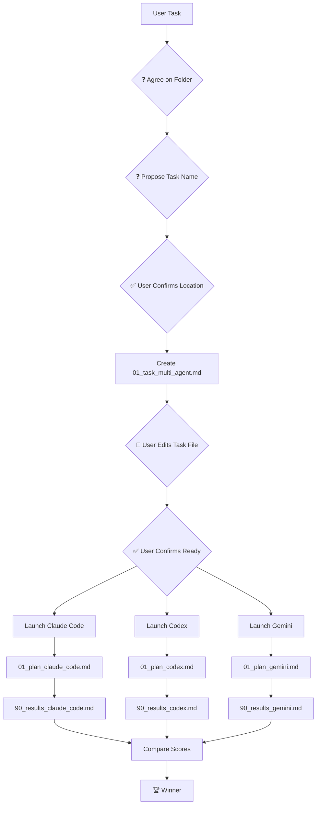

# Multi-Agent Orchestrator

**🔴 CRITICAL: NEVER MOCK DATA! Try multiple approaches to get real data. If failed - stop task and document all attempts.**

Launch N agents (Claude Code, Codex CLI, Gemini) with identical task file → Compare self-evaluations → Synthesize winner.

Тебе нужно запустить мультиагентов cli (но не sub agents in claude code), чтобы они создали свои папки в папке, на которую ты тоже дал ссылку.

  

## Quick Start - One Line
```bash
# ✅ WORKING: Automated multi-agent execution
./run_parallel_agents.sh 01_your_task.md
```

¶1 **Process Flow:** Agree on task location first, create editable task file immediately, user refines task directly in file, launch parallel agents after user confirms "Ready", self-evaluation determines winner through criteria scoring.



## 1.0 Setup: Task Definition

### 1.1 MANDATORY: Agree on Task Location First
¶1 **FIRST STEP - Agree on folder name and path BEFORE creating anything:**

**🔴 REQUIRED QUESTIONS:**
1. **"Where should I create this task folder?"** [Suggest 2-3 options based on task type]
   - If customer-related: `/client_cases/[client_name]/`
   - If algorithm: `/algorithms/[department]/`
   - If analysis: `/analytics/[type]/`
2. **"What should be the task folder name?"** [Propose descriptive name with number prefix]
   - Format: `XX_[descriptive_name]` (e.g., `15_customer_segmentation_analysis`)

**Example:**
```
🤖: "For your [task type] task, I suggest these locations:
   1. 📁 /client_cases/[client_name]/15_[task_name]/ (if client-specific)
   2. 📁 /algorithms/product_div/15_[task_name]/ (if product algorithm)
   3. 📁 /analytics/clickhouse/15_[task_name]/ (if data analysis)

   Which location works best? And what should the folder name be?"

👤: "Use client_cases/HP/15_customer_metrics_validation/"

🤖: "✅ Agreed! Creating task in: /client_cases/HP/15_customer_metrics_validation/"
```

### 1.2 Create Task File Immediately
¶1 **Create task file RIGHT AFTER folder agreement - no more back-and-forth!**

**⚠️ QUICK DRAFT APPROACH:** Create basic structure immediately, user can edit directly in the file.

```bash
# 1. Create task folder
mkdir -p [agreed_folder_path]

# 2. Navigate to task folder
cd [agreed_folder_path]

# 3. Create QUICK task file (user will edit this directly)
cat > 01_task_multi_agent_[quick_name].md << 'EOF'
## Task: [Your quick understanding - user will improve this]

**Success Criteria:** [DRAFT - user will refine these]
- [Draft criterion 1 - based on your initial understanding]
- [Draft criterion 2 - based on your initial understanding]
- [Draft criterion 3 - based on your initial understanding]

## Instructions for You (User):
1. **📝 EDIT THIS FILE** - Add details, fix criteria, clarify requirements
2. **✅ CONFIRM** - Reply "Ready" when file looks good
3. **🔄 ITERATE** - If major changes needed, edit the file and reply with changes

**Current Status:** 🔄 AWAITING YOUR EDITS AND CONFIRMATION

EOF

# 4. Show user the file location and provide clickable link
echo "📄 Task file created: [agreed_folder_path]/01_task_multi_agent_[quick_name].md"
echo "🔗 Click to edit: file://[full_path_to_file]"

# 5. Create agent workspaces within task folder
mkdir -p claude_code codex_cli

# 6. Return to parent directory
cd ..
```

### 1.3 User Edits Task File Directly
¶1 **User now has full control - they edit the task file directly in their IDE.**

**User workflow:**
1. **Open the file** I created (link provided above)
2. **Edit directly** - improve task description, refine criteria, add details
3. **Reply "Ready"** when satisfied - OR edit more and reply with specific changes needed

**No more chat back-and-forth! User controls the task definition.**

**Example User Edits:**
```markdown
## Task: Analyze customer conversion funnel for HP Q4 campaign performance

**Success Criteria:**
- [✅] Generate conversion rates by channel (Google, Facebook, LinkedIn)
- [✅] Identify top 3 drop-off points in funnel with root causes
- [✅] Provide actionable recommendations for 15% conversion improvement
- [✅] Complete analysis in under 2 hours using available ClickHouse data
```

### 1.4 User Confirmation = "Ready"
¶1 **Wait for user to say "Ready" or provide specific changes.**

**Acceptable responses:**
- ✅ "Ready" - proceed with current file
- ✅ "Ready with changes: [specific edits]" - apply changes then proceed
- ✅ "Change criterion #2 to: [new text]" - apply single change then proceed

**DO NOT PROCEED** until user explicitly confirms readiness.

```bash
# 1. Create task folder (if doesn't exist)
mkdir -p [task_folder_name]

# 2. Navigate to task folder
cd [task_folder_name]

# 3. Create task file
cat > 01_task_multi_agent_[task_folder_name].md << 'EOF'
## Task: [description]
**Success Criteria:**
- [criterion 1]
- [criterion 2]

 <Agents artefact requrement>

EOF

# 4. Create agent workspaces within task folder
mkdir -p claude_code codex_cli

# 5. Return to parent directory
cd ..
```

**Folder Structure Created:**
```
[agreed_folder_path]/
├── 01_task_multi_agent_[quick_name].md               # Task specification (user will edit)
├── claude_code/                                      # Claude workspace
├── codex_cli/                                        # Codex workspace
└── gemini/                                           # Gemini workspace
```


## 2.0 Execution: Parallel Agent Launch

### 2.1 Automated Execution

**IMPORTANT for Claude Code users:** When YOU run this script from Claude Code, use background mode:
```bash
# Run in background so Claude Code can monitor progress
./run_parallel_agents.sh task_file.md &
SCRIPT_PID=$!

# Then monitor progress every 30-60 seconds
ps aux | grep $SCRIPT_PID
tail -f [task_folder]/*/claude_output.log
```

**The scripts handle all technical requirements automatically:**
- ✅ Repository root execution
- ✅ Environment variable loading (.env file)
- ✅ Correct agent flags and permissions
- ✅ Workspace setup and cleanup
- ✅ Background process management
- ✅ Real-time progress monitoring (updates every 5 seconds)
- ✅ Agents run in parallel background processes

**No manual setup required - just run the script!**

## ✅ READY-TO-USE SCRIPTS

**All the complex setup is automated in ready-to-use scripts:**

### 🚀 Main Script (Recommended):
```bash
./run_parallel_agents.sh task_file.md
```

### 🔧 Individual Agent Scripts:
```bash
./run_claude_agent.sh task_file.md    # Claude only
./run_codex_agent.sh task_file.md     # Codex only
./run_gemini_agent.sh task_file.md    # Gemini only (NEW!)
```


**All scripts automatically handle:**
- ✅ Repository root execution
- ✅ .env file loading (database credentials)
- ✅ Correct agent flags
- ✅ Workspace setup
- ✅ Results collection

### 2.2 Usage Examples

**Basic workflow after user says "Ready":**
```bash
# 1. User confirms task file is ready
👤: "Ready"

# 2. Run multi-agent comparison
🤖: "./run_parallel_agents.sh [agreed_folder_path]/01_task_multi_agent_[quick_name].md"

# 3. Agents work in parallel
🤖: "Agents launched! Check progress in [agreed_folder_path]/claude_code/ and [agreed_folder_path]/codex_cli/"
```

**Expected timing:**
- **Codex**: 2-3 minutes for most tasks
- **Claude**: 5+ minutes depending on task complexity

**Scripts handle everything automatically - just wait for completion!**

### 2.3 Artifact Placement Requirements

**🔴 CRITICAL: ALL ARTIFACTS MUST BE IN AGENT WORKSPACE FOLDER**

¶1 **Every agent MUST create ALL output files in their assigned workspace folder** - NEVER in external directories like `data_processed/`, `output/`, or project root.

**❌ INCORRECT (violations):**
```bash
# BAD: Creating outputs outside agent workspace
[task_folder]/
├── 01_task.md
├── claude_code/
│   ├── 01_plan_claude_code.md      ✅
│   └── 90_results_claude_code.md   ✅
├── data_processed/
│   └── output.csv                  ❌ WRONG! Should be in claude_code/
└── results.json                     ❌ WRONG! Should be in claude_code/
```

**✅ CORRECT (all artifacts in workspace):**
```bash
[task_folder]/
├── 01_task.md
├── claude_code/
│   ├── 01_plan_claude_code.md      ✅ Planning document
│   ├── 90_results_claude_code.md   ✅ Results + self-evaluation
│   ├── output.csv                  ✅ Data artifact
│   ├── results.json                ✅ Metadata artifact
│   ├── conversion_script.py        ✅ Code artifact
│   └── execution.log               ✅ Log artifact
└── codex_cli/
    ├── 01_plan_codex.md            ✅
    ├── 90_results_codex.md         ✅
    └── analysis.json               ✅
```

**Why This Matters:**
1. **Traceability** - Easy to see which agent created which artifacts
2. **Comparison** - Compare outputs side-by-side without confusion
3. **Cleanup** - Delete failed agent results cleanly
4. **Reproducibility** - Know exact inputs/outputs for each agent
5. **Multi-agent workflows** - Prevent file conflicts when agents run in parallel

**Implementation Guidelines for Agents:**
- When writing files: ALWAYS use relative paths from your workspace folder
- For Python scripts: `output_path = "Randles_2021_parsed.csv"` (writes to current directory)
- For bash commands: `cd [agent_workspace] && python script.py`
- For file references in documentation: Use relative paths from workspace

**Validation Checklist (after task completion):**
- [ ] All agent outputs are in their respective workspace folders
- [ ] No stray files in task root directory
- [ ] No outputs in external folders (data_processed/, output/, etc.)
- [ ] Each agent's workspace is self-contained

## 3.0 Evaluation: Self-Assessment Comparison

### 3.1 Monitor via Plan Files
¶1 **Track progress** - check `[agreed_folder_path]/claude_code/01_*_plan_claude_code.md` and `[agreed_folder_path]/codex_cli/01_*_plan_codex.md` for real-time status.

### 3.2 Compare Self-Evaluations
¶1 **No manual testing** - compare `90_*_results_claude_code.md` and `90_*_results_codex.md` files only.
¶2 **Winner = highest score** - agent with most ✅ criteria wins.

```
┌────────────────────────┬──────────────┬─────────────┬─────────────┐
│ Success Criteria       │ Claude Code  │ Codex       │ Gemini      │
├────────────────────────┼──────────────┼─────────────┼─────────────┤
│ Process 1M rows <5s    │ ❌ (6.2 sec) │ ✅ (3.8 sec)│ ✅ (4.1 sec)│
│ Handle bad data        │ ✅ (tested)  │ ✅ (tested) │ ✅ (tested) │
│ Unique optimizations   │ ❌ (duplicated)│ ✅ (unique) │ ✅ (unique) │
├────────────────────────┼──────────────┼─────────────┼─────────────┤
│ CRITERIA MET           │ 1/3          │ 3/3         │ 3/3         │
└────────────────────────┴──────────────┴─────────────┴─────────────┘
🏆 WINNER: Tie between Codex and Gemini
```

### 3.3 Document Results
¶1 **Create comparison document** - record winner and reasoning for future reference.


## Reference

### <AgentsArtefactRequirement>
**File Templates:**
```markdown
# 01_[task]_plan_[agent].md
## My Approach ([agent])
- [ ] Step 1: [action]
## Progress Updates: ✅ [timestamp] Step 1 complete

# 90_[task]_results_[agent].md
## Self-Evaluation ([agent])
### Criterion 1: [from task file]
**Status:** ✅/❌/⚠️ | **Evidence:** [data] | **Details:** [how tested]
## Overall: X/Y criteria met | Grade: ✅/❌/⚠️
[+ may be additional artefacts that required by task] 
```

### Folder Structure
```
[agreed_folder_path]/                     # User-approved location
├── 01_task_multi_agent_[quick_name].md   # Task specification (user-editable)
├── claude_code/                          # Claude workspace
│   ├── 01_*_plan_claude_code.md          # Claude's planning
│   └── 90_*_results_claude_code.md       # Claude's results & evaluation
├── codex_cli/                            # Codex workspace
│   ├── 01_*_plan_codex.md                # Codex's planning
│   └── 90_*_results_codex.md             # Codex's results & evaluation
└── gemini/                               # Gemini workspace
    ├── 01_*_plan_gemini.md               # Gemini's planning
    └── 90_*_results_gemini.md            # Gemini's results & evaluation
```
 </Agents artefact requrement>

[CRITICAL] you MUST run cli agents (Codex, Claude, Gemini - don't mix up with sub agents) to solve it.
  You must run Claude Code CLI, Codex CLI, and Gemini CLI!!! not cursor subclient.
**🔴 CRITICAL: NEVER MOCK DATA! Try multiple approaches to get real data. If failed - stop task and document all attempts.**
---
*One task file. N agents. Best self-evaluation wins.*