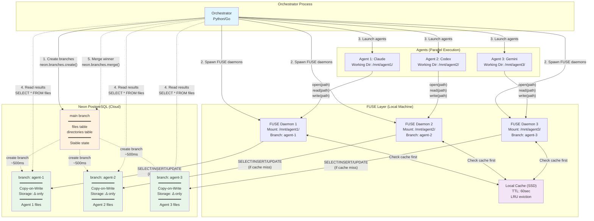
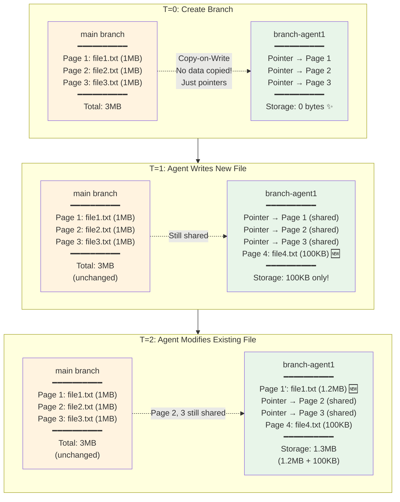
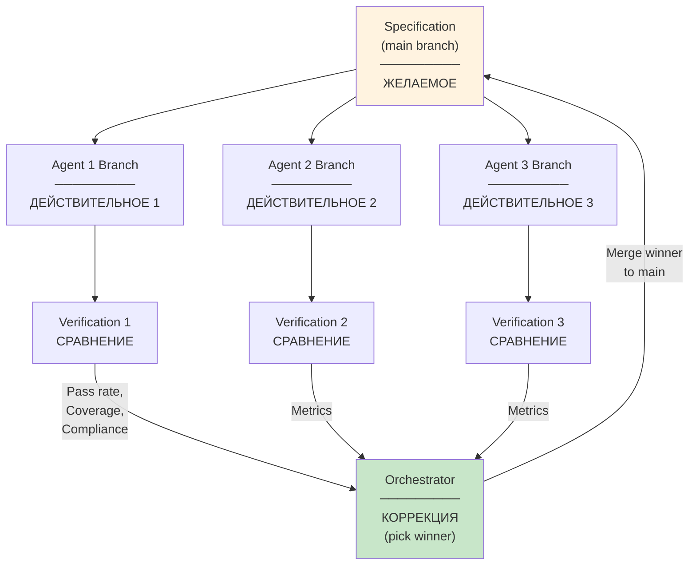
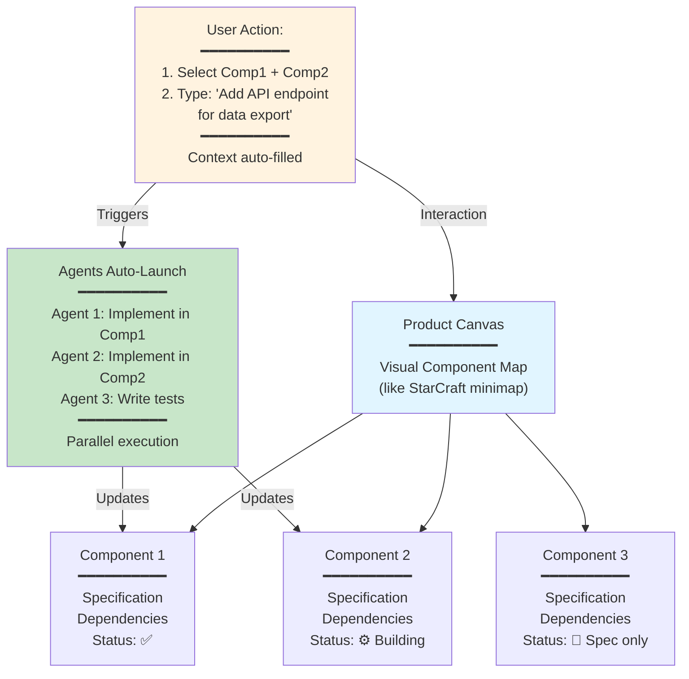

# FUSE + Neon для Multi-Agent Workflows

**Thesis:** FUSE (Filesystem in Userspace) + Neon PostgreSQL создают распределённую файловую систему с copy-on-write branching, где каждый агент работает с изолированной веткой через стандартные file operations, устраняя Git merge conflicts и обеспечивая instant snapshots для параллельной работы множества агентов — реализуя кибернетический контур управления разработкой через спецификацию (желаемое) → реализация (действительное) → сравнение → коррекция.

## Overview

Архитектурное предложение для решения проблемы storage coordination в multi-agent системах с философией управления разработкой как кибернетической системой. Комбинирует:
- **FUSE** - файловую абстракцию (agents видят обычный filesystem)
- **Neon** - PostgreSQL с Git-like branching (copy-on-write изоляция)
- **Cybernetic Control** - specification-driven development с контурами обратной связи
- **BFO Ontology** - различение Continuants (структуры) vs Occurrents (процессы)

**Primary sources:**
- FUSE kernel documentation (https://www.kernel.org/doc/html/latest/filesystems/fuse.html)
- Neon branching for agents (https://neon.com/branching/branching-for-agents, accessed 2025-11-12)
- AgentFS project (https://github.com/penberg/agentfs, accessed 2025-11-12)
- Daniel Kravtsov conversation on control loops in software development (2025-11-12)
- BFO (Basic Formal Ontology) principles for information systems

Структура:
1. **§1.0 Проблема** - Git merge conflicts, нет atomic rollback, manual coordination, отсутствие контуров обратной связи
2. **§2.0 Кибернетический контекст** - разработка как управление динамической системой, контуры обратной связи, specification → implementation → verification
3. **§3.0 FUSE технология** - userspace filesystem, операции → SQL mapping, информационные объекты как Continuants
4. **§4.0 Neon branching** - copy-on-write branches, instant snapshots (<500ms), временные ветки как Occurrents
5. **§5.0 Архитектура** - FUSE frontend + Neon backend интеграция, кибернетические контуры в системе
6. **§6.0 Prior Art** - AgentFS (SQLite), Neon официально для AI agents, gaps в multi-agent orchestration
7. **§7.0 Implementation** - prototype roadmap, benchmarks, validation loops
8. **§8.0 Продуктовое видение** - IDE-like interface поверх спецификаций, визуализация контуров управления

## Mermaid Diagrams

### Архитектура системы (Continuant Diagram)



### Workflow процесса (Occurrent Diagram)

```mermaid
graph LR
    Start["🚀 Task Start<br/>Multi-agent run"] --> CreateBranches["📦 Create Neon Branches<br/>━━━━━━━━━━<br/>branch-agent1 (500ms)<br/>branch-agent2 (500ms)<br/>branch-agent3 (500ms)<br/>━━━━━━━━━━<br/>Total: ~1.5sec"]

    CreateBranches --> Mount["🔧 Mount FUSE<br/>━━━━━━━━━━<br/>/mnt/agent1/ → branch-agent1<br/>/mnt/agent2/ → branch-agent2<br/>/mnt/agent3/ → branch-agent3<br/>━━━━━━━━━━<br/>3 FUSE daemons running"]

    Mount --> SpawnAgents["⚡ Spawn Agents<br/>━━━━━━━━━━<br/>Agent 1: cwd=/mnt/agent1/<br/>Agent 2: cwd=/mnt/agent2/<br/>Agent 3: cwd=/mnt/agent3/<br/>━━━━━━━━━━<br/>Parallel execution"]

    SpawnAgents --> Work1["📝 Agent 1 Works<br/>━━━━━━━━━━<br/>echo 'plan' > 01_plan.md<br/>mkdir artifacts/<br/>python script.py<br/>━━━━━━━━━━<br/>FUSE → Neon branch-agent1"]

    SpawnAgents --> Work2["📝 Agent 2 Works<br/>━━━━━━━━━━<br/>echo 'plan' > 01_plan.md<br/>mkdir artifacts/<br/>python script.py<br/>━━━━━━━━━━<br/>FUSE → Neon branch-agent2"]

    SpawnAgents --> Work3["📝 Agent 3 Works<br/>━━━━━━━━━━<br/>echo 'plan' > 01_plan.md<br/>mkdir artifacts/<br/>python script.py<br/>━━━━━━━━━━<br/>FUSE → Neon branch-agent3"]

    Work1 --> Snapshot1["💾 Auto-Snapshot<br/>Every 5 minutes<br/>branch-agent1-snap-T5<br/>branch-agent1-snap-T10"]
    Work2 --> Snapshot2["💾 Auto-Snapshot<br/>Every 5 minutes<br/>branch-agent2-snap-T5<br/>branch-agent2-snap-T10"]
    Work3 --> Snapshot3["💾 Auto-Snapshot<br/>Every 5 minutes<br/>branch-agent3-snap-T5<br/>branch-agent3-snap-T10"]

    Snapshot1 --> WaitComplete["⏳ Wait for<br/>All Agents"]
    Snapshot2 --> WaitComplete
    Snapshot3 --> WaitComplete

    WaitComplete --> ReadResults["📖 Orchestrator Reads Results<br/>━━━━━━━━━━<br/>SELECT content FROM files<br/>WHERE branch='branch-agent1'<br/>WHERE branch='branch-agent2'<br/>WHERE branch='branch-agent3'<br/>━━━━━━━━━━<br/>Bypass FUSE, direct SQL"]

    ReadResults --> Evaluate["🎯 Evaluate & Pick Winner<br/>━━━━━━━━━━<br/>Score agent1: 85<br/>Score agent2: 72<br/>Score agent3: 90 ⭐<br/>━━━━━━━━━━<br/>Winner: Agent 3"]

    Evaluate --> Merge["🔀 Merge Winner to Main<br/>━━━━━━━━━━<br/>neon.branches.merge(<br/>  source='branch-agent3',<br/>  target='main'<br/>)<br/>━━━━━━━━━━<br/>Time: ~100ms (pointer swap)"]

    Merge --> Cleanup["🧹 Cleanup<br/>━━━━━━━━━━<br/>unmount /mnt/agent1/<br/>unmount /mnt/agent2/<br/>unmount /mnt/agent3/<br/>delete branch-agent1<br/>delete branch-agent2<br/>delete branch-agent3<br/>━━━━━━━━━━<br/>Agent 3 files now in main"]

    Cleanup --> Done["✅ Complete<br/>Result in main branch"]

    style Start fill:#e1f5ff
    style CreateBranches fill:#fff3e0
    style Mount fill:#f3e5f5
    style SpawnAgents fill:#e8f5e9
    style Work1 fill:#fff9c4
    style Work2 fill:#fff9c4
    style Work3 fill:#fff9c4
    style Evaluate fill:#ffccbc
    style Merge fill:#c8e6c9
    style Done fill:#b2dfdb
```



### Copy-on-Write механизм (Technical Detail)



---

## 1.0 Проблема: Git не подходит для multi-agent

**Ordering principle:** От симптомов (§1.1 conflicts) к архитектурным ограничениям (§1.2).

### 1.1 Merge Conflicts

**Current Git workflow:**
```
/multi_agent_framework/
├── claude_agent/result.md
├── codex_agent/result.md
└── gemini_agent/result.md

Git sees: 3 concurrent commits → potential conflicts
```

**Problem:**
- Если агенты создают одинаковые пути → merge conflict
- Synthesis agent должен знать folder structure заранее
- Manual coordination needed

### 1.2 Нет Atomic Rollback

**Scenario:**
```
Agent creates 45 files → crashes on file 45
How to rollback only this agent?
```

**Git solution:** `rm -rf agent_folder/` → теряем partial progress

**Needed:** Time-travel snapshots
- T=0: Empty workspace
- T=5: Plan written [SNAPSHOT]
- T=10: Code 50% done [SNAPSHOT]
- T=20: CRASH → rollback to T=10

---

## 2.0 Кибернетический контекст: Разработка как управление

**Ordering principle:** От фундаментальной метафоры (§2.1 кибернетика) к применению в разработке (§2.2 specification-driven), затем к проблемам интеграции (§2.3 контуры обратной связи). Философский фундамент предшествует техническому решению.

**Source:** Daniel Kravtsov, experience managing UAV flight control systems + software development orchestration (2025-11-12 conversation)

### 2.1 Кибернетическая система управления

**Definition:** Разработка софта = управление динамическим объектом, где спецификация — это "желаемое состояние", код — "действительное", а агенты выполняют коррекцию.

**Классический контур управления:**
```
┌─────────────┐
│  Желаемое   │  ← Specification (что должно быть)
│  (Target)   │
└──────┬──────┘
       │
       ▼
┌─────────────┐
│  Сравнение  │  ← Verification (совпадает ли?)
│  (Compare)  │
└──────┬──────┘
       │ Error signal
       ▼
┌─────────────┐
│  Коррекция  │  ← Agent implements fix
│  (Control)  │
└──────┬──────┘
       │
       ▼
┌─────────────┐
│Действительное│ ← Code (что есть на самом деле)
│  (Actual)   │
└──────┬──────┘
       │
       └──────► Measurement → обратно к Сравнению
```

**Aviation parallel:**
- **Cruise control analogy:** Вектор состояния = (скорость, расстояние до препятствия)
- **Software development:** Вектор состояния = (code completeness, test pass rate, specification compliance)
- **Key insight:** Оба — динамические системы с feedback loops

**Problem: Phase delay in nested control loops**

**Analogy: Управление лодкой на малой скорости**
- **Physics:** Угловая скорость = интеграл углового ускорения
- **Effect:** Два интегратора → 180° phase shift → feedback changes sign
- **Result:** Новички "гуляют" (oscillate), потому что коррекция запаздывает и меняет знак

**Software parallel:**
```
Agent writes code → Tests run → QA validates → PM reviews
                     ↑_________________________________|
                          Long feedback loop
```

**Solution:** Короткие контуры обратной связи на каждом уровне абстракции
- Не только финальный результат (PM review)
- Но и промежуточные метрики (unit tests, type checks, linters)

**Source attribution:**
- Control theory fundamentals from flight control systems engineering
- Phase delay analogy from Daniel Kravtsov UAV development experience (Krasnoyarsk, Russia 2015-2018)
- Software application synthesized in conversation 2025-11-12

### 2.2 Specification-Driven Development

**Aviation engineering процесс → Software development mapping:**

| Aviation Process | Software Equivalent | FUSE+Neon Implementation |
|------------------|---------------------|--------------------------|
| **Requirements (High-level)** | Product spec, user stories | Specification files in `main` branch |
| **Requirements (Low-level)** | Function signatures, types, API contracts | Interface definitions, schemas |
| **Design Document** | Architecture doc, component design | Mermaid diagrams, folder structure |
| **Implementation** | Code | Agent writes to isolated branch |
| **Verification** | Does code match requirements? | Test agent validates against spec |
| **Validation** | Do requirements match reality? | User acceptance, metrics |

**Key principle: Полнота и непротиворечивость**

¶1 **Verification vs Validation:**
- **Verification:** "Are we building the system right?" (code ↔ spec)
- **Validation:** "Are we building the right system?" (spec ↔ user needs)

¶2 **Completeness requirement:**
- Specification должна покрывать все степени свободы
- Example: `function sin(x)` → High-level requirement
  - Low-level: Interpolation method (Taylor series vs lookup table)
  - Low-level: Precision (float32 vs float64)
  - Low-level: Domain constraints (x ∈ [-π, π] or wrap-around?)

¶3 **Non-contradiction requirement:**
- Agent writing code + Agent writing tests MUST have identical input (specification)
- Otherwise: Tests могут pass при неверном коде (spec ambiguity)

**Current gap:** Git-based workflows не обеспечивают:
1. Atomic specification snapshots per agent
2. Traceability: code line → requirement
3. Rollback to last-valid-verified state

**FUSE+Neon solution:**
- Specification in `main` branch (read-only for agents)
- Each agent gets CoW branch with spec copied
- Test agent and code agent see **same spec snapshot** (no race conditions)
- Verification = compare outputs from both agents
- Merge winner = agent whose output passes verification

### 2.3 Контуры обратной связи в multi-agent системах

**Problem: Длинные цепочки принятия решений**

**Scenario без коротких контуров:**
```
Agent 1 → Agent 2 → Agent 3 → ... → Agent N → Orchestrator evaluates
                                                ↓
                                        Phase delay 180°
                                        Oscillating corrections
```

**Solution: Layered control loops**



**Key benefits:**
1. **Короткий контур:** Agent → Verification (seconds to minutes)
2. **Параллельные контуры:** N agents = N independent loops (no cross-interference)
3. **Atomic rollback:** Failed verification → delete branch (no partial state pollution)

**BFO Ontology application:**
- **Specification (Continuant):** Информационный объект, существует вне времени
- **Branch (Occurrent):** Процесс разработки, разворачивается во времени
- **Verification (Occurrent):** Событие сравнения в момент T
- **Merge (Occurrent):** Событие коррекции системы

**Real-world analogy: Test-driven development (TDD)**
- TDD = короткий контур (write test → write code → run test → refactor)
- Multi-agent с FUSE+Neon = TDD at orchestration level
  - Specification = test suite
  - Agent branches = implementations
  - Verification = automated test run
  - Merge = picking passing implementation

---

## 3.0 FUSE: Filesystem in Userspace

**Ordering principle:** От базового механизма (§3.1) к integration patterns (§3.2), затем к performance optimization (§3.3). Понимание технологии предшествует применению.

**BFO Classification:** FUSE daemon = Continuant (software component that exists), file operations = Occurrents (events that happen over time)

### 3.1 Что такое FUSE

**Definition:** Позволяет создавать файловые системы без kernel code

```
Agent: open("/workspace/file.txt", "r")
  ↓ system call
Kernel VFS
  ↓ FUSE kernel module
FUSE Daemon (наш Python/Go код)
  ↓ translate to SQL
Neon PostgreSQL: SELECT content FROM files WHERE path = '/workspace/file.txt'
```

**Key benefit:** Agent видит обычный filesystem, не знает о БД.

### 3.2 File Operations → SQL Mapping

**BFO Note:** Each file operation is an Occurrent (event at time T), while files themselves are Continuants (information objects that persist)

**Трансляция:**
```
File Op              SQL
────────────────     ─────────────────────────────────
open(path, 'r')   →  SELECT content FROM files WHERE path = ?
write(path, data) →  INSERT INTO files (path, content) VALUES (?, ?)
                     ON CONFLICT DO UPDATE
readdir(path)     →  SELECT path FROM files WHERE path LIKE ?
mkdir(path)       →  INSERT INTO directories (path) VALUES (?)
unlink(path)      →  DELETE FROM files WHERE path = ?
```

**Database schema:**
```sql
CREATE TABLE files (
    path TEXT,
    content BYTEA,
    size BIGINT,
    branch_name TEXT,
    created_at TIMESTAMPTZ,

    PRIMARY KEY (path, branch_name)
);

CREATE TABLE directories (
    path TEXT,
    branch_name TEXT,

    PRIMARY KEY (path, branch_name)
);
```

### 3.3 Performance: Caching Layer

**Problem:** Every read() → network roundtrip (slow)

**Solution:** Local cache в FUSE daemon
```python
class FUSEDaemon:
    def __init__(self):
        self.cache = {}  # {path: (content, timestamp)}
        self.ttl = 60  # seconds

    def read(self, path):
        # Check cache
        if path in self.cache and not expired(self.cache[path]):
            return self.cache[path].content

        # Cache miss → query Neon
        content = neon.query("SELECT content FROM files WHERE path = %s", path)
        self.cache[path] = (content, time.now())
        return content
```

**Performance target:**
- Cold read: <50ms (network to Neon)
- Hot read: <1ms (local cache)
- Write: <20ms (async to Neon)

---

## 4.0 Neon: PostgreSQL с Branching

**Ordering principle:** От branching mechanism (§4.1 copy-on-write) к multi-agent isolation (§4.2), затем к merge strategy (§4.3). Технология → применение → интеграция.

**BFO Classification:**
- Database branches = Continuants (persistent data structures)
- Branch creation/merge = Occurrents (temporal events)
- Copy-on-write = Process (Occurrent) that creates new Continuant without copying data

### 4.1 Copy-on-Write Branches

**Key feature:** Git-like branches для database

**Create branch:**
```bash
neon branches create --name agent-claude --parent main
# Time: ~500ms
# Storage: 0 bytes initially (copy-on-write!)
```

**How it works:**
```
Main branch (1GB):
┌─────────────┐
│ Page 1: f1  │
│ Page 2: f2  │
└─────────────┘

Create branch agent-claude:
┌─────────────┐
│ Pointers to │  ← No data copied yet
│ main pages  │
└─────────────┘

Agent writes new file:
┌─────────────┐
│ Page 1: f1  │ ← Points to main (shared)
│ Page 2: f2  │ ← Points to main (shared)
│ Page 3: f3  │ ← NEW (only in branch)
└─────────────┘
```

**Storage efficiency:** 10 agents × 10MB delta = 100MB, not 10GB

### 4.2 Branch Isolation

**Multi-agent pattern:**
```
main (stable)
  ├── agent-claude (isolated workspace)
  ├── agent-codex (isolated workspace)
  └── agent-gemini (isolated workspace)
```

**Isolation guarantees:**
- Each agent sees consistent snapshot
- Writes go to own branch only
- No conflicts possible (different branches)
- Rollback = delete branch (instant)

### 4.3 Merge = Pointer Swap

**Traditional Git merge:**
- Three-way merge algorithm
- Conflict resolution needed
- Time: seconds to hours

**Neon branch promotion:**
```python
# Pick winner
neon.branches.merge(source='agent-claude', target='main')
# Time: ~100ms (pointer swap)
# No conflicts (not merging, just promoting)
```

---

## 5.0 Архитектура: FUSE + Neon Integration

**Ordering principle:** От agent perspective (§5.1 что видят агенты) к orchestrator perspective (§5.2 как управляет оркестратор), затем к auto-snapshots (§5.3 автоматизация). User experience → Control layer → Automation.

**Cybernetic mapping:**
- Agent = Actuator (выполняет коррекцию)
- FUSE + Neon = Sensor + Memory (измеряет текущее состояние, хранит историю)
- Orchestrator = Controller (принимает решения о коррекции)

### 5.1 Agent Perspective

**What agent sees:**
```bash
$ pwd
/workspace

$ ls
# Empty (new branch)

$ echo "Result" > output.txt
$ mkdir artifacts/
$ python script.py > artifacts/data.json
```

**What actually happens:**
```sql
-- FUSE daemon translates to:
INSERT INTO files (path, content, branch_name)
VALUES ('/output.txt', 'Result', 'agent-claude');

INSERT INTO directories (path, branch_name)
VALUES ('/artifacts/', 'agent-claude');

INSERT INTO files (path, content, branch_name)
VALUES ('/artifacts/data.json', '{"data": ...}', 'agent-claude');
```

**Agent doesn't know:** FUSE, Neon, SQL - just uses filesystem.

### 5.2 Orchestrator Workflow

**Spawn agent:**
```python
def spawn_agent(agent_name, task):
    # 1. Create Neon branch
    branch = neon.branches.create(
        name=f"agent-{agent_name}-{uuid()}",
        parent='main'
    )

    # 2. Mount FUSE
    mount_point = f"/mnt/{agent_name}/"
    fuse_daemon = start_fuse(
        neon_connection=neon_conn,
        branch=branch.name,
        mount=mount_point
    )

    # 3. Launch agent
    agent = subprocess.Popen([
        agent_name,  # 'claude', 'codex', etc
        '--task', task,
        '--cwd', mount_point
    ])

    return {'agent': agent, 'branch': branch, 'mount': mount_point}
```

**Read results (synthesis):**
```python
def synthesize_results(agent_infos):
    results = []

    for info in agent_infos:
        # Query Neon directly (bypass FUSE)
        content = neon.query(
            branch=info['branch'],
            sql="SELECT content FROM files WHERE path = '/result.md'"
        )
        results.append({'agent': info['agent'], 'content': content})

    return results
```

**Pick winner & merge:**
```python
winner = max(results, key=evaluate_quality)

# Promote winner's branch to main
neon.branches.merge(source=winner['branch'], target='main')

# Cleanup
for info in agent_infos:
    fuse_unmount(info['mount'])
    neon.branches.delete(info['branch'])
```

### 5.3 Auto-Snapshots

**Background process в FUSE daemon:**
```python
def auto_snapshot_loop(branch_name, interval=300):
    while True:
        time.sleep(interval)  # 5 minutes

        snapshot = neon.branches.create(
            name=f"{branch_name}-snapshot-{int(time.time())}",
            parent=branch_name
        )

        print(f"Created snapshot: {snapshot.name}")
```

**Rollback if agent crashes:**
```python
if agent.returncode != 0:
    # Get latest snapshot
    snapshots = neon.branches.list(pattern=f"{branch_name}-snapshot-*")
    latest = max(snapshots, key=lambda s: s.created_at)

    # Restore
    neon.branches.restore(branch=branch_name, snapshot=latest.id)
```

---

## 6.0 Existing Solutions & Prior Art

**Ordering principle:** От discovered solutions (§6.1 AgentFS, §6.2 Neon for agents) к gaps в рынке (§6.3). Инвентаризация существующего → идентификация пробелов.

### 6.1 AgentFS (Pekka Enberg)

**GitHub:** https://github.com/penberg/agentfs (accessed 2025-11-12)

**What it is:**
- SQLite-based filesystem for AI agents
- FUSE interface + Turso (distributed SQLite) backend
- Features: sandboxing, auditability, reproducibility

**Architecture:**
```
Agent → FUSE → SQLite (Turso) → Single database file
```

**Comparison:**

| Feature       | AgentFS (SQLite) | Our Proposal (Neon) |
|---------------|------------------|---------------------|
| Backend       | SQLite           | PostgreSQL          |
| Branching     | Snapshots        | Native branches     |
| Scale         | Single agent     | Multi-agent (∞)     |
| Performance   | Embedded (fast)  | Network (cached)    |
| Isolation     | Separate DBs?    | Branches            |

**Key difference:**
- AgentFS = single agent focus
- Our proposal = multi-agent orchestration focus

### 6.2 Neon: Built for AI Agents

**Discovery:** Neon официально позиционируется для AI agents!

**Evidence:**
1. **Docs:** https://neon.com/branching/branching-for-agents
2. **Stat:** 80% Neon databases created by agents, not humans
3. **Acquisition:** Databricks bought Neon (Jan 2025) "to build next wave of AI agents"

**Neon features for agents:**
- Instant branching (<500ms)
- API-first (programmatic control)
- Auto-scale compute (bursty workloads)
- Idle-to-zero (cost optimization)

**Validation:** Industry independently identified same use case.

### 6.3 Gap: FUSE + Neon Combination

**Current solutions:**
- ✅ AgentFS: FUSE interface, но SQLite (single-agent)
- ✅ Neon: Branching, но no FUSE (agents must use SQL)
- ❌ FUSE + Neon: **Not found in research**

**Our opportunity:**
```
AgentFS FUSE interface + Neon multi-agent branching = Novel combination
```

**Benefits:**
- Agents see filesystem (AgentFS approach)
- Backend scales to ∞ agents (Neon branching)
- No code changes for agents (drop-in replacement)

---

## 7.0 Implementation

**Ordering principle:** От proof of concept (§7.1 minimal FUSE daemon) к multi-agent integration (§7.2), затем к benchmarks (§7.3). Validate technology → Scale → Measure performance.

### 7.1 Proof of Concept (Week 1-2)

**Phase 1: Minimal FUSE daemon**

**Option A:** Fork AgentFS
```bash
git clone https://github.com/penberg/agentfs
cd agentfs
# Add Neon backend adapter
```

**Option B:** Implement from scratch
```python
from fuse import FUSE, Operations
import psycopg2

class NeonFS(Operations):
    def __init__(self, neon_url, branch):
        self.conn = psycopg2.connect(neon_url)
        self.branch = branch

    def read(self, path, size, offset, fh):
        cur = self.conn.cursor()
        cur.execute(
            "SELECT content FROM files WHERE path = %s AND branch_name = %s",
            (path, self.branch)
        )
        row = cur.fetchone()
        return row[0][offset:offset+size] if row else b''

    def write(self, path, data, offset, fh):
        cur = self.conn.cursor()
        cur.execute("""
            INSERT INTO files (path, content, branch_name)
            VALUES (%s, %s, %s)
            ON CONFLICT (path, branch_name) DO UPDATE
            SET content = EXCLUDED.content
        """, (path, data, self.branch))
        self.conn.commit()
        return len(data)

# Mount
FUSE(NeonFS(neon_url, branch='main'), '/mnt/agentfs', foreground=True)
```

**Test:**
```bash
# Terminal 1: Start daemon
python neonfs.py

# Terminal 2: Use filesystem
cd /mnt/agentfs
echo "Test" > file.txt
cat file.txt

# Verify in Neon
psql $NEON_URL -c "SELECT * FROM files;"
```

### 7.2 Multi-Agent Integration (Week 3-4)

**Orchestrator:**
```python
# spawn_agents.py
agents = ['claude', 'codex', 'gemini']
agent_infos = []

for agent in agents:
    # Create branch
    branch = neon.branches.create(f"agent-{agent}")

    # Mount FUSE
    mount = f"/mnt/{agent}"
    subprocess.Popen(['python', 'neonfs.py', '--branch', branch, '--mount', mount])

    # Launch agent
    process = subprocess.Popen([agent, '--cwd', mount])

    agent_infos.append({'agent': agent, 'branch': branch, 'process': process})

# Wait for completion
for info in agent_infos:
    info['process'].wait()

# Synthesis
results = []
for info in agent_infos:
    content = neon.query(
        branch=info['branch'],
        sql="SELECT content FROM files WHERE path = '/result.md'"
    )
    results.append(content)

# Pick winner
winner = evaluate_and_pick_best(results)
neon.branches.merge(source=winner['branch'], target='main')
```

### 7.3 Performance Benchmarks

**Test scenarios:**
```
1. Single agent:
   - Create 1000 files
   - Measure: latency, throughput

2. Multi-agent (3 agents):
   - Each creates 1000 files in parallel
   - Measure: conflicts (should be 0), storage overhead

3. Multi-agent (50 agents):
   - Stress test branching
   - Measure: branch creation time, storage cost

4. Rollback test:
   - Create snapshot every 5min
   - Kill agent randomly
   - Measure: recovery time
```

**Comparison baseline:**
- Git-based approach (current)
- Metrics: merge conflict rate, engineer time, storage usage

---

## 8.0 Продуктовое видение: IDE поверх спецификаций

**Ordering principle:** От текущего состояния (§8.1 спецификация как код) к продуктовому vision (§8.2 visual IDE), затем к user experience (§8.3 interaction patterns). Проблема → Решение → UX.

**Source:** Daniel Kravtsov conversation on specification-first development and visual product interfaces (2025-11-12)

### 8.1 Спецификация как исходный код

**Current paradigm shift:**
```
Traditional:          Specification → Implementation
                      (Requirements doc) (Code)

Specification-first:  Specification = Code
                      ↓
                      Multiple implementations (agents compete)
                      ↓
                      Verification picks winner
```

**Key insight from conversation:**
> "У меня был проект на 150 страниц spec. Сделал за 3 дня через агентов. Спецификация + контексты полмиллиона токенов. Весь трюк в том, чтобы максимально рано выделять независимость компонентов."

**Принцип независимости:**
- Каждый аспект системы = отдельная спецификация
- Соседние аспекты договариваются через interface specification
- Агенты работают параллельно, каждый над своим аспектом
- DRY (Don't Repeat Yourself) - переиспользование спецификаций
- Агентыsami говорят: "Не переизобретайте, используйте существующее"

### 8.2 Visual IDE для спецификаций

**Vision: Starcraft-like product development interface**

**Quote from conversation:**
> "Мне нравится как в StarCraft ты смотришь на карту. Выделил два кубика, сказал фразу — 95% контекста автодополняется. Указал суть, язык установлен, добавил три слова — это фича."

**Product interface concept:**



**Key UX features:**
1. **Visual component map:** Drag-and-drop component organization
2. **Context-aware input:** Select components → context auto-fills
3. **Natural language commands:** "Add feature X", "Fix bug Y", "Refactor Z"
4. **Real-time agent visualization:** See which agents working on what
5. **Specification editor with AI assist:** Write specs, AI suggests completeness

**Continuant diagram integration:**
- Product canvas shows system structure (Continuants)
- Each component = box with dependencies
- Click component → see specification
- Drag edge between components → define interface

**Occurrent diagram integration:**
- Timeline view shows processes (Occurrents)
- Agent execution visualized as Gantt chart
- Verification events marked on timeline
- Merge events show winner selection

### 8.3 Interaction Patterns

**Pattern 1: Feature addition**
```
User: Select Component A + Component B
User: Type "Add export to CSV"
System: Auto-completes context:
        - Component A uses Python
        - Component B uses TypeScript
        - CSV library: pandas (Python), papaparse (TS)
        - Existing export patterns: JSON, XML
        - Interface specification: dataExport()
System: Launch 3 agents with full context
System: Visualize progress on canvas
System: Pick winner after verification
```

**Pattern 2: Architecture refactoring**
```
User: Select entire service (10 components)
User: Type "Split into microservices"
System: Analyze dependencies
System: Suggest split points (MECE boundaries)
User: Approve split
System: Launch agents to refactor each microservice
System: Verify inter-service contracts
System: Gradual rollout (blue-green deployment)
```

**Pattern 3: Specification evolution**
```
Timeline view (Occurrent):
T=0: Initial spec written
T=1: Agent implements → finds ambiguity
T=2: Spec automatically updated (clarification)
T=3: Re-run implementation
T=4: Verification passes
T=5: Merge to main

All tracked in FUSE+Neon branches
```

**Cybernetic loop visualization:**
```
Visual Canvas:
┌─────────────────────────────────────┐
│  Specification (Желаемое)           │
│  [Edit] [Visualize] [Validate]      │
└───────────┬─────────────────────────┘
            │
            ▼
┌─────────────────────────────────────┐
│  Agents (Коррекция)                 │
│  [Agent 1: 45%] [Agent 2: 78%]      │
└───────────┬─────────────────────────┘
            │
            ▼
┌─────────────────────────────────────┐
│  Implementation (Действительное)    │
│  [View Code] [View Branches]        │
└───────────┬─────────────────────────┘
            │
            ▼
┌─────────────────────────────────────┐
│  Verification (Сравнение)           │
│  [Tests: 95%] [Coverage: 87%]       │
│  [Spec compliance: ✅]               │
└───────────┬─────────────────────────┘
            │
            │ Feedback loop
            └──────────────────────────┐
                                       │
            ┌──────────────────────────┘
            ▼
     [Update Spec] or [Merge Winner]
```

**BFO ontology in UI:**
- **Continuants tab:** Structure view (components, dependencies, data models)
- **Occurrents tab:** Process view (builds, deployments, agent runs, verifications)
- **Information Objects:** Specifications, requirements, test cases (all Continuants)
- **Events:** Code commits, test runs, deployments (all Occurrents)

**Key differentiation from traditional IDEs:**
- Traditional IDE: Code is primary artifact
- Specification IDE: Specification is primary artifact, code is disposable
- Traditional: Human writes code, AI assists
- Specification IDE: AI writes code, human writes specs and verifies

---

## 9.0 Next Steps

### 9.1 Immediate Actions

- [ ] Contact Pekka Enberg (AgentFS author) - collaboration?
- [ ] Contact Neon team - existing FUSE work?
- [ ] PoC: Fork AgentFS, add Neon backend
- [ ] Benchmark: SQLite vs Neon for multi-agent

### 9.2 Open Questions

- Optimal snapshot frequency? (5min fixed vs adaptive)
- Cache eviction strategy? (LRU vs TTL vs hybrid)
- Garbage collection for old branches?
- Cross-agent shared state? (read-only mount of main branch?)

### 9.3 Contribution Path

**Open source strategy:**
1. Implement Neon backend for AgentFS
2. Submit PR to penberg/agentfs
3. Document multi-agent use case
4. Publish benchmarks (SQLite vs Neon for N agents)

**Alternative: Separate project**
- If AgentFS doesn't want Neon dependency
- Create `agentfs-neon` as separate repo
- Reuse AgentFS FUSE interface, swap backend

---

## Ground Truth Attribution

**Primary sources:**
1. **FUSE kernel docs:** https://www.kernel.org/doc/html/latest/filesystems/fuse.html (accessed 2025-11-12)
2. **Neon branching for AI agents:** https://neon.com/branching/branching-for-agents (accessed 2025-11-12)
3. **AgentFS (Pekka Enberg):** https://github.com/penberg/agentfs (accessed 2025-11-12)
4. **Databricks acquires Neon:** https://www.databricks.com/company/newsroom/press-releases/databricks-agrees-acquire-neon (2025-01)
5. **Daniel Kravtsov conversation (2025-11-12):** Multi-agent Git pain points, cybernetic control loops, specification-driven development, UAV flight control analogies, BFO ontology application

**Key stats:**
- Neon branch creation: <500ms (Neon official documentation)
- 80% Neon databases created by AI agents (Neon marketing stat)
- Copy-on-write storage efficiency: 10 agents × 10MB delta = 100MB, not 10GB (Neon architecture)
- Daniel's project: 150-page specification → 3 days implementation via multi-agent system (conversation 2025-11-12)

**BFO Ontology sources:**
- Basic Formal Ontology (BFO) principles for information systems
- Continuants vs Occurrents classification
- Information objects as Continuants ("about" relationship)

**Aviation engineering sources:**
- Daniel Kravtsov UAV flight control experience (Krasnoyarsk, Russia 2015-2018)
- Cruise control analogy for feedback loops
- Phase delay problem in nested integrators (180° shift)
- Verification vs Validation from aerospace standards

**Novel contributions:**
- ⚠️ **FUSE + Neon combination for multi-agent:** Not found in prior art (our architectural proposal)
- ⚠️ **Cybernetic control loops applied to software development orchestration:** Synthesized from Daniel's UAV control theory experience + multi-agent pain points
- ⚠️ **Specification-driven development with competing agents:** Practical implementation pattern from 150-page project experience
- ⚠️ **BFO ontology applied to agent storage (Continuants vs Occurrents):** Philosophical framework mapping to technical architecture
- ⚠️ **Starcraft-like visual IDE for specifications:** Product vision synthesized from conversation

**LLM Analysis:**
- Integration of aviation control theory → software orchestration (§2.0)
- BFO ontology mapping to FUSE+Neon components (§3.0, §4.0)
- Product vision synthesis from conversation fragments (§8.0)

---

**★ Final Insight ─────────────────────────────────────**

**Core idea:** Разработка софта = управление динамической системой. FUSE+Neon реализует кибернетический контур: спецификация (желаемое) → агенты (коррекция) → код (действительное) → verification (сравнение).

**Why it works (технически):**
- FUSE = agents see files (no code changes, filesystem as universal API)
- Neon = branching at DB level (isolation без conflicts, CoW efficiency)
- Copy-on-write = scaling без storage explosion (10 agents ≠ 10× storage)

**Why it works (философски):**
- Короткие контуры обратной связи (agent → verification → orchestrator)
- Specification-first paradigm (spec = code, implementations compete)
- BFO ontology separation (Continuants = structure, Occurrents = process)
- Atomic rollback (delete branch = instant undo, no partial state pollution)

**Industry validation:**
- AgentFS proves FUSE works for agents (SQLite backend, single-agent focus)
- Neon proves branching works for agents (80% DBs by agents, <500ms branch creation)
- Aviation engineering proves feedback loop principles (40+ years of UAV control theory)
- Our contribution: **Combine all three** for multi-agent orchestration at scale

**Cybernetic breakthrough:**
- Traditional Git: Long feedback loop (write code → push → CI → review → merge)
- FUSE+Neon: Short feedback loop per agent (spec → implement → verify → merge winner)
- Eliminates phase delay problem (180° shift from nested integrators)
- Parallel control loops (N agents = N independent feedback systems)

**Product vision:**
- Starcraft-like visual interface over specifications
- Select components → type natural language → agents auto-launch
- Continuant view (structure) + Occurrent view (process timeline)
- Specification = primary artifact, code = disposable output

**Next step:**
1. Fork AgentFS, swap SQLite → Neon backend (Week 1-2)
2. Benchmark multi-agent scaling (Week 3)
3. Build visual IDE prototype (Month 2-3)

**Timeline:**
- Technical: 4 weeks to production-ready multi-agent storage
- Product: 3 months to visual specification IDE alpha

**Quote that started it all:**
> "Разработка распределенной системы должна быть как управление роботом — короткие контуры обратной связи на каждом уровне абстракции. Иначе система будет 'гулять' как лодка на малой скорости." — Daniel Kravtsov, 2025-11-12
**─────────────────────────────────────────────────────**
