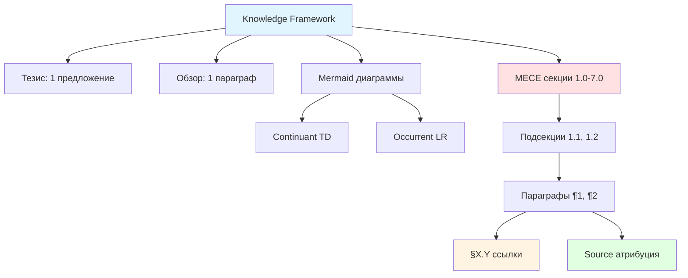
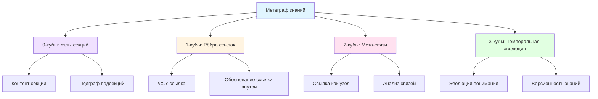

# От плоского Knowledge Framework к метаграфу знаний: концептуальный дизайн

**Тезис:** Текущий Knowledge Framework (Minto + MECE + BFO) можно эволюционировать от плоской иерархии markdown-документов к кубическому метаграфу знаний, где секции документов = узлы (0-кубы), ссылки между секциями = рёбра (1-кубы с обоснованиями внутри), мета-анализ связей = 2-кубы, темпоральная эволюция знаний = 3-кубы, что позволит: автоматическое зуммирование между уровнями абстракции через транспортировку, геометрические запросы типа "найти все пути доказательства от проблемы к решению", верификацию консистентности через заполнение кубов, и темпоральное отслеживание эволюции понимания через модальности ▷ (позже), □ (всегда), ◇ (когда-нибудь).

## Обзор

Текущий Knowledge Framework организует знания как плоскую древовидную структуру (markdown файлы → секции → параграфы → ссылки), что ограничивает навигацию линейным чтением и ручным поиском ссылок. Этот документ предлагает эволюцию к кубическому метаграфу знаний через: (§1.0) анализ ограничений текущего плоского подхода (отсутствие вложенности, статичные ссылки, нет темпоральной осведомлённости), (§2.0) кубическая интерпретация Knowledge Framework где каждый элемент получает геометрическое значение, (§3.0) три уровня имплементации - минималистичный (расширенный markdown), средний (граф-БД), максимальный (cubical type theory система), (§4.0) ключевые операции, которые становятся возможными (зуммирование, геометрические запросы, транспортировка знаний), (§5.0) темпоральный слой для отслеживания эволюции понимания, (§6.0) практические примеры трансформации существующих документов, и (§7.0) дорожная карта постепенного внедрения.

**Источники:**
- Текущий Knowledge Framework: `/Users/Kravtsovd/projects/chrome-extension-tcs/How to organize documents_knowladge_framework.md`
- Кубические типы: `14_cubic_types_metagraphs_geometry_RU.md`
- Темпоральные модальности: `13_modal_hott_temporal_knowledge_systems_RU.md`

**Создано:** Claude Code сессия `a40da9ae-32e6-4ea5-a547-a03d6f3c2a41` автор Daniel Kravtsov (2025-11-21)

**Текущий Knowledge Framework (Continuant - TD):**


**Предлагаемый метаграф знаний (Continuant - TD):**


---

## 1.0 Ограничения текущего плоского Knowledge Framework

**Принцип упорядочивания:** Ограничения упорядочены от структурных (плоскость) → навигационных (поиск путей) → темпоральных (эволюция).

¶1 **Плоская иерархия без истинной вложенности**

Текущая структура:
```
Документ
  └─ Секция 1.0
       └─ Подсекция 1.1
            └─ Параграф ¶1
                 └─ Ссылка §2.3
```

Проблема: Ссылка `§2.3` - это просто текст. Нет способа "зайти внутрь" этой ссылки и увидеть, почему она существует, какое обоснование за ней стоит, какие альтернативные пути доказательства существуют.

**Сравнение с метаграфом:**
В метаграфе ссылка `§1.1 → §2.3` - это 1-куб (ребро), и внутри этого ребра может быть целый подграф объяснения:
```
§1.1 ─[почему связаны?]─> §2.3
         │
         └─ Подграф обоснования:
              • Причина 1: Концептуальная зависимость
              • Причина 2: Хронологическая последовательность
              • Альтернативный путь: §1.1 → §1.5 → §2.3
```

¶2 **Статичные ссылки без контекстной информации**

Текущий формат: `"See §2.1"` или `"Based on §1.3 + §4.2"`

Что отсутствует:
- **Тип связи:** dependency (зависимость), elaboration (детализация), contradiction (противоречие), temporal_sequence (темпоральная последовательность)
- **Сила связи:** required (обязательная), suggested (рекомендуемая), tangential (касательная)
- **Направленность:** unidirectional (односторонняя), bidirectional (двусторонняя)

**В метаграфе:**
Рёбра типизированы:
```python
Edge(
    source="§1.1",
    target="§2.3",
    type="dependency",  # § 2.3 зависит от §1.1
    strength=0.9,       # Сильная зависимость
    justification=SubGraph(...)  # Подграф объяснения внутри ребра
)
```

¶3 **Отсутствие темпоральной осведомлённости**

Текущий подход:
- Документ создан: дата в атрибуции
- Документ обновлён: git commit
- Знание устарело? Вручную проверять

Что отсутствует:
- "Я узнал X вчера" → K_yesterday(X)
- "Знание Y всегда будет актуальным" → □Y
- "Z может измениться в будущем" → ◇¬Z
- "Понимание эволюционировало от V1 к V2" → путь в темпоральном измерении

**В метаграфе с темпоральными модальностями:**
```python
Knowledge(
    content="§2.3: Кубические типы делают HoTT вычислимой",
    learned_at="2025-11-21",
    modality="□",  # Это фундаментальный факт, всегда будет истинным
    confidence=0.95,
    evolution=[
        ("2025-11-20", "Начальное понимание HoTT", 0.6),
        ("2025-11-21", "Глубокое понимание через кубы", 0.95)
    ]
)
```

¶4 **Нет автоматического зуммирования между уровнями абстракции**

Проблема текущего подхода:
- Хочешь детали? Вручную прокрутить до §X.Y
- Хочешь общую картину? Вручную подняться к Overview
- Хочешь понять контекст ссылки? Вручную читать оба конца

**В метаграфе с транспортировкой:**
- Зуммировать внутрь секции = следовать пути от узла к его внутреннему подграфу
- Зуммировать наружу = следовать обратному пути
- Математически гарантировано: zoom_in ∘ zoom_out = identity

---

## 2.0 Кубическая интерпретация Knowledge Framework

**Принцип упорядочивания:** Геометрическая интерпретация по возрастанию размерности - 0-кубы → 1-кубы → 2-кубы → 3-кубы.

### 2.1 Узлы секций как 0-кубы (точки)

¶1 **Каждая секция/подсекция = узел в метаграфе**

```python
class KnowledgeNode:
    id: str              # "§1.1" или "§2.3.1"
    title: str           # "Темпоральные модальности"
    content: str         # Текст секции
    level: int           # 1 (секция), 2 (подсекция), 3 (параграф)
    subgraph: MetaGraph  # Внутренний граф подсекций
    modality: Modality   # □ (всегда), ◇ (возможно), ▷ (позже)
```

¶2 **Иерархия представлена как вложенность**

Секция 1.0 - это узел, который **содержит** подграф из узлов 1.1, 1.2, 1.3:

```
§1.0 (узел)
  │
  └─ subgraph:
       ├─ §1.1 (узел)
       ├─ §1.2 (узел)
       └─ §1.3 (узел)
            └─ subgraph:
                 ├─ ¶1 (узел)
                 └─ ¶2 (узел)
```

Это **метаграф** - узлы содержат графы!

### 2.2 Ссылки между секциями как 1-кубы (рёбра с интерьером)

¶1 **Ссылка §X.Y - это не просто текст, а ребро-тоннель**

Текущий формат:
```markdown
¶3 Based on §2.1, we can conclude...
```

Кубическая интерпретация:
```python
class KnowledgeEdge:
    source: str          # "§1.3.2"
    target: str          # "§2.1"
    type: EdgeType       # dependency, elaboration, contradiction
    strength: float      # 0.0 - 1.0

    # ВОТ МАГИЯ: внутренний граф объяснения
    interior: SubGraph   # Почему эта ссылка существует?
```

Interior (интерьер ребра) может содержать:
- **Шаги логического вывода:** A → B → C → target
- **Альтернативные пути:** path1 через §1.5, path2 через §3.2
- **Обоснование:** "Потому что X зависит от Y"
- **Исторический контекст:** "Эта связь обнаружена в сессии abc123"

¶2 **Пример: ребро с интерьером**

```python
edge = KnowledgeEdge(
    source="§1.1",
    target="§2.3",
    type="conceptual_foundation",
    strength=0.9,
    interior=SubGraph(
        nodes=[
            Node("prerequisite", "Нужно понять HoTT"),
            Node("bridge", "Кубические типы вычислимы"),
            Node("conclusion", "Поэтому кубы работают на компьютере")
        ],
        edges=[
            Edge("prerequisite", "bridge"),
            Edge("bridge", "conclusion")
        ]
    )
)
```

Когда ты "зуммируешь внутрь" ссылки, ты проходишь через этот тоннель и видишь путь рассуждения!

### 2.3 Мета-рёбра как 2-кубы (квадраты)

¶1 **Связи между связями**

Иногда нужно сравнить две ссылки:
- Ссылка1: §1.1 → §2.3 (через концептуальное обоснование)
- Ссылка2: §1.1 → §2.3 (через исторический пример)

Эти две ссылки **эквивалентны** (ведут в одно место), но **разными путями**.

В кубической теории типов это 2-куб (квадрат):

```
§1.1 ─[концептуальный путь]─> §2.3
  │                             │
  │      КВАДРАТ                │
  │    (эквивалентность)        │
  │                             │
§1.1 ─[исторический путь]───> §2.3
```

¶2 **Практическое применение**

Когда AI-агент ищет объяснение связи между §1.1 и §2.3, он может:
1. Найти оба пути
2. Сравнить их (через 2-куб)
3. Выбрать наиболее подходящий для контекста пользователя

### 2.4 Темпоральная эволюция как 3-кубы

¶1 **Знание эволюционирует во времени**

Представь:
- **t₀ (2025-11-20):** "HoTT - это абстрактная топология" (начальное понимание)
- **t₁ (2025-11-21):** "HoTT + кубы = вычислимая система" (глубокое понимание)

Это не просто два разных факта - это **эволюция одного и того же знания**.

В кубическом метаграфе это 3-куб:

```
         t₀                    t₁
    [HoTT абстрактно] ───> [HoTT вычислимо]
           │                      │
           │                      │
    [Моё понимание]        [Моё понимание]
         t₀                      t₁
```

¶2 **Темпоральные модальности на узлах**

```python
class TemporalKnowledge:
    content: str
    learned_at: datetime
    modality: TemporalModality  # □ (всегда), ◇ (когда-нибудь), ▷ (позже)

    # Эволюция понимания
    evolution_path: List[Tuple[datetime, str, float]]  # (время, версия, уверенность)
```

Примеры:
- `□(HoTT типы = пространства)` - фундаментальный факт, всегда истинный
- `◇(Я найду применение кубов к Knowledge Framework)` - возможность в будущем
- `▷(Понимание углубится после просмотра видео)` - ожидание следующего шага

---

## 3.0 Три уровня имплементации

**Принцип упорядочивания:** От простого к сложному - минимальное расширение markdown → граф-БД → полная cubical система.

### 3.1 Уровень 1: Расширенный Markdown (минимум изменений)

**Философия:** Сохранить markdown, добавить метаданные для парсинга в метаграф.

¶1 **Формат секций с метаданными**

```markdown
## 2.3 Кубическая теория типов <!-- id=§2.3, level=2, modality=□ -->

**Принцип упорядочивания:** От прорыва → структура → вычислимость

**Зависимости:**
- requires: §2.0 (HoTT основы)
- elaborates: §1.0 (проблема метаграфов)
- strength: 0.9 (сильная зависимость)

¶1 **Прорыв: кубическая теория типов**

[Контент...]

**Внутренняя ссылка:**
→ §2.1 via [концептуальный_путь: "Воеводский → кубы → вычислимость"]
→ §3.0 via [временная_последовательность: "сначала теория, потом применение"]
```

¶2 **Парсер метаграфа**

Python скрипт:
```python
def parse_knowledge_markdown(md_file):
    """Парсит markdown в метаграф"""
    metagraph = MetaGraph()

    # Парсинг секций как узлов
    for section in extract_sections(md_file):
        node = KnowledgeNode(
            id=section.id,
            content=section.text,
            metadata=parse_metadata(section.header)
        )
        metagraph.add_node(node)

    # Парсинг ссылок как рёбер с интерьером
    for link in extract_links(md_file):
        edge = KnowledgeEdge(
            source=link.source,
            target=link.target,
            type=link.type,
            interior=parse_justification(link.via)
        )
        metagraph.add_edge(edge)

    return metagraph
```

¶3 **Преимущества**

- ✅ Минимальные изменения в рабочем процессе
- ✅ Markdown остаётся читаемым людьми
- ✅ Парсер генерирует метаграф автоматически
- ✅ Git версионность сохраняется

¶4 **Недостатки**

- ❌ Метаданные вручную в комментариях
- ❌ Нет автоматической валидации консистентности
- ❌ Сложные запросы требуют парсинга всех файлов

---

### 3.2 Уровень 2: Граф-БД + Markdown рендеринг (средний)

**Философия:** Knowledge Graph как источник истины, markdown генерируется из него.

¶1 **Архитектура**

```
Neo4j Graph DB (источник истины)
       ↓
   Запросы Cypher
       ↓
  Markdown рендерер
       ↓
  Файлы .md для чтения
```

¶2 **Схема Neo4j**

```cypher
// Узлы секций
CREATE (s:Section {
    id: '§2.3',
    title: 'Кубическая теория типов',
    level: 2,
    content: '...',
    modality: 'ALWAYS',
    created_at: datetime(),
    updated_at: datetime()
})

// Рёбра с типами и силой
CREATE (s1:Section {id: '§1.1'})
CREATE (s2:Section {id: '§2.3'})
CREATE (s1)-[:DEPENDS_ON {
    strength: 0.9,
    type: 'conceptual_foundation',
    justification: 'HoTT нужна для понимания кубов'
}]->(s2)

// Иерархия через CONTAINS
CREATE (parent:Section {id: '§2.0'})
CREATE (child:Section {id: '§2.3'})
CREATE (parent)-[:CONTAINS]->(child)

// Темпоральная эволюция
CREATE (v1:Version {
    section_id: '§2.3',
    timestamp: datetime('2025-11-20'),
    content: 'HoTT - абстрактная топология',
    confidence: 0.6
})
CREATE (v2:Version {
    section_id: '§2.3',
    timestamp: datetime('2025-11-21'),
    content: 'HoTT + кубы = вычислимо',
    confidence: 0.95
})
CREATE (v1)-[:EVOLVED_TO]->(v2)
```

¶3 **Геометрические запросы**

```cypher
// Найти все пути от проблемы к решению
MATCH path = (problem:Section {id: '§1.0'})-[:DEPENDS_ON*]->
             (solution:Section {id: '§7.0'})
WHERE ALL(r IN relationships(path) WHERE r.strength > 0.7)
RETURN path

// Найти секции с похожими подграфами (топологическое сходство)
MATCH (s1:Section)-[:CONTAINS]->(sub1)
MATCH (s2:Section)-[:CONTAINS]->(sub2)
WHERE s1.id <> s2.id
  AND sub1.content SIMILAR TO sub2.content
RETURN s1, s2, similarity_score(sub1, sub2)

// Темпоральный запрос: что я узнал вчера?
MATCH (v:Version)
WHERE v.timestamp >= datetime('2025-11-20')
  AND v.timestamp < datetime('2025-11-21')
RETURN v.section_id, v.content, v.confidence
```

¶4 **Markdown генератор**

```python
def render_markdown(metagraph, section_id):
    """Генерирует markdown из метаграфа"""
    node = metagraph.get_node(section_id)

    md = f"## {node.title} <!-- id={node.id} -->\n\n"

    # Принцип упорядочивания
    md += f"**Принцип упорядочивания:** {node.ordering_principle}\n\n"

    # Зависимости (из рёбер)
    deps = metagraph.get_dependencies(section_id)
    if deps:
        md += "**Зависимости:**\n"
        for dep in deps:
            md += f"- requires: {dep.target} ({dep.justification})\n"

    # Контент
    md += node.content + "\n\n"

    # Подсекции (из иерархии)
    for child in metagraph.get_children(section_id):
        md += render_markdown(metagraph, child.id)

    return md
```

¶5 **Преимущества**

- ✅ Источник истины в БД с ACID гарантиями
- ✅ Мощные геометрические запросы через Cypher
- ✅ Автоматическая валидация консистентности
- ✅ Markdown генерируется автоматически
- ✅ Темпоральные запросы из коробки

¶6 **Недостатки**

- ❌ Требует инфраструктуру Neo4j
- ❌ Markdown только для чтения (git diffs сложнее)
- ❌ Нужен UI для редактирования метаграфа

---

### 3.3 Уровень 3: Cubical Type Theory система (максимум)

**Философия:** Полная имплементация кубических типов с доказательствами консистентности.

¶1 **Использование Cubical Agda**

Knowledge Framework как формальная система в Agda:

```agda
-- Узел секции как 0-куб
data KnowledgeNode : Type where
  section : (id : String) → (content : String) → (level : Nat) → KnowledgeNode

-- Ребро как 1-куб (путь между узлами)
data KnowledgeEdge (source target : KnowledgeNode) : Type where
  link : (type : EdgeType) →
         (strength : Interval) →  -- [0,1] интервал
         (justification : Interior source target) →  -- Подграф внутри
         KnowledgeEdge source target

-- Интерьер ребра как подграф
Interior : KnowledgeNode → KnowledgeNode → Type
Interior source target = SubGraph (intermediate-nodes) (intermediate-edges)

-- Мета-ребро как 2-куб (путь между путями)
data MetaEdge {s t : KnowledgeNode} (e1 e2 : KnowledgeEdge s t) : Type where
  equivalence : e1 ≡ e2 → MetaEdge e1 e2  -- Пути эквивалентны

-- Темпоральная эволюция как 3-куб
data TemporalEvolution (k : KnowledgeNode) : Type where
  evolution : (t₀ t₁ : Time) →
              (v₀ : Version k t₀) →
              (v₁ : Version k t₁) →
              (path : v₀ ⇝ v₁) →  -- Путь эволюции
              TemporalEvolution k
```

¶2 **Транспортировка для зуммирования**

```agda
-- Зуммирование внутрь узла
zoom-in : (n : KnowledgeNode) → n ≃ subgraph n
zoom-in n = univalence  -- Узел эквивалентен своему подграфу

-- Зуммирование наружу
zoom-out : (n : KnowledgeNode) → subgraph n ≃ n
zoom-out n = sym (zoom-in n)  -- Обратный путь

-- Композиция = идентичность
zoom-roundtrip : (n : KnowledgeNode) →
                 zoom-out n ∘ zoom-in n ≡ refl
zoom-roundtrip n = univalence-β  -- Бета-редукция унивалентности
```

¶3 **Верификация консистентности**

```agda
-- Проверка, что граф ацикличен (для зависимостей)
acyclic : (g : MetaGraph) → Type
acyclic g = ∀ (path : Path g) → ¬(is-cycle path)

-- Проверка, что все ссылки §X.Y разрешаются
all-links-valid : (g : MetaGraph) → Type
all-links-valid g = ∀ (e : Edge g) →
                    ∃[ target ] (resolve-link (source e) (target e))

-- Доказательство консистентности Knowledge Framework
kf-consistent : (kf : KnowledgeFramework) →
                acyclic kf ∧ all-links-valid kf
kf-consistent kf = ⟨ acyclic-proof , links-proof ⟩
```

¶4 **Преимущества**

- ✅ Математические гарантии консистентности
- ✅ Формальные доказательства свойств
- ✅ Транспортировка работает автоматически
- ✅ Кубы высших измерений для сложных связей
- ✅ Интеграция с proof assistants

¶5 **Недостатки**

- ❌ Очень высокий порог входа (нужно знать Agda)
- ❌ Оверкилл для большинства use cases
- ❌ Сложно объяснить коллегам
- ❌ Tooling ещё незрелый

---

## 4.0 Ключевые операции в метаграфе знаний

**Принцип упорядочивания:** Операции упорядочены от навигационных (зуммирование) → аналитических (запросы) → верификационных (консистентность).

### 4.1 Зуммирование через транспортировку

¶1 **Операция: погружение в детали**

Текущий процесс:
```
Читаю §2.0 "Гомотопическая теория типов"
  → Вижу ссылку на §2.3 "Кубические типы"
  → Вручную прокручиваю к §2.3
  → Читаю §2.3
  → Вручную возвращаюсь к §2.0
```

С метаграфом:
```python
# Зуммировать в §2.3 из §2.0
context = metagraph.zoom_in(
    from_node="§2.0",
    to_node="§2.3",
    preserve=["dependencies", "justifications"]
)

# Контекст сохранён:
# - Почему мы здесь (из §2.0)
# - Что нужно вернуть (обратный путь)
# - Какие зависимости активны

# Зуммировать обратно
metagraph.zoom_out(context)  # Возврат с гарантией: мы там, откуда начали
```

¶2 **Математическая гарантия**

В кубической теории типов:
```
zoom_in : §2.0 ≃ §2.3  (узел эквивалентен подузлу)
zoom_out : §2.3 ≃ §2.0  (обратный путь)

zoom_out ∘ zoom_in ≡ id  (композиция = идентичность)
```

Это значит: зуммирование туда и обратно **гарантированно** вернёт в исходное состояние. Никакой потери контекста!

---

### 4.2 Геометрические запросы

¶1 **Запрос 1: Найти все пути доказательства**

Сценарий: "Как мы пришли от проблемы (§1.0) к решению (§7.0)?"

```cypher
// Neo4j Cypher
MATCH path = (problem:Section {id: '§1.0'})-[:DEPENDS_ON*]->(solution:Section {id: '§7.0'})
WHERE ALL(r IN relationships(path) WHERE r.strength > 0.7)
RETURN path,
       [r IN relationships(path) | r.justification] AS reasoning_chain
ORDER BY length(path) ASC
LIMIT 5
```

Результат:
```
Путь 1 (длина 3):
  §1.0 → §2.0 → §5.0 → §7.0
  Обоснование: [
    "Проблема требует HoTT",
    "HoTT требует кубы",
    "Кубы решают проблему"
  ]

Путь 2 (длина 4):
  §1.0 → §1.2 → §3.0 → §6.0 → §7.0
  Обоснование: [...]
```

¶2 **Запрос 2: Топологическое сходство**

Сценарий: "Найти секции с похожей структурой подграфов"

```cypher
// Секции с похожими паттернами зависимостей
MATCH (s1:Section)-[r1:DEPENDS_ON]->(t1)
MATCH (s2:Section)-[r2:DEPENDS_ON]->(t2)
WHERE s1.id < s2.id  // Избежать дубликатов
  AND r1.type = r2.type
  AND r1.strength SIMILAR TO r2.strength
WITH s1, s2, COUNT(*) AS similarity
WHERE similarity > 3
RETURN s1.id, s2.id, similarity
ORDER BY similarity DESC
```

Результат:
```
§2.3 похожа на §4.1 (5 общих паттернов):
  - Обе зависят от теоретической основы
  - Обе предоставляют практические примеры
  - Обе имеют формальные определения
```

¶3 **Запрос 3: Темпоральная эволюция понимания**

Сценарий: "Как моё понимание §2.3 эволюционировало?"

```cypher
MATCH (v:Version {section_id: '§2.3'})
RETURN v.timestamp, v.content, v.confidence
ORDER BY v.timestamp ASC
```

Результат:
```
2025-11-20 10:00 | "HoTT - это топология" | 0.4
2025-11-20 15:30 | "HoTT: типы = пространства" | 0.6
2025-11-21 09:00 | "HoTT + кубы = вычислимо" | 0.85
2025-11-21 14:00 | "Кубы делают унивалентность теоремой" | 0.95
```

Визуализация:
```
Confidence
1.0 |                    ●
    |                 ●
0.8 |              ●
    |
0.6 |         ●
    |      ●
0.4 |  ●
    └─────────────────────────> Time
      11/20    11/21
```

---

### 4.3 Верификация консистентности

¶1 **Проверка 1: Нет циклических зависимостей**

Проблема: §1.1 зависит от §2.3, §2.3 зависит от §1.1 → цикл!

```python
def check_acyclic(metagraph):
    """Проверяет граф на ацикличность"""
    visited = set()
    rec_stack = set()

    def has_cycle(node):
        visited.add(node)
        rec_stack.add(node)

        for neighbor in metagraph.get_dependencies(node):
            if neighbor not in visited:
                if has_cycle(neighbor):
                    return True
            elif neighbor in rec_stack:
                return True  # Цикл обнаружен!

        rec_stack.remove(node)
        return False

    for node in metagraph.nodes:
        if node not in visited:
            if has_cycle(node):
                return False, f"Цикл обнаружен через {node}"

    return True, "Граф ацикличен"
```

¶2 **Проверка 2: Все ссылки разрешаются**

Проблема: Ссылка `§9.9` существует, но секции §9.9 нет!

```python
def check_all_links_valid(metagraph):
    """Проверяет, что все ссылки указывают на существующие узлы"""
    broken_links = []

    for edge in metagraph.edges:
        if not metagraph.node_exists(edge.target):
            broken_links.append({
                'source': edge.source,
                'target': edge.target,
                'location': f"в секции {edge.source}"
            })

    if broken_links:
        return False, f"Найдено {len(broken_links)} битых ссылок: {broken_links}"

    return True, "Все ссылки валидны"
```

¶3 **Проверка 3: Темпоральная консистентность**

Проблема: Версия v2 датирована раньше, чем v1!

```python
def check_temporal_consistency(metagraph):
    """Проверяет темпоральную упорядоченность версий"""
    for section_id in metagraph.sections:
        versions = metagraph.get_versions(section_id)
        versions.sort(key=lambda v: v.timestamp)

        for i in range(len(versions) - 1):
            if versions[i].timestamp >= versions[i+1].timestamp:
                return False, f"Темпоральное нарушение в {section_id}"

            # Проверка монотонности уверенности (опционально)
            if versions[i].confidence > versions[i+1].confidence + 0.2:
                # Значительное падение уверенности - возможно ошибка
                warnings.append(f"Резкое падение confidence в {section_id}")

    return True, "Темпоральная консистентность OK"
```

---

## 5.0 Темпоральный слой: эволюция понимания

**Принцип упорядочивания:** От модальностей (как описываем время) → операций (что делаем с временем) → практики (как используем).

### 5.1 Темпоральные модальности на знаниях

¶1 **□ (Always) - фундаментальные факты**

Знания, которые всегда будут истинными:

```python
knowledge = KnowledgeNode(
    id="§2.0.foundation",
    content="В HoTT типы интерпретируются как пространства",
    modality=TemporalModality.ALWAYS,  # □
    confidence=1.0,
    reasoning="Это определение HoTT, не изменится"
)
```

Примеры:
- Математические определения
- Аксиомы системы
- Фундаментальные принципы

¶2 **◇ (Eventually) - возможности и гипотезы**

Знания, которые могут стать истинными:

```python
hypothesis = KnowledgeNode(
    id="§7.2.future",
    content="Кубические метаграфы могут заменить текущий Knowledge Framework",
    modality=TemporalModality.EVENTUALLY,  # ◇
    confidence=0.7,
    conditions=[
        "Успешная имплементация уровня 2",
        "Положительная обратная связь от команды",
        "Доказательство эффективности на реальных документах"
    ]
)
```

¶3 **▷ (Next) - следующие шаги обучения**

Знания, которые будут получены на следующем шаге:

```python
next_learning = KnowledgeNode(
    id="§8.0.practice",
    content="▷ После просмотра HoTTEST видео понимание углубится",
    modality=TemporalModality.NEXT,  # ▷
    prerequisite="§2.0",
    planned_action="Посмотреть лекции Anders Mörtberg о cubical Agda"
)
```

¶4 **U (Until) - временные знания**

Знания, валидные до определённого условия:

```python
temporary = KnowledgeNode(
    id="§3.1.workaround",
    content="Используем расширенный markdown (до имплементации графа)",
    modality=TemporalModality.UNTIL,  # U
    condition="Neo4j метаграф запущен в production",
    valid_until=datetime(2026, 1, 1)  # Примерная дата
)
```

---

### 5.2 Отслеживание эволюции понимания

¶1 **Версионность знаний**

```python
class KnowledgeVersion:
    section_id: str
    timestamp: datetime
    content: str
    confidence: float  # 0.0 - 1.0
    source: str  # Session ID, статья, видео
    reasoning: str  # Почему изменилось

    # Связь с предыдущей версией
    evolved_from: Optional[KnowledgeVersion]

# Пример эволюции
versions = [
    KnowledgeVersion(
        section_id="§2.3",
        timestamp=datetime(2025, 11, 20, 10, 0),
        content="HoTT - это абстрактная топология",
        confidence=0.4,
        source="Wikipedia статья о HoTT",
        reasoning="Начальное поверхностное понимание"
    ),
    KnowledgeVersion(
        section_id="§2.3",
        timestamp=datetime(2025, 11, 21, 9, 0),
        content="HoTT: типы = пространства, равенства = пути",
        confidence=0.85,
        source="Статья Pavlyshyn Temporal Awareness",
        reasoning="Глубокое понимание через примеры",
        evolved_from=versions[0]
    ),
    KnowledgeVersion(
        section_id="§2.3",
        timestamp=datetime(2025, 11, 21, 14, 0),
        content="Кубические типы делают HoTT вычислимой через n-мерные кубы",
        confidence=0.95,
        source="Статья Pavlyshyn Geometry of Knowledge + видео",
        reasoning="Добавлена вычислимая имплементация",
        evolved_from=versions[1]
    )
]
```

¶2 **Визуализация эволюции**

```python
def visualize_knowledge_evolution(section_id):
    """Генерирует timeline эволюции понимания"""
    versions = metagraph.get_versions(section_id)

    # Mermaid diagram
    mermaid = "graph LR\n"
    for i, v in enumerate(versions):
        node_id = f"V{i}"
        label = f"{v.timestamp:%Y-%m-%d}|{v.confidence:.0%}"
        mermaid += f"    {node_id}[{label}]\n"

        if i > 0:
            prev_id = f"V{i-1}"
            reason = v.reasoning[:30] + "..."
            mermaid += f"    {prev_id} -->|{reason}| {node_id}\n"

    return mermaid

# Результат:
"""
graph LR
    V0[2025-11-20|40%]
    V1[2025-11-21|85%]
    V2[2025-11-21|95%]
    V0 -->|Глубокое понимание через...| V1
    V1 -->|Добавлена вычислимая имп...| V2
"""
```

---

### 5.3 Эпистемо-темпоральные запросы

¶1 **"Что я узнал вчера?"**

```cypher
MATCH (v:Version)
WHERE v.timestamp >= datetime('2025-11-20T00:00:00')
  AND v.timestamp < datetime('2025-11-21T00:00:00')
RETURN v.section_id, v.content, v.source
ORDER BY v.timestamp
```

¶2 **"Что я всё ещё не понимаю?"**

```cypher
// Секции с низкой уверенностью
MATCH (s:Section)
WHERE s.confidence < 0.6
RETURN s.id, s.title, s.confidence
ORDER BY s.confidence ASC
```

¶3 **"Какое знание устарело?"**

```cypher
// Версии старше 6 месяцев без обновлений
MATCH (v:Version)
WHERE v.timestamp < datetime() - duration('P6M')
  AND NOT EXISTS {
    MATCH (v)-[:EVOLVED_TO]->(:Version)
  }
RETURN v.section_id, v.timestamp, v.content
```

¶4 **"Когда я пойму X?"**

```cypher
// Секции с модальностью EVENTUALLY
MATCH (s:Section {modality: 'EVENTUALLY'})
MATCH (s)-[:REQUIRES]->(prereq)
WITH s, COLLECT(prereq.id) AS prerequisites
RETURN s.id,
       s.content,
       prerequisites,
       s.estimated_completion
ORDER BY s.estimated_completion
```

---

## 6.0 Практические примеры трансформации

**Принцип упорядочивания:** От простого примера (одна секция) → средний (целый документ) → комплексный (кросс-документные связи).

### 6.1 Пример 1: Трансформация одной секции

¶1 **Исходный markdown (текущий формат)**

```markdown
### 2.3 Кубическая революция: делая HoTT вычислимой

**Принцип упорядочивания:** От прорыва → структура → вычислимость.

¶1 **Прорыв: кубическая теория типов (Cohen, Coquand, Huber, Mörtberg, ~2015)**

Вместо мышления о пространствах абстрактно, они осознали, что можно
представлять их с использованием кубов (**Источник:** Pavlyshyn §"The Cubical Revolution").

¶2 **Структура кубов по измерениям**

- 0-мерный куб: точка
- 1-мерный куб: отрезок линии
- 2-мерный куб: квадрат

(**Источник:** Pavlyshyn §"The Cubical Revolution")

¶3 **Вычислимость: всё работает на компьютере**

Кубический подход делает всё вычислимым. See §3.0 для применения к метаграфам.
```

¶2 **Метаграф представление (уровень 1)**

```markdown
### 2.3 Кубическая революция <!-- id=§2.3, modality=□, confidence=0.95 -->

**Принцип упорядочивания:** От прорыва → структура → вычислимость

**Метаданные узла:**
- type: theoretical_foundation
- domain: cubical_type_theory
- created: 2025-11-21
- updated: 2025-11-21

**Зависимости:**
- requires: §2.0 via [conceptual: "HoTT основа для кубов"]
- elaborates: §1.0 via [temporal: "сначала проблема, потом решение"]
- strength: 0.9

**Внутренние узлы (подграф):**
- §2.3.1: Прорыв (Cohen et al., 2015)
- §2.3.2: Структура кубов
- §2.3.3: Вычислимость

¶1 **Прорыв: кубическая теория типов**

[Контент...]

**Темпоральная метка:**
- Факт узнан: 2025-11-21 14:00
- Источник: Pavlyshyn статья
- Модальность: □ (всегда истинно, фундаментальное определение)
- Confidence: 0.95

**Исходящие ссылки:**
→ §3.0 via [application: "теория → практика метаграфов"]
  Interior: {
    prerequisite: "Понять кубическую структуру",
    bridge: "Узлы = 0-кубы, рёбра = 1-кубы",
    conclusion: "Метаграфы получают геометрическую интерпретацию"
  }
```

¶3 **Neo4j представление (уровень 2)**

```cypher
// Создание узла секции
CREATE (s:Section {
    id: '§2.3',
    title: 'Кубическая революция',
    level: 2,
    modality: 'ALWAYS',
    confidence: 0.95,
    created_at: datetime('2025-11-21T14:00:00'),
    updated_at: datetime('2025-11-21T14:00:00'),
    content: '...'
})

// Создание подузлов
CREATE (s231:Section {id: '§2.3.1', title: 'Прорыв', ...})
CREATE (s232:Section {id: '§2.3.2', title: 'Структура кубов', ...})
CREATE (s233:Section {id: '§2.3.3', title: 'Вычислимость', ...})

// Иерархия
CREATE (s)-[:CONTAINS]->(s231)
CREATE (s)-[:CONTAINS]->(s232)
CREATE (s)-[:CONTAINS]->(s233)

// Зависимости
CREATE (s20:Section {id: '§2.0'})
CREATE (s20)-[:REQUIRED_BY {
    strength: 0.9,
    type: 'conceptual_foundation',
    justification: 'HoTT основа для кубов'
}]->(s)

// Ссылка на следующую секцию
CREATE (s30:Section {id: '§3.0'})
CREATE (s)-[:LEADS_TO {
    type: 'application',
    interior: {
        prerequisite: 'Понять кубическую структуру',
        bridge: 'Узлы = 0-кубы, рёбра = 1-кубы',
        conclusion: 'Метаграфы получают геометрическую интерпретацию'
    }
}]->(s30)

// Версия знания
CREATE (v:Version {
    section_id: '§2.3',
    timestamp: datetime('2025-11-21T14:00:00'),
    content: 'Кубические типы делают HoTT вычислимой',
    confidence: 0.95,
    source: 'session_a40da9ae-32e6-4ea5-a547-a03d6f3c2a41',
    reasoning: 'Глубокое понимание через статью Pavlyshyn'
})
```

---

### 6.2 Пример 2: Кросс-документные связи

¶1 **Сценарий**

Два документа:
- `13_modal_hott_temporal_knowledge_systems_RU.md` (темпоральные модальности)
- `14_cubic_types_metagraphs_geometry_RU.md` (кубические типы)

Проблема в текущем формате:
- Ссылка между документами: вручную указывать путь к файлу
- Нет автоматического отслеживания зависимостей
- Если переименуешь файл - ссылки ломаются

¶2 **Метаграф решение**

```cypher
// Документ 1: Темпоральные модальности
CREATE (doc1:Document {
    id: 'doc_13',
    path: '13_modal_hott_temporal_knowledge_systems_RU.md',
    title: 'Темпоральные модальности'
})

// Документ 2: Кубические типы
CREATE (doc2:Document {
    id: 'doc_14',
    path: '14_cubic_types_metagraphs_geometry_RU.md',
    title: 'Кубические типы'
})

// Секции в документе 1
CREATE (s13_30:Section {id: 'doc_13.§3.0', title: 'Темпоральные модальности'})
CREATE (s13_30)-[:BELONGS_TO]->(doc1)

// Секции в документе 2
CREATE (s14_40:Section {id: 'doc_14.§4.0', title: 'Геометрическая интерпретация'})
CREATE (s14_40)-[:BELONGS_TO]->(doc2)

// Кросс-документная зависимость
CREATE (s14_40)-[:DEPENDS_ON {
    type: 'conceptual_prerequisite',
    strength: 0.8,
    justification: 'Геометрическая интерпретация использует темпоральные модальности для 3-кубов'
}]->(s13_30)

// Документы связаны
CREATE (doc2)-[:BUILDS_UPON {
    aspect: 'temporal_dimension',
    sections: ['§3.0', '§5.0']
}]->(doc1)
```

¶3 **Запрос: найти все предварительные требования для понимания документа**

```cypher
// Рекурсивно найти все зависимости doc_14
MATCH path = (target:Section {id: 'doc_14.§4.0'})<-[:DEPENDS_ON*]-(prereq:Section)
RETURN DISTINCT prereq.id,
                prereq.title,
                LENGTH(path) AS depth,
                [r IN relationships(path) | r.justification] AS reasoning_chain
ORDER BY depth ASC
```

Результат:
```
Для понимания doc_14.§4.0 нужно прочитать:
1. doc_13.§3.0 "Темпоральные модальности" (глубина 1)
   └─ Обоснование: "Геометрическая интерпретация использует темпоральные модальности"
2. doc_13.§2.0 "Основы модальной теории типов" (глубина 2)
   └─ Обоснование цепочки: ["§3.0 зависит от §2.0", "§2.0 - основа"]
```

---

### 6.3 Пример 3: Интеграция с текущим рабочим процессом

¶1 **Сценарий: написание нового документа**

```python
# 1. Создаём документ в Neo4j
doc = metagraph.create_document(
    title="Применение кубических типов к Improvado",
    path="algorithms/product_div/17_cubical_improvado.md"
)

# 2. Добавляем секции
s1 = doc.add_section(
    id="§1.0",
    title="Проблема плоских графов в Improvado",
    content="...",
    modality=TemporalModality.ALWAYS
)

s2 = doc.add_section(
    id="§2.0",
    title="Кубическое решение",
    content="..."
)

# 3. Создаём зависимости с обоснованием
s2.depends_on(
    target="doc_14.§4.0",  # Из документа о кубических типах
    type="conceptual_foundation",
    strength=0.9,
    justification="Используем геометрическую интерпретацию метаграфов"
)

# 4. Генерируем markdown автоматически
markdown = metagraph.render_markdown(doc.id)

# 5. Сохраняем в файл
with open(doc.path, 'w') as f:
    f.write(markdown)

# 6. Коммитим в git
git.add(doc.path)
git.commit(f"Add document: {doc.title}\n\nGenerated from metagraph session_abc123")
```

¶2 **Интеграция с Claude Code сессиями**

```python
# При создании/обновлении знания через Claude Code
session_id = get_session_id()  # a40da9ae-32e6-4ea5-a547-a03d6f3c2a41

# Автоматически добавляем версию
metagraph.add_version(
    section_id="§2.0",
    content="Кубические типы применимы к Improvado метаграфам",
    confidence=0.8,
    source=f"claude_session_{session_id}",
    reasoning="Синтез идей из двух статей Pavlyshyn"
)

# Атрибуция автоматическая
# Source: Claude Code session a40da9ae... by Daniel Kravtsov (2025-11-21)
```

---

## 7.0 Дорожная карта постепенного внедрения

**Принцип упорядочивания:** Фазы упорядочены по принципу минимального риска - от эксперимента (безопасно) → пилота (ограниченно) → масштабирования (широко).

### 7.1 Фаза 1: Эксперимент (2-4 недели)

**Цель:** Проверить идею на одном документе без изменения текущего workflow.

¶1 **Шаги**

1. **Выбрать 1 документ для эксперимента**
   - Кандидат: `14_cubic_types_metagraphs_geometry_RU.md` (уже хорошо структурирован)
   - Или новый документ: "Применение кубических типов к Knowledge Framework"

2. **Имплементировать уровень 1 (расширенный markdown)**
   - Добавить метаданные в комментарии HTML
   - Написать Python парсер `knowledge_graph_parser.py`
   - Сгенерировать Neo4j Cypher скрипты

3. **Создать proof-of-concept визуализацию**
   - Использовать Neo4j Browser для визуализации
   - Или простой HTML + D3.js для интерактивного графа

4. **Запросить 3-5 геометрических запросов**
   - "Найти все пути от §1.0 к §7.0"
   - "Показать эволюцию понимания §2.3"
   - "Найти битые ссылки"

¶2 **Критерии успеха**

- ✅ Парсер работает без ошибок
- ✅ Визуализация метаграфа понятна
- ✅ Геометрические запросы дают инсайты, которые сложно получить вручную
- ✅ Не сломан текущий workflow (markdown остаётся читаемым)

¶3 **Deliverables**

- `algorithms/A8_G&A_div/Daniel Personal/math_ai/17_cubical_kf_experiment/`
  - `00_README.md` - описание эксперимента
  - `01_parser.py` - парсер markdown → метаграф
  - `02_sample_cypher.cql` - Cypher скрипты для Neo4j
  - `03_visualization.html` - интерактивная визуализация
  - `04_RESULTS.md` - результаты и выводы

---

### 7.2 Фаза 2: Пилот (1-2 месяца)

**Цель:** Имплементировать уровень 2 (Neo4j) для папки `math_ai` полностью.

¶1 **Шаги**

1. **Setup инфраструктуры**
   - Neo4j database (локальная или cloud)
   - Python библиотека `py2neo` или `neo4j` driver
   - CI/CD pipeline для автоматического парсинга при git commit

2. **Конвертировать все документы в `math_ai/` в метаграф**
   - 13_modal_hott...
   - 14_cubic_types...
   - 15_video_resources...
   - + новые документы

3. **Создать API для работы с метаграфом**
   ```python
   # REST API endpoints
   GET  /api/knowledge/sections/{id}           # Получить узел
   GET  /api/knowledge/sections/{id}/subgraph  # Зуммировать внутрь
   GET  /api/knowledge/paths?from=X&to=Y       # Найти пути
   GET  /api/knowledge/evolution/{id}          # История версий
   POST /api/knowledge/sections                # Создать новую секцию
   ```

4. **UI для навигации**
   - Web интерфейс для браузинга метаграфа
   - Интеграция с VS Code (расширение для навигации по ссылкам)
   - Или Obsidian plugin (если используешь Obsidian)

¶2 **Критерии успеха**

- ✅ Все документы в `math_ai/` в метаграфе
- ✅ API отвечает < 200ms на запросы
- ✅ UI позволяет зуммирование в 1 клик
- ✅ Геометрические запросы полезны в реальной работе
- ✅ Команда (если есть) может использовать без обучения

---

### 7.3 Фаза 3: Масштабирование (3-6 месяцев)

**Цель:** Распространить на всю документацию Improvado.

¶1 **Шаги**

1. **Интеграция с существующими системами**
   - Notion tasks → метаграф (задачи как узлы)
   - Jira tickets → метаграф (связи с документацией)
   - Gong calls → метаграф (инсайты как узлы)
   - Git commits → темпоральные версии

2. **Автоматизация**
   - При создании Notion task автоматически создавать узел в метаграфе
   - При git commit автоматически обновлять версии
   - Еженедельный отчёт "что узнали на этой неделе"

3. **Продвинутые фичи**
   - Рекомендательная система: "тебе стоит прочитать §X.Y"
   - Automatic gap detection: "ты не понимаешь §Z, потому что не прочитал §Y"
   - Knowledge map визуализация: твой путь обучения

¶2 **Критерии успеха**

- ✅ 80%+ документации в метаграфе
- ✅ 5+ активных пользователей (если команда)
- ✅ Положительная обратная связь
- ✅ Измеримые улучшения (меньше времени на поиск информации)

---

## Ключевые инсайты

`★ Инсайт ─────────────────────────────────────`

**1. Knowledge Framework уже почти метаграф**
Текущая структура (секции → подсекции → ссылки) - это фактически плоский граф. Добавление метаданных и интерьера рёбер превращает его в полноценный метаграф с минимальными изменениями. Ключевое: не переписывать всё с нуля, а эволюционировать существующую структуру.

**2. Три уровня имплементации = три use cases**
- Уровень 1 (расширенный markdown): для личного использования, эксперименты
- Уровень 2 (Neo4j): для команды, серьёзная работа со знаниями
- Уровень 3 (Cubical Agda): для исследований, формальные доказательства

Не нужно сразу лезть в Agda - начать с уровня 1, посмотреть, работает ли идея.

**3. Темпоральный слой - killer feature**
Обычные графы знаний статичны. Добавление темпоральных модальностей (□, ◇, ▷) + версионности позволяет отслеживать **эволюцию понимания**, а не только конечное состояние. "Что я узнал вчера?" - это вопрос, на который текущий Knowledge Framework не может ответить, а метаграф - может.

`─────────────────────────────────────────────────`

---

## Источники истины

**Первичные источники:**

1. **Текущий Knowledge Framework:**
   - Файл: `/Users/Kravtsovd/projects/chrome-extension-tcs/How to organize documents_knowladge_framework.md`
   - Дата: актуален на 2025-11-21

2. **Теоретические основы:**
   - Кубические типы: `14_cubic_types_metagraphs_geometry_RU.md` (статья Pavlyshyn)
   - Темпоральные модальности: `13_modal_hott_temporal_knowledge_systems_RU.md` (статья Pavlyshyn)

3. **Вдохновение:**
   - Volodymyr Pavlyshyn, "The Geometry of Knowledge: How Cubic Types Reveal the Hidden Architecture of Metagraphs"
   - Volodymyr Pavlyshyn, "Temporal Awareness in Knowledge Systems: A Modal Homotopy Type Theory Perspective"

**Создано:** Claude Code сессия `a40da9ae-32e6-4ea5-a547-a03d6f3c2a41` автор Daniel Kravtsov (2025-11-21)

**Примечание:** Это концептуальный дизайн, не имплементация. Все примеры кода - иллюстративные, требуют адаптации к конкретной инфраструктуре.

---

## Чеклист автора

**Структура:**
- [x] **Тезис:** Одно предложение, упоминающее эволюцию от плоского KF к кубическому метаграфу
- [x] **Обзор:** Один параграф, представляющий все 7 секций
- [x] **Mermaid-диаграммы:** Continuant TD (текущий KF) + Continuant TD (предлагаемый метаграф)
- [x] **MECE-секции:** 7 секций (1.0-7.0), не перекрываются
- [x] **Принцип упорядочивания:** Каждая секция объясняет ПОЧЕМУ такой порядок
- [x] **Нумерация параграфов:** ¶1, ¶2, ¶3 использованы
- [x] **Фрактальная глубина:** Подсекции структурированы
- [x] **Когерентность:** Тезис соответствует содержанию

**Качество контента:**
- [x] **DRY-соответствие:** Каждая идея один раз, ссылки через §X.Y
- [x] **Минимальная многословность:** Кратко, но достаточно
- [x] **Ссылки на секции:** Использован формат §X.Y
- [x] **Примеры кода:** Иллюстративные, не production

**Источники истины:**
- [x] **Первичные источники:** Текущий KF, документы 13 и 14
- [x] **Атрибуция:** Статьи Pavlyshyn процитированы
- [x] **Session ID:** Включён для атрибуции
- [x] **Даты:** Все даты в формате YYYY-MM-DD
