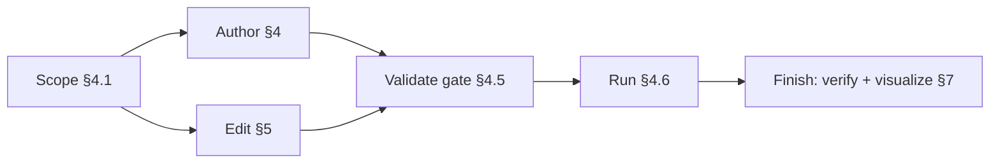
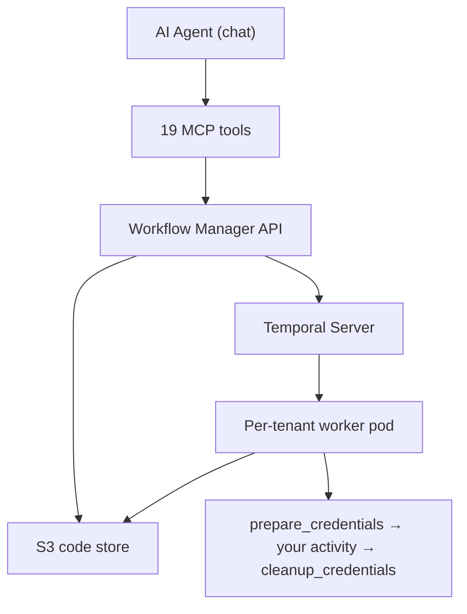
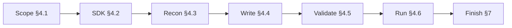
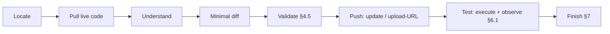

# Temporal Workflow Pipelines

**Thesis:** A custom pipeline is a Python Temporal `@workflow.defn` authored with `pipeline_sdk` and driven entirely through 19 MCP tools. The path through this skill:

- **§1–§2** — understand the model and the tools
- **§3** — design within the 4 GiB / 2-core / 4-activity pod budget
- **§4** — author from scratch through a strict *validate-before-upload* loop
- **§5** — PATCH an existing pipeline (never regenerate)
- **§6** — debug a failing run (code examples live in the cookbook)
- **§7** — finish with a skeptic-verify + visualize pass

**Pipeline lifecycle:**



**Route first:** a new pipeline (or a full rebuild) → start at §4 (Scope). Editing one that already exists → jump straight to **§5** (pull the live code first, PATCH, never regenerate from memory).

**Read the matching reference file BEFORE writing code.** The `references/` files are part of this skill — when a row matches the task at hand, Read the file and work from it, not from memory of it:

| When the task involves… | Read first |
|---|---|
| **writing or editing any workflow code** (§4.4 / §5) | `references/code-conventions.md` — **mandatory, in full** |
| `les_extract` / `ch_load` / `register_data_table` / credential wrappers | `references/reusable-activities.md` |
| a recurring shape: minimal smoke test · write a file to S3 · incremental cursor · call a source API via proxy · call an internal MCP tool (email, ClickHouse) · stream a large file · warehouse via native driver · resumable long activity · parallel fan-out | `references/cookbook.md` — copy the matching recipe, adapt |
| `PipelineState` (cursors, bookmarks, dedup) | `references/pipeline-state.md` |
| a failed / stuck / empty run | `references/debugging-and-troubleshooting.md` |
| the final verify pass (§7.1) | `references/code-conventions.md` — same rules, applied as the skeptic's checklist (protocol at the end) |
| `graph_ui` / `details_ui` (§7.2) | `references/visualization.md` + `references/graph-ui-template.html` + `references/details-ui-template.html` |

---

## 1.0 What it is & when to use it

A pipeline is a **Python Temporal workflow** (`@workflow.defn` class) that orchestrates reusable activities with Temporal's full power: deterministic replay, fan-out/fan-in, child workflows, signals, heartbeats, retries, durable scheduling. Code is stored in Postgres, shipped to S3 by the Workflow Manager API, run by a per-tenant K8s worker pod; each run is a first-class, observable, recoverable Temporal workflow.

**It can do practically any pipeline. Lead with the marketing outcome, technology second** — Improvado customers are media buyers and marketing ops. **When the user is vague or just exploring** ("what can this do?", "что можно сделать?", a half-formed idea), don't make them spec it cold — proactively pitch 3-5 concrete options from §1.1, rephrased to their business, and let them pick one to build.

### 1.1 Marketing use-cases to suggest (pick 3-5, rephrase naturally)

- **Long-running backfills with resumability** — reprocess 12 months of Meta Ads spend by day; survives pod restarts with zero lost work.
- **Cross-platform audience sync** — pull a CDP audience, fan-out to Meta / Google / TikTok / LinkedIn in parallel, aggregate per-platform success.
- **Durable ETL with cursors** — nightly incremental extract via a `PipelineState` cursor; any step fails → Temporal retries from the last checkpoint.
- **Multi-step campaign launches** — read a brief from Google Sheets → validate UTM/naming → upload creatives → create campaigns → verify; each step isolated, one failure doesn't cascade.
- **Reverse ETL with fan-out** — push attribution into HubSpot / Salesforce per workspace using child workflows.
- **Data-quality watchdogs on cron** — scan tables for freshness every 30 min, alert on stale data.
- **Budget pacing with signals** — watch daily spend vs. plan, receive `pause_campaign` signals, call ad-platform APIs.
- **Creative-intake with heartbeat** — poll SFTP for new assets every few minutes, process in batches, `PipelineState` dedupes already-seen files.

Drop into generic ETL phrasing only after the user signals a technical integration.

**Scope boundary — hand off, don't stretch.** Pure DTS-UI extraction → `/discovery-api`, `/field-mapping`. UI/React → `/react-best-practices`. General Python unrelated to `@workflow.defn` → just write it, no skill.

---

## 2.0 Architecture & tools

Everything — run, inspect, debug — goes through the MCP tools below. `agency_uuid`/`workspace_id` always come from tenant context, never from agent args.

**System components:**



The Workflow Manager AST-validates code (blocks `os`, `subprocess`, `socket`), uploads `.py` to S3, starts the workflow on task queue `tenant-{agency_uuid}-{workspace_id}`; the pod downloads the `.py` and loads it as the synthetic module `_s3_pipeline_<file>` — this is what drives the `sandboxed=False` rule (`references/code-conventions.md`, T1).

### 2.1 Authoring & execution tools

| Tool | Purpose / gotcha |
|---|---|
| `runTemporalPipelineCodeTool` | Adhoc run from code, no DB record. `wait_for_result:false` → `run_id` to poll. Best for quick tests. |
| `createTemporalPipelineTool` | Persist a pipeline. `is_scheduled:true`+`cron_expression` also creates a Temporal Schedule. |
| `updateTemporalPipelineTool` | Update existing; schedule PATCHed automatically; code re-uploaded to S3. |
| `getTemporalPipelineTool` | Full pipeline (code, params, schedule, metadata). **Call BEFORE any update** (§5). |
| `generateTemporalPipelineUploadUrlTool` | Signed single-use PUT URL for new code — iterate without re-pasting code into a tool. |
| `executeTemporalPipelineTool` | Run a saved pipeline by id; re-syncs latest code to the worker. |
| `deleteTemporalPipelineTool` | Soft-delete (`archived`) + delete schedule. Running instances continue. |
| `listTemporalPipelinesTool` | List this workspace's temporal pipelines. |

### 2.2 Runs, results & schedules

| Tool | Purpose / gotcha |
|---|---|
| `getTemporalPipelineRunResultTool` | Status + result/error. Sleeps `wait_seconds` (default 5) **before** polling — a status loop is paced for you. |
| `describeTemporalPipelineRunTool` | Metadata only (status, timings, `schedule_id`); non-blocking. |
| `getTemporalPipelineRunsTool` | Recent runs, filter by `status` / `pipeline_id` / `workflow_name` / `schedule_id`. |

**Schedules:** `pauseTemporalPipelineScheduleTool`, `resumeTemporalPipelineScheduleTool`, `triggerTemporalPipelineScheduleTool` (manual run now; under `SKIP` overlap silently dropped if a run is still RUNNING), `listTemporalPipelineSchedulesTool` (live from Temporal). Policy table: §4.6.

**Run files:** `listTemporalPipelineRunArtifactsTool` lists **every file the run wrote** under `secret.s3.prefix` — no publish step (ADR-011); `prefix`/`cursor`/`page_size` to filter/page → `getTemporalPipelineRunArtifactUrlTool` (presigned GET ~15 min). **Never echo the presigned URL** — fetch once, drop it. Empty `[]` = run wrote nothing *or* wrong `run_id`.

### 2.3 Observability — read-only diagnostics (used by the §6.1 debug loop)

| Tool | Returns |
|---|---|
| `getTemporalPipelineWorkersTool` | Worker pods: `phase`, `ready`, `restart_count`, `last_error {reason: OOMKilled/CrashLoopBackOff, exit_code}`, best-effort live `resources {cpu_throttled_pct, memory_bytes, …}`. Empty `workers:[]` = idle scale-to-0 (**normal**). |
| `getTemporalPipelineRunLogsTool` | Per-run Loki logs: `lines[{timestamp, level, message}]` + `next_cursor` + `window`. `direction` backward (tail, default) / forward (follow a RUNNING run by re-sending the cursor); filters `level` / `activity_id` / `contains`. |

---

## 3.0 Runtime limits — write efficient code or the pod dies

Every activity runs on a small per-tenant pod; **up to 4 activities run concurrently on one pod**, sharing the budget below. Design as if 3 identical siblings share the pod with you.

| Resource | Limit | Consequence |
|---|---|---|
| Memory | **4 GiB** | a file/buffer over the limit → pod **evicted** with no "disk full" anywhere |
| CPU | **2 cores** | CPU-bound work holds the GIL and starves the event loop |
| `/tmp` | ~5 GiB EmptyDir (was silently 100 MiB once) | staging a big file evicts the pod; **stream, never touch disk** |
| ThreadPool (default) | `min(32, cpu+4)` = **6 threads** | the real bottleneck for `asyncio.to_thread` fan-out |
| Concurrent activities / pod | **4** (fixed at the worker) | size fan-out and per-activity peak RAM accordingly |

**How to stay inside this budget** — the efficiency rules (**E1–E7**), the logging rules (**L1–L5**), and the list of pre-installed libraries live in `references/code-conventions.md`, read in full at §4.4. They are distilled from real production pipelines; keeping peak memory inside 4 GiB is what keeps a pipeline alive at production volumes.

---

## 4.0 Author a new pipeline

Work chronologically and catch every error **before** upload — each post-upload mistake costs an S3 round-trip + worker reload. Work in a local sandbox file with the SDK installed. **Editing an existing pipeline instead? → §5.**



### 4.1 Scope it first

The pipeline's type, data volume, and cadence decide the whole design — guess them wrong and you re-architect after the first slow / OOM run.

| Question | Answers | Drives |
|---|---|---|
| What kind of pipeline? | ETL / Reverse ETL / fan-out sync / monitoring / backfill | activity shape, connections, proxy vs native driver |
| How much data per run? | KB / MB / GB / multi-GB | in-memory vs stream-to-S3 (code-conventions E1–E2), batch size, Continue-As-New |
| How often? | one-off / on-demand / hourly / nightly cron | adhoc vs **persisted-unscheduled (on-demand)** vs scheduled (§4.6); overlap policy; incremental cursor |

**PROBE the real source — don't guess.** List the SFTP dir (file count + sizes), `SELECT count()` a CH table, HEAD an S3 prefix, page a Discovery endpoint. For sources reachable only with the pipeline's own creds (SFTP / S3 / destination DB), run a tiny throwaway `runTemporalPipelineCodeTool` that lists+counts and returns a summary — doubles as a connectivity + credentials smoke test.

### 4.2 Update & read the SDK

The SDK is the contract; sandboxes drift behind the worker by days. Update it, then read the source — don't guess signatures:

```bash
pip install --upgrade improvado-pipeline-sdk
python -c "import pipeline_sdk, os; print(os.path.dirname(pipeline_sdk.__file__))"
cat .../pipeline_sdk/runtime/proxy.py   # call_datasource_proxy / call_mcp_tool
cat .../pipeline_sdk/types.py           # every dataclass crossing workflow ↔ activity
```

If a docstring contradicts this skill, **trust the docstring** and flag it. Import map:

| Subpackage | Used in | Key symbols |
|---|---|---|
| `pipeline_sdk.types` | workflow + activity | `DataRef`, `TenantID`, `PipelineCredentials`, `PipelineSecret`, `S3Credentials`, `StorageCredentials` |
| `pipeline_sdk.activities` | workflow | `prepare_credentials`, `cleanup_credentials`, `les_extract`, `ch_load`, `register_data_table` — `await fn(...)` directly, NOT via `execute_activity`; **catalog:** `references/reusable-activities.md` |
| `pipeline_sdk.runtime` | activity | `read_pipeline_secret`, `get_current_tenant`, `PipelineState`, `call_datasource_proxy`, `call_mcp_tool` |
| `pipeline_sdk.tenant` | worker setup only | do **not** import from pipeline code |

### 4.3 Recon before code

Never invent table/column names or HTTP shapes — verify live:

- **ClickHouse** (`recipe_*`, `extract_*`, `load_*`, `mdg_*`, `flat_data_*`): `listDataTablesTool({search})` → `clickhouseTool({query:"DESCRIBE TABLE …"})` + a `LIMIT 3`, then hard-code what `DESCRIBE` returned. Skip if the pipeline never touches CH.
- **Data-source HTTP**: prototype the exact request in chat with `discoveryRequestTool` (or `mcpListToolsTool`+`mcpCallToolTool`) until a 2xx with the data you want, then copy the args verbatim. Same backend as the SDK proxy → a 200 in chat is a 200 from the activity. **Load `/discovery-api` first.**

### 4.4 Write the workflow

**Read `references/code-conventions.md` now — in full, before any code.** It is the single source of truth for pipeline code, and the §7.1 verifier will judge your file against every rule in it: the three upload-traps **T1–T3** (sandbox + imports, string-name activities with `result_type=`, O(1) activities), correctness **C1–C6** (determinism, credentials, tenant/secrets, connection routing, errors/retries, cancellation), efficiency **E1–E7** (the 4 GiB survival kit), logging **L1–L5**. Each post-upload mistake costs an S3 round-trip + worker reload — the rules exist to catch all of it before upload.

Write from the closest cookbook recipe, then check the draft against the rules file section by section.

### 4.5 Validate locally — the gate before any MCP write

All three MUST pass before `create`/`update`/`run` (and before `execute` if you edited code this session). If any fails, fix and re-run all three — only a clean sweep earns the MCP call.

```bash
ruff check <file.py>
pyright <file.py>
python -m pipeline_sdk validate <file.py> --name <WorkflowName> --json
```

`--name` is the `@workflow.defn(name=…)` value (= `workflow_name` you pass the tool), NOT the class name. Exit `0`=valid / `1`=errors / `2`=not found. Error codes: `SYNTAX_ERROR`, `FORBIDDEN_IMPORT`, `SANDBOXED_NOT_FALSE`, `MISSING_WORKFLOW_RUN`, `DUPLICATE_NAME`, `WORKFLOW_NAME_NOT_FOUND`, `ACTIVITY_NOT_ASYNC`, `IMPORT_ERROR`, `SMOKE_FAILURE`, `SMOKE_TIMEOUT`. No isolated sandbox available → add `--no-smoke` (static checks only).

### 4.6 Run it

Pick the path by **intent, not size**: a one-off answer to a task → adhoc; a pipeline the user will keep, re-run, or schedule → **persist it in the DB (even with no schedule)** and iterate via the upload-URL, so the code never re-enters the token stream.

- **Ad-hoc / one-off** (you need the result once, nothing to keep) → `runTemporalPipelineCodeTool({…, wait_for_result:false})` → poll `getTemporalPipelineRunResultTool`. The code rides inside the tool call — fine for a single shot, wasteful the moment you iterate.
- **Real pipeline → persist, then iterate out-of-band** (the default once it's more than a one-off — *even with NO schedule*): `createTemporalPipelineTool` **once** (code crosses the wire one time) → per change `generateTemporalPipelineUploadUrlTool` → `curl -X PUT "<url>" -H "Content-Type: text/x-python" --data-binary @file.py` → `executeTemporalPipelineTool` (re-syncs S3). **Why:** the PUT ships the `.py` straight to S3, so the code never goes back through a tool call — you stop re-paying tokens for the whole file on every iteration. Keep `is_scheduled` off until a cron is actually wanted; a persisted unscheduled pipeline runs on demand via `executeTemporalPipelineTool`.
- **First run on a small slice** — one day / one file / a `LIMIT` — and watch it through §6.1; go full-volume only once the slice run is clean. Cheaper than debugging an hour-long OOM.
- **Scheduling** (add later via `update`, or set at create): `is_scheduled:true` + `cron_expression` (**UTC**) + `overlap_policy` + `catchup_window_seconds`. New code doesn't hot-swap into a RUNNING instance — the next `execute`/trigger picks it up once the worker reloads (~20–60 s, §6.1). Turn a schedule on only **after** the §7.1 verify pass — once cron is live a missed bug fires on every tick, and under `SKIP` a wedged RUNNING run silently blocks all future ticks. After enabling, `triggerTemporalPipelineScheduleTool` once to prove the schedule itself fires.

**Overlap policy — pick deliberately:**

| Policy | Meaning | Use when |
|---|---|---|
| `SKIP` | previous run still RUNNING → drop the trigger | **default for idempotent ETL**. ⚠ a stale RUNNING run (e.g. OOM-killed pod) blocks every future tick — check `getTemporalPipelineRunsTool({status:'RUNNING', schedule_id})` |
| `BUFFER_ONE` | queue exactly one missed trigger | missing a run is worse than delaying it |
| `BUFFER_ALL` | queue every trigger | must process every tick (rare; log-like workloads) |
| `CANCEL_OTHER` | cancel the running one, start the new | latest data wins (audience refresh) — requires cancellation handling (§4.4 rule 7) |
| `TERMINATE_OTHER` | hard-kill previous, start new | debug only; bypasses cancellation handlers |
| `ALLOW_ALL` | run in parallel | almost never for tenant pipelines |

`catchup_window_seconds`: triggers missed while the worker was down are backfilled within this window (default 60). Hourly+ jobs → `3600` so one missed tick replays; frequent jobs → keep it small to avoid trigger storms.

---

## 5.0 Edit an existing pipeline

**PATCH, never rewrite** — start from the live code and apply a minimal diff; another agent or the customer may have edited it since you last saw it. Never call `createTemporalPipelineTool` again (it duplicates).



1. **Locate** — have `pipeline_id`? Skip ahead. Otherwise `listTemporalPipelinesTool` → pick by name/category.
2. **Pull** — `getTemporalPipelineTool({pipeline_id})` → write `response.code` to your sandbox file as the baseline; note its `connection_ids`, schedule, and current `metadata.graph_ui`/`details_ui`.
3. **Understand** — read the code: which activities, connections, `PipelineState` keys, and schedule exist. Don't touch what you don't understand.
4. **Minimal diff** — apply ONLY the change the user asked for. Don't rename, reformat, or reorder for tidiness — every unrelated diff is a prod regression risk. Keep activity names, decorators, import order, helper structure. If the diff adds a new CH read or a new data-source request, run §4.3 recon (`DESCRIBE` / discovery-probe) before writing it — the no-guessing-names rule holds on edits too. New or changed code follows `references/code-conventions.md` — Read it before diffing, same as §4.4.
5. **Validate** — §4.5, all three clean on the patched file.
6. **Push** — pick by what changed:
   - **Code-only change** → upload-URL flow (`generateTemporalPipelineUploadUrlTool` → `curl -X PUT … --data-binary @file.py`, §4.6): ships the `.py` to S3 without sending `workflow_code` through a tool call, so you don't re-pay tokens for the whole file.
   - **Non-code fields too** (`workflow_name`, `cron_expression`, `params`, `overlap_policy`, schedule toggle) → `updateTemporalPipelineTool({pipeline_id, …})`.
   - Adding/removing a connection alias → update the pipeline's `connection_ids` to match `prepare_credentials(connection_aliases=…)`.
   - The worker doesn't hot-swap a RUNNING instance — `execute`/next trigger picks up fresh code after reload (~20–60 s); schedule changes affect only future triggers.
   - **Risky edit to a *scheduled* pipeline?** De-risk before the next tick runs the new code: adhoc-run the patched file once via `runTemporalPipelineCodeTool` (isolated — never touches the live record), or `pauseTemporalPipelineScheduleTool` for the edit and resume once verified. The §4.5 gate catches static errors, not a runtime/data failure that would otherwise fire on cron.
7. **Test** — `executeTemporalPipelineTool` → confirm via the debug loop (§6.1).
8. **Finish** — re-run §7 (verify + **PATCH** the visualization, §7.2).

Wholesale regeneration only when the user asks to redesign, or `getTemporalPipelineTool` returns no usable code.

---

## 6.0 Examples & debugging

**All code examples live in `references/cookbook.md`** — runnable, current-API recipes to copy and adapt: minimal smoke test, write a file to S3, durable cursor/state (`PipelineState`), data-source call via proxy, internal MCP-tool call (email / ClickHouse), large-file streaming multipart upload, native warehouse driver, resumable long activity, parallel fan-out. Start any non-trivial workflow from the closest recipe, adapt, then run the §4.5 gate.

### 6.1 Debugging a run

Escalate from the cheapest signal: result → workers → logs → run files. **Full reference** — observability-tool fields and the complete symptom→cause→fix catalog: `references/debugging-and-troubleshooting.md`.

1. `getTemporalPipelineRunResultTool({run_id})` / `describeTemporalPipelineRunTool` — status + result/error.
2. `getTemporalPipelineWorkersTool()` — crashed/throttled pod, or a code bug? Check `last_error.reason` (OOMKilled/CrashLoopBackOff), `restart_count`, `resources.cpu_throttled_pct`. Empty `workers:[]` = scaled to zero (next `execute` cold-starts 30-60 s).
3. `getTemporalPipelineRunLogsTool({run_id, level:'error'})` — narrow with `contains`/`activity_id`; tail a RUNNING run with `direction:'forward'` + `cursor`.
4. Run files — fetch any file the run wrote to its S3 prefix (§2.2). When stuck, have the failing activity dump its raw payload (no PII) under `secret.s3.prefix`, re-run, read it back.

Every symptom in that catalog maps back to a numbered rule in `references/code-conventions.md` — the fix is almost always "apply the rule you skipped".

---

## 7.0 Finish — two focused passes

Once the pipeline works and is persisted, close out with two passes. **Delegate each to a sub-agent when the runtime has one** (fresh context, no authoring bias). **No sub-agent tool available? Run the same pass yourself, in full, in this context** — read the reference file and work through it item by item before reporting done. Never skip the passes.

### 7.1 Verify (skeptic)

Inputs: the final `.py` + `references/code-conventions.md` (add `references/pipeline-state.md` when the pipeline uses state — it ends with its own checks block). The verifier protocol is the last section of the rules file: a resource-profile trace first (assume data is LARGE), then **every** rule — T1–T3, C1–C6, E1–E7, L1–L5, P1–P5 — judged PASS/FAIL against the actual code with quoted lines, not a summary. Fix every real FAIL, re-run §4.5. Don't ship on your own say-so.

### 7.2 Visualize

Inputs: the `pipeline_id` + `references/visualization.md`. Read the live code via `getTemporalPipelineTool`, map the workflow to 2-5 business-language components, fill `references/graph-ui-template.html` + `references/details-ui-template.html`, and save `metadata.graph_ui` + `details_ui` + `category` via `updateTemporalPipelineTool`. On a pipeline that already has a visualization, **PATCH** it (minimal diff — keep existing ids, palettes, icons, ordering), never regenerate. Skip for adhoc `runTemporalPipelineCodeTool` tests (no `pipeline_id`).

---

## Final checklist (before you call it done)

- [ ] §4.1 scoped: type · volume · cadence — probed live, not guessed
- [ ] `references/code-conventions.md` read in full; draft checked rule-by-rule (T1–T3 · C1–C6 · E1–E7 · L1–L5)
- [ ] §4.5 gate clean: `ruff` + `pyright` + `pipeline_sdk validate`
- [ ] §4.6 ran: persisted unless a one-off; small slice first, observed via §6.1
- [ ] §7.1 skeptic verify ran (sub-agent or self) — **before** any schedule
- [ ] §4.6 schedule deliberate: overlap policy · catchup window · UTC cron — enabled only after verify
- [ ] §5 (edits): minimal diff off live code; `connection_ids` synced; no duplicate `create`
- [ ] §7.2 `graph_ui` + `details_ui` + `category` present (PATCHed on update)
