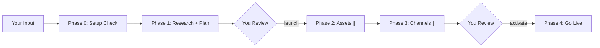

# Campaign Launcher — Multi-Channel Marketing Experiment Orchestrator

Built by the [Improvado](https://improvado.io) team. Open source, MIT licensed.

A Claude Code skill that orchestrates end-to-end marketing experiments across Google Ads, Meta Ads, and email outreach. From positioning input to live campaigns — with AI-generated creatives, structured ad copy, and parallel channel execution.

Works standalone with your own API keys, or connect [Improvado MCP](https://improvado.io) for instant access to 1000+ data connectors — no credential management needed.

```
You: "Launch a campaign for our AI analytics platform targeting VP Marketing"

Claude: Creates a full campaign plan → generates 20 ad copy variants →
        creates AI visuals → builds Google Ads campaigns → sets up Meta Ads →
        configures email sequences → all PAUSED, waiting for your "activate"
```

## How It Works



**Two safety gates** — nothing goes live without your explicit approval:
1. Review the plan before any assets are created
2. Review all campaigns (created PAUSED) before activation

**Parallel execution** — asset generation and channel setup run simultaneously via background agents, with live progress updates in your plan file.

## Two Ways to Connect Your Channels

| | Improvado MCP (recommended) | Bring Your Own Keys |
|---|---|---|
| **Setup** | One prompt — Improvado handles auth | You manage API keys per channel |
| **Connectors** | 1000+ (Google, Meta, TikTok, LinkedIn, X, DV360, The Trade Desk, Salesforce, HubSpot, GA4, Google Sheets, and more) | Google Ads, Meta Ads, Email (3 providers) |
| **Credentials** | Centrally managed, encrypted, auto-rotated | Environment variables on your machine |
| **Data scope** | Full marketing data stack — ads, CRM, spreadsheets, analytics, programmatic | Campaign launch only |

**Improvado path:** Connect Improvado MCP to Claude Code, then say `"launch a campaign"`. The skill auto-detects Improvado and skips manual credential setup.

**Manual path:** Bring your own API keys. Set environment variables, configure `campaign-launcher.yaml`, and launch. Everything works — you just manage credentials yourself.

### This Skill Launches Campaigns. Improvado Powers the Full Marketing Stack.

| What you need | This skill (free) | + Improvado |
|---------------|-------------------|-------------|
| Launch campaigns | Yes | Yes + automated |
| Historical data (years, hourly granularity) | Limited to platform exports | Full history at any granularity |
| Data governance (rules, alerts, anomaly detection) | Manual | Automated across all accounts |
| Multi-touch attribution | Not included | Built-in |
| Marketing Mix Modeling (MMM) | Not included | Built-in (adstock + saturation) |
| Cross-channel unified analytics | Not included | One warehouse, one query |

## Supported Channels

### This Skill (BYOK)

| Channel | API Mode | Zero-Setup Mode |
|---------|----------|-----------------|
| **Google Ads** | Direct API (search campaigns, RSA ads, keywords) | CSV export for Google Ads Editor |
| **Meta Ads** | Facebook Graph API (campaigns, ad sets, creatives) | — |
| **Email Outreach** | Lemlist REST API | Resend (free tier) or SendGrid |

### With Improvado MCP: 1000+ Connectors

All of the above plus: TikTok Ads, LinkedIn Ads, Twitter/X Ads, DV360, The Trade Desk, Amazon Ads, Pinterest, Snapchat, Reddit, Microsoft Ads, Apple Search Ads, programmatic platforms (Xandr, MediaMath), CRM (Salesforce, HubSpot, Pipedrive), analytics (GA4, Adobe Analytics, Mixpanel), email platforms (Mailchimp, Klaviyo, Brevo), e-commerce (Shopify, BigCommerce), spreadsheets (Google Sheets, Excel), and hundreds more — all authenticated and managed centrally.

## AI Creative Generation

| Provider | Cost | Setup |
|----------|------|-------|
| **xAI Grok** | ~$0.14/image | `XAI_KEY` env var |
| **fal.ai Flux** | $0.003-$0.14/image | `FAL_KEY` env var |
| **Manual** | Free | Generates prompts for Midjourney/DALL-E/Canva |

## Quick Start

### 1. Install the skill

Copy the `campaign-launcher-oss` folder into your Claude Code skills directory:

```bash
# If you have an existing .claude/skills/ directory
cp -r campaign-launcher-oss /path/to/your/project/.claude/skills/

# Or clone and symlink
git clone https://github.com/YOUR_USERNAME/campaign-launcher.git
ln -s $(pwd)/campaign-launcher/.claude/skills/campaign-launcher-oss /path/to/your/project/.claude/skills/campaign-launcher-oss
```

### 2. Create your config

Copy the example config to your project root:

```bash
cp .claude/skills/campaign-launcher-oss/config/config.example.yaml ./campaign-launcher.yaml
```

Edit `campaign-launcher.yaml` with your company info, ICP segments, personas, and landing pages.

### 3. Set up API keys (for channels you want)

API keys go in environment variables, never in config files.

**Minimum viable setup (zero API keys):**
- Google Ads in `csv_export` mode + manual creative prompts
- Generates everything locally — you upload to Google Ads Editor manually

**Full setup:**
```bash
# Google Ads (API mode)
export GOOGLE_ADS_DEVELOPER_TOKEN="your-token"
export GOOGLE_ADS_CLIENT_ID="your-client-id"
export GOOGLE_ADS_CLIENT_SECRET="your-secret"
export GOOGLE_ADS_REFRESH_TOKEN="your-refresh-token"

# Meta Ads
export META_ACCESS_TOKEN="your-access-token"

# Email (pick one)
export LEMLIST_API_KEY="your-key"
export RESEND_API_KEY="your-key"      # Free tier: 100 emails/day
export SENDGRID_API_KEY="your-key"

# Creatives (pick one)
export XAI_KEY="your-key"             # console.x.ai
export FAL_KEY="your-key"             # fal.ai
```

### 4. Launch

```
claude "launch a campaign for [your positioning angle]"
```

The skill will check your setup, tell you what's ready, and walk you through anything missing.

## What Gets Created

For each experiment, the skill creates a structured output directory:

```
campaigns/
  EXP-2025-001/
    plan.md              # Living campaign plan (source of truth)
    banner-copy.md       # 20 ad copy combinations
    creatives/           # AI-generated images (square + story)
    google-ads-import.csv  # (if CSV mode)
  registry.md            # All experiments log
```

## Config Reference

`campaign-launcher.yaml` structure:

```yaml
company:
  name: "Acme Corp"
  product: "Acme Analytics"
  website: "https://acme.com"
  brand_colors: { primary: "#1a1a2e", accent: "#e94560" }
  logo_url: "https://acme.com/logo.svg"

icp_segments:
  - name: "Enterprise"
    description: "500+ employees"
    best_angles: ["cost reduction", "automation"]

personas:
  - name: "VP Marketing"
    segment: "Enterprise"
    pain_points: ["manual reporting", "no ROI visibility"]

landing_pages:
  - name: "Main Demo"
    url: "https://acme.com/demo"
    positioning: "general"

channels:
  google_ads:
    enabled: true
    mode: "csv_export"    # or "api"
  meta_ads:
    enabled: false
  email_outreach:
    enabled: true
    provider: "resend"    # "lemlist", "resend", or "sendgrid"

creatives:
  provider: "manual"      # "xai", "fal", or "manual"

experiments:
  output_dir: "./campaigns"
  next_id: 1
```

## Credential Setup Guides

<details>
<summary><b>Google Ads API</b></summary>

1. Create a Google Cloud project at [console.cloud.google.com](https://console.cloud.google.com)
2. Enable the **Google Ads API**
3. Create **OAuth 2.0 credentials** (Desktop application type)
4. Apply for a **developer token** in Google Ads UI (Tools → API Center)
5. Run the OAuth consent flow to get a **refresh token**
6. Set the 4 env vars and add `customer_id` to your config

Not ready for API? Use `mode: "csv_export"` — generates a file you import via Google Ads Editor.
</details>

<details>
<summary><b>Meta Ads (Facebook/Instagram)</b></summary>

1. Go to [business.facebook.com](https://business.facebook.com) → Business Settings
2. Create a **System User** (Admin role) under Users → System Users
3. Generate a token with permissions: `ads_management`, `ads_read`, `pages_read_engagement`
4. Find your **Ad Account ID**, **Page ID**, and **Pixel ID** from Business Settings
5. Set `META_ACCESS_TOKEN` env var and add IDs to config
</details>

<details>
<summary><b>Lemlist</b></summary>

1. Go to Lemlist app → Settings → Integrations → API
2. Copy your API key
3. Set `LEMLIST_API_KEY` env var
</details>

<details>
<summary><b>Resend (free tier)</b></summary>

1. Sign up at [resend.com](https://resend.com)
2. Dashboard → API Keys → Create
3. Set `RESEND_API_KEY` env var
4. Free tier: 100 emails/day, 3000/month
</details>

<details>
<summary><b>xAI (Grok image generation)</b></summary>

1. Go to [console.x.ai](https://console.x.ai)
2. Create an API key
3. Set `XAI_KEY` env var
4. Cost: ~$0.14 per image
</details>

<details>
<summary><b>fal.ai (Flux image generation)</b></summary>

1. Go to [fal.ai](https://fal.ai)
2. Dashboard → Keys → Create
3. Set `FAL_KEY` env var
4. Cost: $0.003 (fast) to $0.14 (pro) per image
</details>

## Architecture

```
campaign-launcher-oss/
  SKILL.md                              # Main orchestrator
  config/
    config.example.yaml                 # Annotated example config
  references/
    setup-guide.md                      # First-run wizard instructions
    experiment-plan-template.md         # Campaign plan markdown template
    channel-google-ads.md               # Google Ads: direct API + CSV export
    channel-meta-ads.md                 # Meta Ads: Facebook Graph API
    channel-email-outreach.md           # Lemlist / Resend / SendGrid
    asset-copy-generator.md             # 20 banner copy combinations
    asset-creative-generator.md         # AI image generation pipeline
```

The skill uses Claude Code's **Agent tool** to run channel and asset creation in parallel. Each agent reads its specific reference doc and updates the shared plan file with live progress.

## Safety

- All campaigns are created in **PAUSED** status — no money spent until you say "activate"
- Google Ads and Meta Ads use **validateOnly** before real API mutations
- Two mandatory human review gates (plan + activation)
- Each channel agent is isolated — no cross-channel awareness
- API keys are only in environment variables, never in config files or plan docs

## Requirements

- [Claude Code](https://docs.anthropic.com/en/docs/claude-code) CLI
- At least one channel configured — via [Improvado MCP](https://improvado.io) or your own API keys (or use Google Ads CSV export with zero API keys)

## Built by Improvado

[Improvado](https://improvado.io) is a marketing analytics platform with 1000+ native data connectors. This skill is our gift to the Claude Code community — launch campaigns faster, whether you use Improvado or not.

Questions? [improvado.io](https://improvado.io) | [GitHub Issues](https://github.com/tekliner/improvado-agentic-frameworks-and-skills/issues)

## License

MIT
