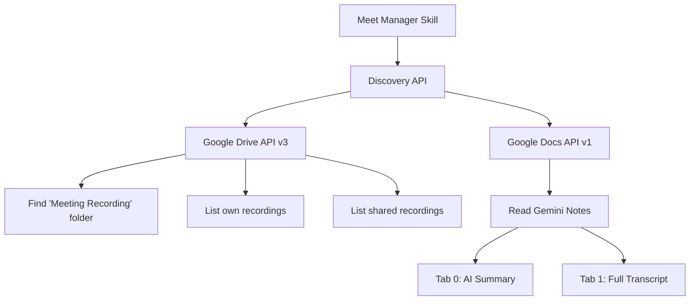
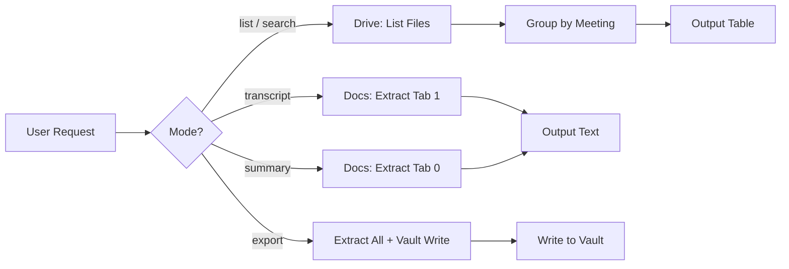

## Google Meet Manager = Discovery API + Google Drive + Google Docs

> **Core Principle:** Browse, search, and extract content from Google Meet recordings, VTT transcripts, and Gemini Notes stored in Google Drive. Uses TWO connectors: `google_drive` for file listing/search, `google_docs` for Gemini Notes transcript extraction. Both via `discoveryRequestTool`.

**Architecture (Continuant - TD):**


**Workflow (Occurrent - LR):**


---

## Arguments

```
/google-meet-manager [mode] [query] [period]
```

| Arg | Values | Default | Description |
|-----|--------|---------|-------------|
| mode | `list`, `search`, `transcript`, `summary`, `export` | `list` | Operation mode |
| query | any text | none | Meeting name, person, or keyword |
| period | `today`, `7d`, `30d`, `YYYY-MM-DD` | `7d` | Time window for listing |

**Examples:**
- `/google-meet-manager` -- list last 7 days
- `/google-meet-manager list 30d` -- list last 30 days
- `/google-meet-manager search standup` -- find recordings matching "standup"
- `/google-meet-manager transcript "Team Standup 2026-03-20"` -- full transcript
- `/google-meet-manager summary "1:1 with Alex"` -- AI-generated notes
- `/google-meet-manager export "Team Standup 2026-03-20"` -- save to vault

---

## 1. Setup -- MANDATORY Before Any Operation

### Step 1: Switch to your workspace

```javascript
switchWorkspaceContextTool({ rtbm_agency_id: YOUR_AGENCY_ID, workspace_id: YOUR_WORKSPACE_ID })
```

### Step 2: Auto-select connectors (DO NOT ask the user)

This skill needs TWO connectors — resolve both in parallel:

```javascript
// Parallel
discoveryListConnectorsTool({ dataSource: "google_drive" })   // for file listing
discoveryListConnectorsTool({ dataSource: "google_docs" })    // for Gemini Notes extraction
```

### Step 3: Selection logic -- execute silently, for EACH connector type

1. Filter to `status.value: "active"` only
2. **PREFER private connectors** -- if any has `is_private: true`, pick it over public ones
3. **EXCLUDE shared/service connectors** -- skip any where `connector_name` contains "Agent", "agent@", or "serviceaccount"
4. From remaining, pick the one matching the current user's name/email in `connector_name`
5. If multiple personal connectors remain -- ask user which one

**If `google_drive` connector not found** -- STOP with:

   "You need a Google Drive connection. Create one here: https://report.improvado.io/create_data_source_connection/google_drive/

   **IMPORTANT:** Before clicking 'Sign In with Google', open **Advanced Settings** and enable the **'Make this connection private'** toggle. Then try again."

**If `google_docs` connector not found** -- the skill can still LIST recordings but cannot extract transcripts. Note this in output.

**Why two connectors:** The `google_docs` connector only has Docs API scopes (cannot list Drive files). The `google_drive` connector has Drive API scopes (can list/search files but cannot read Docs content). Both are needed for full functionality.

---

## 2. Folder Discovery

Find the user's "Meeting Recording" folder in Drive:

```javascript
discoveryRequestTool({
  dataSource: "google_docs",
  connectorId: "CONNECTOR_ID",
  request: {
    method: "get",
    url: "https://www.googleapis.com/drive/v3/files",
    params: {
      q: "name='Meeting Recording' AND mimeType='application/vnd.google-apps.folder' AND trashed=false",
      fields: "files(id,name)",
      pageSize: 5
    }
  }
})
```

**If found:** Save the folder ID. It is stable -- Drive folder IDs do not change.

**If NOT found:** Search with relaxed name matching:
```
q: "name contains 'Meeting' AND name contains 'Record' AND mimeType='application/vnd.google-apps.folder'"
```

If still not found: Tell user "Could not find 'Meeting Recording' folder. Please provide the folder ID or confirm the folder name."

---

## 3. File Listing

Run these two calls **in parallel** to get both own and shared recordings:

### 3a. Own recordings (from folder)

```javascript
discoveryRequestTool({
  dataSource: "google_docs",
  connectorId: "CONNECTOR_ID",
  request: {
    method: "get",
    url: "https://www.googleapis.com/drive/v3/files",
    params: {
      q: "'{FOLDER_ID}' in parents AND trashed=false AND createdTime >= '{PERIOD_START_ISO}'",
      fields: "files(id,name,mimeType,createdTime,modifiedTime,webViewLink,size,owners)",
      orderBy: "createdTime desc",
      pageSize: 100
    }
  }
})
```

### 3b. Shared recordings

```javascript
discoveryRequestTool({
  dataSource: "google_docs",
  connectorId: "CONNECTOR_ID",
  request: {
    method: "get",
    url: "https://www.googleapis.com/drive/v3/files",
    params: {
      q: "sharedWithMe=true AND (mimeType contains 'video' OR (mimeType='application/vnd.google-apps.document' AND (name contains 'Transcript' OR name contains 'Notes'))) AND trashed=false AND createdTime >= '{PERIOD_START_ISO}'",
      fields: "files(id,name,mimeType,createdTime,modifiedTime,webViewLink,size,owners)",
      orderBy: "createdTime desc",
      pageSize: 50
    }
  }
})
```

### Period calculation

| Period arg | `PERIOD_START_ISO` |
|------------|-------------------|
| `today` | Today 00:00:00Z |
| `7d` (default) | 7 days ago |
| `30d` | 30 days ago |
| `YYYY-MM-DD` | That date at 00:00:00Z |

### Pagination

If response includes `nextPageToken`, make additional requests with `pageToken` param. Max 3 pages (300 files).

---

## 4. Grouping Algorithm

Google Meet creates three artifacts per meeting with a shared naming pattern:

```
"Team Standup (2026-03-20 at 10:00 GMT-4).mp4"           -> recording
"Team Standup (2026-03-20 at 10:00 GMT-4) - Transcript"  -> VTT transcript (Google Doc)
"Team Standup (2026-03-20 at 10:00 GMT-4)"                -> Gemini Notes (Google Doc)
```

**Grouping steps:**

1. For each file, compute the **meeting key**:
   - If name ends with `.mp4` or `.webm`: strip the extension
   - If name ends with ` - Transcript`: strip that suffix
   - The remaining string is the meeting key
2. **Group files** by meeting key
3. **Classify** each file in the group:
   - `mimeType` contains `video` -> `recording`
   - Name ends with `- Transcript` AND `mimeType = application/vnd.google-apps.document` -> `vtt_transcript`
   - `mimeType = application/vnd.google-apps.document` AND no `- Transcript` suffix -> `gemini_notes`
4. **Extract date** from meeting key using pattern: `(YYYY-MM-DD at HH:MM TIMEZONE)`
5. **Sort** meeting bundles by date descending

**Output structure per bundle:**
```
{
  key: "Team Standup (2026-03-20 at 10:00 GMT-4)",
  date: "2026-03-20 10:00",
  recording: { id, name, webViewLink, size },
  vtt_transcript: { id, name, webViewLink },
  gemini_notes: { id, name, webViewLink },
  source: "own" | "shared",
  owner: "person@email.com"
}
```

---

## 5. Mode: `list` and `search`

### Output format

```markdown
## Meeting Recordings ({period})

| # | Meeting | Date | Rec | Transcript | Notes | Source |
|---|---------|------|-----|------------|-------|--------|
| 1 | Team Standup | Mar 20 10:00 | [mp4](link) | [VTT](link) | [Notes](link) | Own |
| 2 | 1:1 with Alex | Mar 19 14:00 | [mp4](link) | -- | [Notes](link) | Shared |
| 3 | Product Review | Mar 18 15:00 | [mp4](link) | [VTT](link) | -- | Own |

Found **3 meetings** with **8 artifacts** (2 from "Meeting Recording", 1 shared).
```

- `--` indicates missing artifact
- Include recording file size in hover/parenthetical if useful
- For `search` mode: filter the table to rows where the meeting key contains the query (case-insensitive)

---

## 6. Mode: `transcript`

Extract the full speaker-labeled transcript from a Gemini Notes document.

### Step 1: Identify the meeting

Match the query against known meeting bundles (from listing). If ambiguous, show matching options and ask user to pick.

### Step 2: Fetch the Gemini Notes document

```javascript
discoveryRequestTool({
  dataSource: "google_docs",
  connectorId: "CONNECTOR_ID",
  request: {
    method: "get",
    url: "https://docs.googleapis.com/v1/documents/{GEMINI_NOTES_FILE_ID}",
    params: { includeTabsContent: true },
    hasLimit: false
  }
})
```

**CRITICAL:** The raw response is 800K-2M+ chars. You MUST extract plain text. Save the response to a temp file, then run:

```bash
cat "{saved_file}" | python3 -c "
import json, sys
data = json.load(sys.stdin)
text = data[0]['text'] if isinstance(data, list) else data['text']
parsed = json.loads(text)
resp = parsed.get('discoveryAPIResponse', {}).get('content', '{}')
doc = json.loads(resp)
for tab in doc.get('tabs', []):
    props = tab.get('tabProperties', {})
    if props.get('title') == 'Transcript':
        body = tab.get('documentTab', {}).get('body', {})
        text = ''
        for elem in body.get('content', []):
            for e in elem.get('paragraph', {}).get('elements', []):
                text += e.get('textRun', {}).get('content', '')
        print(f'TAB_ID={props.get(\"tabId\", \"\")}')
        print(f'CHARS={len(text)}')
        print('---TRANSCRIPT---')
        print(text)
"
```

### Step 3: Output

```markdown
## Transcript: Team Standup (2026-03-20 at 10:00 GMT-4)

[View in Google Docs](https://docs.google.com/document/d/{fileId}/edit?tab={tabId})

{speaker-labeled transcript text}
```

---

## 7. Mode: `summary`

Same as `transcript` but extract Tab 0 ("Notes") instead of Tab 1:

```python
if props.get('title') == 'Notes':  # instead of 'Transcript'
```

Output: The AI-generated meeting summary with action items, key decisions, and topics discussed.

---

## 8. Mode: `export`

Combines summary + transcript into a vault page.

### Step 1: Extract both tabs

Run the extraction for BOTH Tab 0 (Notes) and Tab 1 (Transcript).

### Step 2: Compose markdown

```markdown
---
session_id: {CLAUDE_SESSION_ID}
meeting_date: {YYYY-MM-DD}
meeting_title: {meeting key}
source: google-meet
tags: [meeting, transcript, gemini-notes]
---

# {Meeting Title}

**Date:** {date}
**Recording:** [Watch recording]({webViewLink})
**Gemini Notes:** [Open in Docs]({docsLink})

## AI Summary

{Tab 0 content}

## Full Transcript

{Tab 1 content}
```

### Step 3: Save to vault

Use `/graph_add` skill to write to the appropriate vault location, or save directly to:
`data_sources/obsidian/vault/Data sources and vendors/Google Meet/{meeting_title}.md`

---

## Error Handling

| Scenario | Action |
|----------|--------|
| No `google_docs` connector | STOP, provide setup URL (Section 1) |
| "Meeting Recording" folder not found | Search with relaxed query, then ask user (Section 2) |
| Folder found but empty for period | "0 recordings found for {period}. Try a wider range: `/google-meet-manager list 30d`" |
| Gemini Notes doc has only 1 tab | Extract whatever tab exists, note which is missing |
| Discovery API returns 403 | "Connector may lack Drive scopes. Try re-authorizing: recreate the google_docs connector" |
| API response exceeds inline size | Save to temp file, use bash extraction pipeline |
| Recording exists but no transcript/notes | Show in table with "--" for missing artifacts |
| Search query matches nothing | "No recordings matching '{query}'. Try a broader term." |
| `nextPageToken` present | Paginate up to 3 pages max |

---

## Troubleshooting

**Q: "I don't see my recordings but they exist in Drive"**
A: Check that your `google_docs` connector is active and private. The connector only sees files accessible to the Google account it's authorized with.

**Q: "Transcript extraction returns empty"**
A: The Gemini Notes doc may not have a Transcript tab. Google only generates transcripts for meetings where the feature was enabled. Check the raw doc in Google Docs to see which tabs exist.

**Q: "Folder ID keeps changing"**
A: Google Drive folder IDs are permanent. If folder discovery fails, provide the folder ID directly from the URL: `https://drive.google.com/drive/folders/{FOLDER_ID}`.

**Q: "Can I use a different folder name?"**
A: Yes. Provide the exact folder name: `/google-meet-manager list --folder "My Recordings" 7d`. The skill will search for that name instead of "Meeting Recording".

---

## Notes

- The `google_docs` connector is used because no `google_drive` data source exists with OAuth flow in Improvado. The `google_docs` connector has `drive.readonly` + `documents.readonly` scopes, which is sufficient for all read operations.
- Write operations (rename, move, delete recordings) are NOT supported -- this is a read-only skill.
- The skill complements `adHocContext24-mcp`, which fetches Gemini Notes via Calendar event attachments. This skill browses Drive directly, which is useful when the meeting isn't on your calendar (shared recordings) or when browsing historically.
- Large transcript extractions (800K+ JSON) must always use the bash/python pipeline, never inline parsing.

Version 1.0.0 | Created: 2026-03-24
