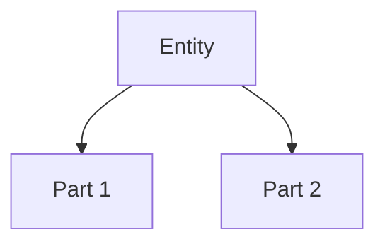

# Knowledge Framework Documentation Skill

## Description

Expert documentation framework using MECE, BFO ontology, and fractal structure. This skill should be used AUTOMATICALLY whenever creating or editing .md files to ensure clear, maintainable documentation that follows strict structural principles: one thesis, overview paragraph, Mermaid diagrams (Continuant TD + Occurrent LR), and numbered MECE sections with DRY principles and Ground Truth attribution.

## When to Use

Use this skill when:
- User asks to create/improve documentation
- User needs to structure complex information
- User mentions: MECE, ontology, documentation framework, knowledge base
- User asks "how to organize documentation"
- Creating README, architecture docs, process guides, or analysis reports
- ANY situation requiring clear, structured explanation

**PROACTIVE APPLICATION:**
- Automatically apply when creating ANY .md file (README, guides, docs, analysis)
- Automatically apply when user requests documentation or asks to "write" something structured
- Automatically apply before finalizing any markdown document >20 lines

**IMPORTANT:** Apply this skill BEFORE writing .md files, not after. The framework guides the writing process itself.

## Quick Start Checklist

When creating ANY .md file, follow this checklist:

```markdown
[ ] 1. Start with Thesis (1 sentence previewing MECE sections)
[ ] 2. Write Overview (1 paragraph introducing each section)
[ ] 3. Add Mermaid diagram(s): TD for structure, LR for process
[ ] 4. Create numbered sections (1.0, 2.0, 3.0)
[ ] 5. Add ¶1 ordering principle in first section
[ ] 6. Use ¶ paragraph numbering throughout
[ ] 7. Add Ground Truth attribution (sources with dates)
[ ] 8. Verify MECE (no overlap, no gaps)
[ ] 9. Check DRY (no duplication)
[ ] 10. Add Author Checklist at end
```

**5-Second Decision Tree:**
- Creating .md file? → Use this skill
- Document >20 lines? → Use this skill
- User says "write" or "document"? → Use this skill

## Practical Workflow

**BEFORE starting to write .md content:**

1. **Identify document type** (architecture/process/analysis) → determines diagram types
2. **Extract MECE sections** from user request → these become 1.0, 2.0, 3.0
3. **Write Thesis** → one sentence previewing those sections
4. **Write Overview** → one paragraph introducing each section
5. **Choose diagrams** → TD for structure, LR for process
6. **Fill sections** → with ¶1 ordering principle, then content
7. **Add attribution** → sources with dates throughout
8. **Apply checklist** → verify all requirements met

**Example rapid application:**
```
User: "Create a README for the email parser module"

Agent thinks:
- .md file → trigger knowledge-framework skill
- Type: Mixed (components + process)
- MECE sections from context: 1.0 Components, 2.0 Workflow, 3.0 Usage
- Diagrams needed: TD (email components), LR (parsing flow)
- Thesis: "Email parser extracts structured data from messages using..."
```

## Core Principles

**Documentation = Code:**
- Fractal structure (each level is complete)
- MECE organization (Mutually Exclusive, Collectively Exhaustive)
- DRY (Don't Repeat Yourself - each fact appears once)
- Minimal tokens, maximum clarity

**🚨 CRITICAL: Ground Truth Only**
- **ONLY document what EXISTS in context** - no speculation, no "future sections", no "might need"
- **NO verbose additions** - if maintenance/troubleshooting wasn't mentioned in task, DON'T add it
- **NO generic sections** - avoid "Best Practices", "Common Pitfalls", "Advanced Usage" unless explicitly requested
- **Test: Can you point to source for EVERY paragraph?** If no → delete it
- **Sections ONLY from user's actual request** - don't invent "nice to have" sections

## Mandatory Structure

### 1. Header Elements (REQUIRED)

```markdown
## 📋 [Document Title]

**Thesis (1 sentence):** [Specific outcome with who/what/when - must preview MECE sections]

**Overview (1 paragraph):** [Expands thesis AND introduces each MECE section]
```

### 2. Mermaid Diagrams (REQUIRED - minimum 1, complex docs need 2)

**CRITICAL RULE:** Choose diagram type by ontological category:

**Continuant Diagram (TD) - "What Exists":**

- **Use for:** System architecture, data models, component hierarchies
- **Nodes:** NOUNS (Database, API, User, Service)
- **Direction:** Top-Down (TD)
- **Edges:** "contains", "depends on", "is part of"

**Occurrent Diagram (LR) - "What Happens":**

- **Use for:** Processes, workflows, pipelines, temporal sequences
- **Nodes:** VERBS (Extract, Validate, Transform)
- **Direction:** Left-Right (LR)
- **Edges:** "then", "triggers", "flows to"

**Complex documents REQUIRE BOTH diagrams** - one for structure (TD), one for process (LR).

### 3. MECE Sections (REQUIRED)

```markdown
## 1.0 [First Section Name]

¶1 **Ordering principle:** [Explain why sections appear in THIS order]

¶2 [General concept]

¶3 [Specific detail]

### 1.1 [Subsection]
[Follows same pattern: 1-sentence → paragraph → details]

## 2.0 [Second Section Name]
...
```

**Numbering Rules:**
- Sections: 1.0, 2.0, 3.0
- Subsections: 1.1, 1.2, 1.3
- Paragraphs: ¶1, ¶2, ¶3

**Ordering Logic (¶1 MUST explain):**
- Importance (critical → nice-to-have)
- Logical flow (context → implementation → validation)
- Chronology (setup → execution → cleanup)

### 4. BFO Ontology Classification

**Continuants (Things that exist):**
- Exist fully at any moment
- Examples: database tables, API endpoints, configuration
- Mermaid: `graph TD`
- Sections: NOUNS (1.0 Data Model, 2.0 Components)

**Occurrents (Things that happen):**
- Unfold across time
- Examples: pipeline execution, API flow, deployment
- Mermaid: `graph LR`
- Sections: VERBS (1.0 Setup, 2.0 Execute, 3.0 Monitor)

**Mixed Documents:**
- Analysis: 1.0 Data (Continuant) → 2.0 Methods (Occurrent) → 3.0 Results
- Decision: 1.0 Problem (Continuant) → 2.0 Options → 3.0 Solution

## DRY Enforcement

- Each fact appears EXACTLY ONCE
- Use references, not duplication
- Example:
  ```markdown
  See §2.1¶3 for configuration details
  Full process in section 3.0
  ```

## Ground Truth Attribution (MANDATORY)

**Core Rule:** Every piece of information MUST be traceable to its source. This enables verification, trust, updates, and audit trails.

### Attribution Patterns

**External articles/research:**
```markdown
**Source:** [Article Title](URL) (accessed YYYY-MM-DD)
```

**YouTube videos with timestamps (MUST be clickable):**
```markdown
**Source:** [Creator], "Video Title", YouTube (YYYY-MM-DD) [Full video](https://youtu.be/VIDEO_ID)
**Quote:** "Exact quote" ([timestamp 23:11](https://youtu.be/VIDEO_ID?t=1391))
**Key insight:** Explanation at [15:30-17:45](https://youtu.be/VIDEO_ID?t=930)
```

**Timestamp URL format:**
- Pattern: `https://youtu.be/VIDEO_ID?t=SECONDS`
- Calculation: `MM:SS → (MM × 60) + SS`
- Example: `23:11 → (23 × 60) + 11 = 1391`
- Use markdown link syntax: `[timestamp MM:SS](URL)`

**Code references:**
```markdown
**Source:** `path/to/file.py:123-145` (function `calculate_metrics`)
**Implementation:** See `db_utils.py:67` for connection logic
```

**Claude Code sessions:**
```markdown
**Generated by:** Claude Code session `abc123xyz` by [Author Name] (YYYY-MM-DD)
**Session ID:** Get via `python data_sources/claude_code/get_session_id.py --quiet`
**Context:** Analysis based on §2.1, §2.3
```

**LLM reasoning:**
```markdown
**LLM Analysis:** Based on ¶1 (customer data) and ¶3 (usage metrics)
**Reasoning chain:** Combined §1.2 + §3.1 to derive conclusion
**Note:** This is synthesized analysis, not direct source data
```

**Database queries:**
```markdown
**Query:** `ch_query.py "SELECT COUNT(*) FROM table"` (YYYY-MM-DD)
**Result:** 1,247 records as of query date
```

**Human expert input:**
```markdown
**Expert input:** [Name] ([Role]), discussed YYYY-MM-DD
**Decision context:** Based on [ticket/meeting reference]
```

### Attribution Placement

**Document-level (in Overview):**
```markdown
## Overview
[Overview text...]

**Primary source:** [Main reference] (accessed YYYY-MM-DD)
```

**Section-level:**
```markdown
### 2.1 Customer Segmentation

**Source:** Internal analysis by [Author], Claude Code session `xyz789` (YYYY-MM-DD)

¶1 [Content...]
```

**Paragraph-level (inline):**
```markdown
¶3 Customer churn rate is 12% (**Source:** query YYYY-MM-DD). This represents...
```

### Verification Requirements

- **URLs tested:** All external links verified accessible
- **Code references precise:** Include line numbers/function names
- **Session IDs retrievable:** Use session ID getter script
- **Dates mandatory:** Every source has YYYY-MM-DD format
- **Query timestamps:** Database queries note execution time

### Common Violations

❌ "Based on research" → ✅ "Based on Gartner Report 2025 (URL, accessed YYYY-MM-DD)"
❌ "Customers prefer X" → ✅ "Customers prefer X (**Source:** Survey `surveys/pref_2025.csv`)"
❌ Presenting synthesis as fact → ✅ "**LLM Analysis:** Combined §1.2 + §3.1"
❌ "See the function" → ✅ "See `utils.py:145` function `calculate_total`"
❌ "(timestamp 23:11)" → ✅ "([timestamp 23:11](https://youtu.be/ID?t=1391))" for YouTube sources

## Author Checklist

Before finalizing ANY document, verify:

```markdown
## ✅ Documentation Checklist

Structure:
- [ ] Thesis (1 sentence) previews ALL MECE sections
- [ ] Overview paragraph introduces each section
- [ ] Minimum 1 Mermaid (complex docs: both TD and LR)
- [ ] Sections numbered (1.0, 2.0, 3.0)
- [ ] ¶1 explains ordering principle

MECE:
- [ ] Sections mutually exclusive (no overlap)
- [ ] Sections collectively exhaustive (covers everything)
- [ ] Can't move content without breaking logic

BFO Ontology:
- [ ] Continuants (TD diagrams) for structure
- [ ] Occurrents (LR diagrams) for processes
- [ ] Nodes match type (nouns vs verbs)

DRY:
- [ ] Each fact appears exactly once
- [ ] References used instead of duplication
- [ ] No redundant Mermaid diagrams

Ground Truth (CRITICAL):
- [ ] Primary source in Overview with date
- [ ] Section sources attributed if single origin
- [ ] Inline attribution for specific facts
- [ ] LLM reasoning marked as synthesis
- [ ] Code refs include file:line/function
- [ ] All sources have YYYY-MM-DD dates
- [ ] Session IDs for Claude Code work
- [ ] URLs tested and accessible

Clarity:
- [ ] Minimal tokens, maximum clarity
- [ ] Each level is complete (fractal principle)
- [ ] Readable by AI agent or human
```

## Common Patterns

### Pattern 1: System Architecture (Continuant-heavy)
```markdown
Thesis: Analytics system processes client data through three layers...

[Continuant TD diagram: Data → Logic → Presentation]

1.0 Data Layer (what exists)
2.0 Business Logic (what exists)
3.0 Presentation Layer (what exists)
```

### Pattern 2: Process Guide (Occurrent-heavy)
```markdown
Thesis: Data pipeline extracts, transforms, and loads...

[Occurrent LR diagram: Extract → Transform → Load]

1.0 Extract Phase (what happens)
2.0 Transform Phase (what happens)
3.0 Load Phase (what happens)
```

### Pattern 3: Analysis (Mixed)
```markdown
Thesis: Facebook Ads analysis evaluates performance using CTR metrics...

[Continuant TD: Data sources hierarchy]
[Occurrent LR: Analysis workflow]

1.0 Data Sources (Continuant)
2.0 Analysis Methods (Occurrent)
3.0 Results & Insights (Continuant)
```

## Anti-Patterns to Avoid

❌ **No Thesis:** Document starts directly with sections
❌ **Missing Diagrams:** Text-only documentation
❌ **Wrong Diagram Type:** Process shown in TD instead of LR
❌ **No ¶1 Ordering:** Reader doesn't know why sections ordered this way
❌ **Duplication:** Same information repeated in multiple sections
❌ **Non-MECE:** Overlapping sections or gaps in coverage
❌ **Verbose:** Using more tokens than necessary
❌ **CRITICAL: Speculation/Invention:** Adding sections not in user's context (e.g., "Troubleshooting" when user only asked to document setup)
❌ **Generic fluff:** "Best Practices", "Tips & Tricks", "Common Mistakes" sections without actual content from context

## Quality Gates

**Before claiming documentation is complete:**

1. Can I delete the thesis and still understand document scope? → ❌ Thesis not specific enough
2. Can I swap section order without breaking logic? → ❌ Missing ¶1 ordering principle
3. Can I find same information in multiple places? → ❌ Violates DRY
4. Are diagrams missing or using wrong orientation? → ❌ Violates BFO ontology
5. Do sections overlap in scope? → ❌ Not MECE
6. **🚨 Can I point to source in context for EVERY paragraph?** → ❌ Speculation/invention - DELETE IT
7. **🚨 Did I add sections user didn't ask for?** → ❌ Verbose - REMOVE THEM
8. **🚨 Is every fact attributed to source (URL/file/session/query)?** → ❌ Missing Ground Truth - ADD ATTRIBUTION
9. **🚨 Are all sources dated (YYYY-MM-DD)?** → ❌ Can't verify freshness - ADD DATES
10. **🚨 Is LLM reasoning flagged as synthesis?** → ❌ Misleading - MARK AS "LLM Analysis"

**Gold Standard:** Another AI agent OR human can:
1. Execute task/understand content with ZERO ambiguity using ONLY information from user's context
2. Verify EVERY claim by following source attribution to original data/code/article
3. Update document when sources change by following Ground Truth links

## Examples Reference

See `examples/` directory for:
- System architecture doc (Continuant-heavy)
- ETL pipeline doc (Occurrent-heavy)
- Analysis report (Mixed)
- API documentation (Mixed)

---

**Meta Note:** This skill itself follows the framework - thesis, overview, MECE sections, BFO classification. Use as template!
