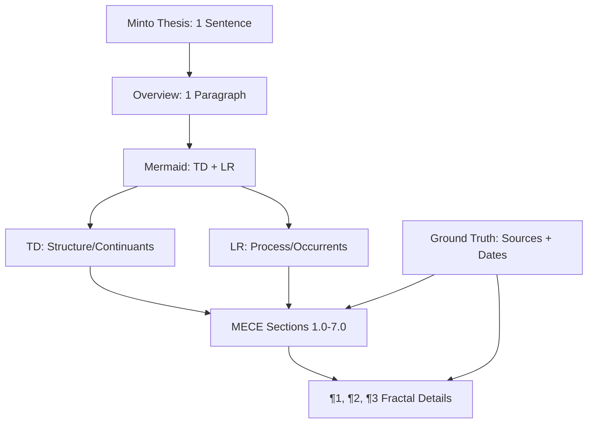

## 📋 Documentation = Code (Minto + MECE + BFO + DRY)

**Core Principle:** Write documentation like code - fractal structure where each abstraction level is complete, MECE-organized, with zero redundancy with links to source for ground truth.

**Documentation Framework Structure (Continuant - TD):**

**Ontological Rule:** TD for Continuants (what exists), LR for Occurrents (what happens)

**Primary source:** `~/projects/chrome-extension-tcs/How to organize documents_knowladge_framework.md`
**Original session:** `e9ce3592-bd66-4a98-b0e7-fcdd8edb5d42` by Daniel Kravtsov (2025-11-13) - v1.0.0 Initial
**Latest update:** `e9ce3592-bd66-4a98-b0e7-fcdd8edb5d42` by Daniel Kravtsov (2025-11-13) - v1.1.0 Mermaid headers
**Release log:** See `SKILL_RELEASE_LOG.md` for full version history

### 🎯 6 Pillars

¶1 **Minimal Verbosity:** Use minimum text and tokens, but enough for another AI agent or human to execute task or understand document.

¶2 **Minto Principle:** Top-to-bottom structure - thesis → overview → sections → details.

¶3 **MECE (Mutually Exclusive, Collectively Exhaustive):** Sections don't overlap, but cover everything.

¶4 **Mermaid Diagrams:** Quick visual explanation of core concepts.

¶5 **Fractal Structure:** Each level mirrors the whole - subsections follow same 1-sentence → mermaid diagrams (1 or 3 if complex) → 1-paragraph → details pattern.

¶6 **DRY (Don't Repeat Yourself):** Each fact appears exactly ONCE. Reference, don't duplicate.

¶7 **Ground Truth (CRITICAL):** EVERY piece of information MUST have traceable source attribution. See §"Ground Truth Attribution Rules" for mandatory patterns.

(Try not to use terms like "MECE", "fractal", "DRY" in the doc itself. These are internal terms - docs should focus on subject content, not metadata about doc creation.)

### 📐 Structure Rules
- **Thesis:** Specific outcome with who/what/when - must preview your MECE sections structure
- **Overview Paragraph:** Expands thesis AND introduces each MECE section (like function docs listing parameters)
- **Sections (1.0, 2.0, 3.0):** Number all sections and subsections (1.1, 1.2). Order by: importance, logical flow, or chronology
- **Paragraph Numbering:** Within sections, number paragraphs (¶1, ¶2, ¶3). Sort by: general→specific, problem→solution, or setup→action→result
- **Ordering Principle (¶1 explains this):** State your ordering logic upfront - readers should understand why content appears in this sequence
- **Fractal Depth:** Each subsection starts with its own 1-sentence thesis, then expands only if needed
    -- if docuemnt is big - more then 10 pages, then you may want to split in into multipel files. but you need to add proper urls path to this files md links
- **Coherence:** If sections are Planning→Execution→Monitoring, thesis must mention all three

### 🔄 Finding True MECE Structure
**Core Rule:** Look for the NATURAL structure of your content, don't force a template

**🧬 BFO Ontology (Highest Level):** Use formal ontology categories to separate WHAT EXISTS from WHAT HAPPENS:

¶1 **Continuants (Things that exist):**
- Exist fully at any moment in time
- Examples: database tables, API endpoints, user roles, configuration files
- Mermaid: Use `graph TD` (top-down hierarchy)
- Sections: Named by nouns (1.0 Data Model, 2.0 System Components)

¶2 **Occurrents (Things that happen):**
- Unfold across time; have beginning, middle, end
- Examples: data pipeline execution, API request flow, deployment process
- Mermaid: Use `graph LR` (left-right sequence)
- Sections: Named by verbs/processes (1.0 Setup, 2.0 Execute, 3.0 Validate)

**📊 Practical Structures:**
- **Temporal Process?** → Occurrent: 1.0 Setup → 2.0 Execution → 3.0 Cleanup
- **System Architecture?** → Continuant: 1.0 Data Layer → 2.0 Logic Layer → 3.0 Presentation
- **Decision Document?** → Mixed: 1.0 Problem (Continuant) → 2.0 Options → 3.0 Solution
- **Analysis?** → Mixed: 1.0 Data (Continuant) → 2.0 Methods (Occurrent) → 3.0 Results

**Key:** BFO ensures your categories reflect reality's actual structure. The TRUE structure makes the document write itself.

### 🎨 Mermaid Ontological Patterns (MANDATORY)

¶1 **Diagram Headers (REQUIRED):**
- **Every Mermaid diagram MUST have descriptive header** (2-5 words) specific to THIS document
- **Format:** `**[Specific Description] ([Type] - [Direction]):**`
- **Examples:**
  - ✅ `**Skill Package Structure (Continuant - TD):**` (specific to skill-creator)
  - ✅ `**Data Pipeline Workflow (Occurrent - LR):**` (specific to ETL system)
  - ❌ `**System Structure:**` (too generic, no type/direction)
  - ❌ Just diagram without header (missing completely)
- **Placement:** Header goes BEFORE ```mermaid code block

¶2 **Why Two Diagrams Minimum, but if subject is complex, you 3 diagrams:**
- **Ontological completeness:** Every domain has BOTH structure (what exists) AND behavior (what happens)
- **Cognitive clarity:** Mixing "system architecture" with "process flow" in ONE diagram creates confusion
- **MECE enforcement:** Separate diagrams prevent mixing Continuants with Occurrents
- **Rule:** Complex documents REQUIRE both Continuant (TD) and Occurrent (LR) diagrams

¶3 **Continuant Diagram (Structure/Architecture):**
- **Type:** `graph TD` or `graph TB` (top-down/top-bottom vertical hierarchy)
- **Shows:** System components, data models, organizational structure, dependencies
- **Nodes:** NOUNS (Database, API, User, Table, Service)
- **Edges:** "contains", "depends on", "is part of", "inherits from"
- **Example:** System architecture, data schema, component hierarchy
- **Header example:** `**Customer Data Model (Continuant - TD):**`

¶3.1 **Vertical Layout for Readability (TD/TB):**
- **Prefer vertical flow** - easier to read than wide horizontal diagrams
- **Group related items** - use intermediate nodes to group 2-4 items when category has many children
- **Pattern:** `Root --> Category1 --> [Item1<br/>Item2]` groups items in single node with line breaks
- **Color coding** - use `style` declarations for visual hierarchy (categories darker, items lighter)

¶4 **Occurrent Diagram (Process/Flow):**
- **Type:** `graph LR` (left-right sequence)
- **Shows:** Workflows, pipelines, request flows, temporal sequences
- **Nodes:** VERBS or process states (Extract, Transform, Load, Validate)
- **Edges:** "then", "triggers", "flows to", temporal ordering
- **Example:** Data pipeline, API request flow, deployment process
- **Header example:** `**ETL Pipeline Execution (Occurrent - LR):**`

¶5 **Participation Diagram (How Continuants participate in Occurrents) - OPTIONAL:**
- **Type:** `graph TD` or `graph LR` depending on emphasis
- **Shows:** Which entities (Continuants) are involved in which processes (Occurrents)
- **Pattern:** Entity nodes + Process nodes, edges show "participates in", "executes", "produces"
- **Example:** User triggers Pipeline which updates Database
- **Header example:** `**User-Pipeline Interaction (Participation - TD):**`

### 🧭 Mermaid Enforcement Rules

¶1 **Mandatory Diagram Gate:**
- Every document MUST include minimum ONE Mermaid diagram at top-level overview
- Complex documents (system specs, architecture docs) REQUIRE BOTH Continuant (TD) and Occurrent (LR) diagrams
- See §"🎨 Mermaid Ontological Patterns" for selection guide

¶2 **Placement:**
- **Primary diagrams:** Directly after Overview paragraph, before Section 1.0
- **Secondary diagrams:** Within sections to illustrate complex subsystems or sub-processes
- **Order:** If both present, show Continuant (structure) BEFORE Occurrent (process)

¶3 **Size and Labeling:**
- **Node count:** 5–12 nodes per diagram; if more, split into multiple diagrams
- **Labels:** Short (1-3 words); nouns for Continuants, verbs for Occurrents
- **Edges:** Label only when relationship is not obvious from context

¶4 **DRY Principle:**
- One diagram per abstraction level
- Deeper sections get smaller, focused diagrams
- Never duplicate information between diagrams - reference parent diagram instead

---

## 🔗 Ground Truth Attribution Rules (MANDATORY)

**Core Rule:** Every piece of information in documentation MUST be traceable to its source. This enables verification, trust, updates, and audit trails.

### Source Attribution Patterns

¶1 **External articles/research:**
```markdown
**Source:** [Article Title](URL) (accessed YYYY-MM-DD)
**Key insight from:** Author Name, "Article Title", Publication, Date
```

¶2 **Code references:**
```markdown
**Source:** `path/to/file.py:123-145` (function `calculate_metrics`)
**Implementation:** See `db_utils.py:67` for connection logic
```

¶3 **Claude Code session results:**
```markdown
**Generated by:** Claude Code session `abc123xyz` by Daniel Kravtsov (2025-11-10)
**Session ID:** Get via `python data_sources/claude_code/get_session_id.py --quiet`
**Context:** Analysis of customer churn patterns based on §2.1, §2.3
```

¶4 **LLM reasoning/analysis:**
```markdown
**LLM Analysis:** Based on ¶1 (customer data patterns) and ¶3 (usage metrics)
**Reasoning chain:** Combined insights from sections §1.2 + §3.1 to derive conclusion
**Note:** This is synthesized analysis, not direct source data
```

¶5 **Database query results:**
```markdown
**Query:** `ch_query.py "SELECT COUNT(*) FROM internal_analytics.dim_agencies"` (2025-11-10)
**Result:** 1,247 active agencies as of query date
```

¶6 **Human expert input:**
```markdown
**Expert input:** Iuliia Kholodova (Product Manager), discussed 2025-11-10
**Decision context:** Based on customer feedback from Notion ticket N-12345
```

¶7 **Meeting notes/calls:**
```markdown
**Source:** Gong call ID `gong_123456` with Customer name (2025-10-15)
**Transcript:** See `/calls/2025-10-15/transcript.txt`
**Key decision:** Client requested ROAS optimization (timestamp 15:30)
```


### Attribution Placement Rules

¶1 **Document-level:** Add primary source in Overview paragraph immediately after thesis
```markdown
## Overview
[Thesis and overview text...]

**Primary source:** [Main reference] (accessed date)
```

¶2 **Section-level:** Add source at start of section if entire section derives from single source
```markdown
### 2.1 Customer Segmentation

**Source:** Internal analysis by Daniel Kravtsov, Claude Code session `xyz789` (2025-11-10)

¶1 [Content...]
```

¶3 **Paragraph-level:** Inline attribution for specific facts or claims
```markdown
¶3 The customer churn rate is 12% annually (**Source:** `SELECT AVG(churn_rate) FROM metrics.customer_health` query 2025-11-10). This represents...
```

¶4 **Mixed sources:** When paragraph combines multiple sources, attribute each piece
```markdown
¶2 Customer satisfaction scores averaged 8.7/10 (**Source:** Zendesk report Q4-2025), while NPS remained at 45 (**Source:** internal survey `surveys/nps_q4.csv`). The correlation (**LLM analysis:** based on these two metrics) suggests...
```

### Verification Requirements

¶1 **URLs must be accessible:** Test all external links - use archive.org snapshot if original may disappear

¶2 **Code references must be precise:** Include line numbers or function names, not just file paths

¶3 **Session IDs must be retrievable:** Use `python data_sources/claude_code/get_session_id.py --quiet` to get current session

¶4 **Dates are mandatory:** Every source attribution MUST include date (YYYY-MM-DD format)

¶5 **Query results include timestamp:** Database queries should note execution date/time since data changes

### Common Violations to Avoid

❌ **Vague attribution:** "Based on research" → ✅ "Based on Gartner Report 2025 (URL, accessed 2025-11-10)"

❌ **No source for claims:** "Customers prefer X" → ✅ "Customers prefer X (Source: Survey results `surveys/pref_2025.csv`)"

❌ **Missing LLM reasoning flag:** Presenting synthesis as fact → ✅ "LLM Analysis: Combined §1.2 + §3.1"

❌ **Code without location:** "See the function" → ✅ "See `utils.py:145` function `calculate_total`"

❌ **Outdated sources:** Link from 2020 without noting if still valid → ✅ Include access date and freshness note

### ✅ Author Checklist (paste at document end and tick)

**Structure:**
- [ ] **Thesis:** Single sentence previewing ALL MECE sections with specific outcome
- [ ] **Overview:** One paragraph introducing each major section
- [ ] **Mermaid diagrams:** At minimum ONE diagram (complex docs need both Continuant TD + Occurrent LR)
- [ ] **MECE sections:** 3-7 top-level sections (1.0, 2.0, 3.0) that don't overlap but cover everything
- [ ] **Ordering principle:** ¶1 of each section states WHY this ordering (importance/flow/chronology)
- [ ] **Paragraph numbering:** ¶1, ¶2, ¶3 used within all sections
- [ ] **Fractal depth:** Subsections mirror parent structure where needed
- [ ] **Coherence:** Thesis mentions all sections actually present in document

**Content Quality:**
- [ ] **DRY compliance:** Each fact appears exactly ONCE, referenced by §X.Y elsewhere
- [ ] **Minimal verbosity:** No unnecessary words, but sufficient for execution/understanding
- [ ] **Section references:** Use §X.Y format for cross-references (e.g., "See §2.1")
- [ ] **Clear labels:** Section titles are descriptive nouns (Continuants) or verbs (Occurrents)

**Ground Truth (CRITICAL):**
- [ ] **Primary source documented:** Main source listed in Overview with URL/path and date
- [ ] **Section sources attributed:** Each section has source if from single origin
- [ ] **Inline attribution:** Specific facts cite source (URL, file path, query, session ID)
- [ ] **LLM reasoning flagged:** Synthesized analysis marked as "LLM Analysis: based on §X, §Y"
- [ ] **Code references precise:** Include file path + line numbers/function names
- [ ] **Dates present:** All sources have YYYY-MM-DD access/execution dates
- [ ] **Session IDs included:** Claude Code work includes session ID and author
- [ ] **URLs tested:** External links verified accessible (or archived)
- [ ] **Query timestamps:** Database queries note execution date/time