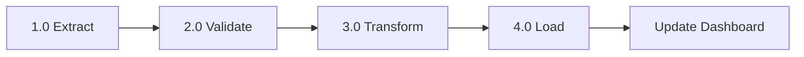

# Example: Process Guide (Occurrent-Heavy)

## 📋 ETL Pipeline Execution

**Thesis:** ETL pipeline executes in four phases (extract, validate, transform, load) processing marketing data from API to warehouse in 15-minute cycles.

**Overview:** This document describes the ETL pipeline execution flow. Section 1.0 covers data extraction from marketing platforms, 2.0 explains validation rules, 3.0 details transformation logic, and 4.0 describes the load process to ClickHouse. Sections ordered chronologically by execution sequence.

## 1.0 Extract Phase

¶1 **Ordering principle:** Sections ordered chronologically - extraction happens first (gets raw data), then validation (checks quality), then transformation (prepares for storage), finally load (persists results).

¶2 **API Connection:** Connect to marketing platform API using OAuth credentials. Retrieve data for date range defined by lookback_window parameter.

¶3 **Rate Limiting:** Respect API limits (100 requests/minute for Facebook Ads, 1000/day for Google Ads). Implement exponential backoff on 429 errors.

## 2.0 Validate Phase

¶1 **Schema Check:** Verify response matches expected fields defined in extract template. Reject extract if missing required columns (date, spend, impressions).

¶2 **Data Quality:** Check for null values in key metrics, duplicate records, date range consistency. Log warnings but continue processing.

## 3.0 Transform Phase

¶1 **Metric Calculation:** Calculate derived metrics (CTR = clicks/impressions, CPC = spend/clicks). Handle division by zero with NULL.

¶2 **Normalization:** Convert currency to USD using exchange rates table. Standardize date formats to YYYY-MM-DD.

## 4.0 Load Phase

¶1 **ClickHouse Insert:** Write transformed data to target table using INSERT SELECT. Use ReplacingMergeTree engine to handle duplicates.

¶2 **Completion:** Update extract status to "completed" in metadata table. Trigger downstream processes (dashboard refresh, alert checks).

---

**Note:** This is Occurrent-heavy (focuses on "what happens"). A complete process doc would also include Continuant diagram showing "what exists" (system components, data tables involved).
