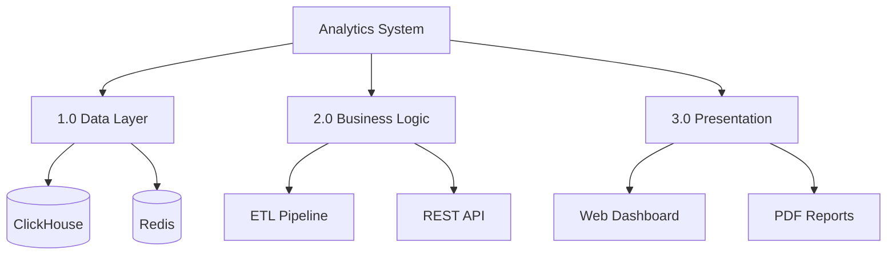

# Example: System Architecture (Continuant-Heavy)

## 📋 Analytics Dashboard System

**Thesis:** Analytics dashboard system processes marketing data through three architectural layers (data, logic, presentation) enabling real-time client reporting.

**Overview:** This document describes the analytics system architecture. Section 1.0 covers the data layer (ClickHouse storage), 2.0 explains business logic (ETL pipeline and API), and 3.0 details the presentation layer (dashboard interface). Sections ordered by data flow: storage → processing → visualization.

## 1.0 Data Layer

¶1 **Ordering principle:** Sections ordered by dependency hierarchy - storage systems first (foundational), then processing logic (depends on storage), finally presentation (depends on both).

¶2 **ClickHouse Database:** Primary storage for time-series marketing data. Tables organized by client (im_XXXX databases) with MergeTree engine for efficient aggregation.

¶3 **Redis Cache:** Temporary storage for API responses and dashboard state. TTL set to 300 seconds for balance between freshness and performance.

## 2.0 Business Logic

¶1 **ETL Pipeline:** Extracts data from marketing platforms (Facebook Ads, Google Ads), transforms metrics, loads to ClickHouse. Runs on schedule defined per client.

¶2 **REST API:** Serves aggregated data to dashboard. Implements caching layer (Redis) and query optimization (materialized views).

## 3.0 Presentation Layer

¶1 **Web Dashboard:** React-based interface showing real-time metrics. Connects to REST API via WebSocket for live updates.

¶2 **PDF Reports:** Scheduled exports generated server-side. Use same API endpoints as dashboard for data consistency.

---

**Note:** This is Continuant-heavy (focuses on "what exists"). A complete system doc would also include Occurrent diagram showing "what happens" (request flow, data pipeline execution).
