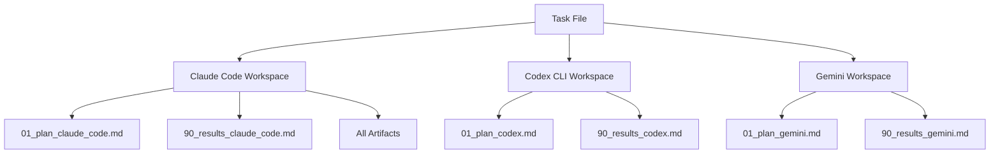
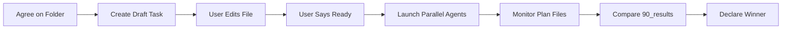

## 📋 Multi-Agent Orchestrator = Competitive Parallel Execution

**Core Principle:** Launch N CLI agents (Claude Code, Codex, Gemini) with identical task → Compare self-evaluations → Declare winner based on measurable success criteria. **🔴 CRITICAL: NEVER MOCK DATA!** Try multiple approaches to get real data; if all fail, stop and document attempts.

**Multi-Agent Workflow Structure (Continuant - TD):**


**Orchestration Process Flow (Occurrent - LR):**

**Ontological Rule:** TD for workspace structure (what exists), LR for orchestration workflow (what happens)

**Primary source:** `algorithms/product_div/Multi_agent_framework/00_MULTI_AGENT_ORCHESTRATOR.md`
**Session ID:** `e9ce3592-bd66-4a98-b0e7-fcdd8edb5d42` by Daniel Kravtsov (2025-11-13) - v2.0.0
**Release log:** See `SKILL_RELEASE_LOG.md` for full version history

### 🎯 When to Use

¶1 **Use multi-agent framework when:**
- Task complexity >7/10
- Multiple valid implementation approaches exist
- Need competitive evaluation
- Best solution critically important

¶2 **Use Task tool sub-agents when:**
- Single specialized capability (gmail, notion, jira)
- Standard workflow exists
- Quick operation needed
- Complexity <5/10

### 📐 Setup Workflow

¶1 **MANDATORY FIRST STEP: Agree on Location**

Before creating anything, ask:
- "Where should I create this task folder?" (suggest 2-3 options based on task type)
- "What should the folder name be?" (format: `XX_descriptive_name`)

**Example:**
```
🤖: "For your task, I suggest:
   1. /client_cases/[client]/15_[task]/ (if client-specific)
   2. /algorithms/product_div/15_[task]/ (if algorithm)

   Which location? And folder name?"

👤: "Use client_cases/HP/15_customer_metrics/"

🤖: "✅ Creating task in: /client_cases/HP/15_customer_metrics/"
```

¶2 **Create Draft Task File Immediately**

After folder agreement, create quick draft - user will edit directly:

```bash
mkdir -p [agreed_path]
cd [agreed_path]

cat > 01_task_multi_agent.md << 'EOF'
## Task: [Your quick understanding]

**Success Criteria:** [DRAFT - user refines]
- [Draft criterion 1]
- [Draft criterion 2]

## Instructions for User:
1. 📝 EDIT THIS FILE - Add details, fix criteria
2. ✅ CONFIRM - Reply "Ready" when good
3. 🔄 ITERATE - Edit and reply with changes

**Current Status:** 🔄 AWAITING YOUR EDITS

## Agents Artifact Requirement
Each agent MUST create:
- `01_plan_[agent].md` - Planning with progress updates
- `90_results_[agent].md` - Results with self-evaluation
- All outputs in workspace folder (claude_code/, codex_cli/, gemini/)

**Self-Evaluation Format:**
### Criterion 1: [from task]
**Status:** ✅/❌/⚠️ | **Evidence:** [data] | **Details:** [how tested]

## Overall: X/Y criteria met | Grade: ✅/❌/⚠️
EOF

mkdir -p claude_code codex_cli gemini
cd ..

echo "📄 Task file: [agreed_path]/01_task_multi_agent.md"
echo "🔗 file://[full_path]"
```

¶3 **User Edits Task File**

User has full control - edits file in IDE. No chat back-and-forth!

**User workflow:**
1. Open file (link provided)
2. Edit directly - improve description, refine criteria
3. Reply "Ready" or "Change criterion #2 to: [text]"

¶4 **Wait for Confirmation**

DO NOT PROCEED until user says "Ready".

**Acceptable:**
- ✅ "Ready"
- ✅ "Ready with changes: [edits]"
- ✅ "Change criterion #2 to: [text]"

### 🔄 Execution

¶1 **Launch Parallel Agents**

When user says "Ready":

```bash
# Run in background
./run_parallel_agents.sh [agreed_path]/01_task_multi_agent.md &
SCRIPT_PID=$!

# Monitor progress
ps aux | grep $SCRIPT_PID
tail -f [task_folder]/*/claude_output.log
```

**Script location:** `algorithms/product_div/Multi_agent_framework/run_parallel_agents.sh`

**Scripts handle automatically:**
- ✅ Repository root execution
- ✅ .env file loading
- ✅ Workspace setup/cleanup
- ✅ Background process management
- ✅ Real-time monitoring (updates every 5s)

**Timing:**
- Codex: 2-3 min
- Claude: 5+ min
- Gemini: 3-5 min

¶2 **Monitor via Plan Files**

Track progress:
```bash
cat [agreed_path]/claude_code/01_*_plan_claude_code.md
cat [agreed_path]/codex_cli/01_*_plan_codex.md
cat [agreed_path]/gemini/01_*_plan_gemini.md
```

¶3 **Artifact Placement (CRITICAL)**

**🔴 ALL ARTIFACTS MUST BE IN AGENT WORKSPACE FOLDER**

Every agent MUST create ALL outputs in assigned workspace - NEVER in external directories.

**❌ WRONG:**
```
[task]/
├── claude_code/
│   ├── 01_plan.md ✅
│   └── 90_results.md ✅
├── data_processed/
│   └── output.csv ❌ WRONG!
└── results.json ❌ WRONG!
```

**✅ CORRECT:**
```
[task]/
├── claude_code/
│   ├── 01_plan.md ✅
│   ├── 90_results.md ✅
│   ├── output.csv ✅
│   ├── results.json ✅
│   └── script.py ✅
└── codex_cli/
    ├── 01_plan.md ✅
    └── 90_results.md ✅
```

**Why:**
1. Traceability - know which agent created what
2. Comparison - side-by-side outputs
3. Cleanup - delete failed results cleanly
4. Reproducibility - exact inputs/outputs

¶4 **Compare Self-Evaluations**

No manual testing - compare `90_results_*.md` files only:

```
┌───────────────────┬─────────┬───────┬────────┐
│ Success Criteria  │ Claude  │ Codex │ Gemini │
├───────────────────┼─────────┼───────┼────────┤
│ Process <5s       │ ❌ 6.2s │ ✅ 3.8│ ✅ 4.1 │
│ Handle bad data   │ ✅      │ ✅    │ ✅     │
│ Unique approach   │ ❌      │ ✅    │ ✅     │
├───────────────────┼─────────┼───────┼────────┤
│ CRITERIA MET      │ 1/3     │ 3/3   │ 3/3    │
└───────────────────┴─────────┴───────┴────────┘
🏆 WINNER: Tie Codex/Gemini
```

Winner = highest score (most ✅ criteria).

### 🔗 Scripts & References

¶1 **Ready-to-use scripts:**

**Main (recommended):**
```bash
./run_parallel_agents.sh task_file.md
```

**Individual:**
```bash
./run_claude_agent.sh task_file.md
./run_codex_agent.sh task_file.md
./run_gemini_agent.sh task_file.md
```

¶2 **Bundled resources:**

**Scripts:**
- `scripts/create_task_file.sh` - Generate standardized task files

**References:**
- `references/script_usage.md` - Detailed script documentation
- `references/task_templates.md` - Pre-built templates for common scenarios
- `algorithms/product_div/Multi_agent_framework/00_MULTI_AGENT_ORCHESTRATOR.md` - Full guide

**When to load:**
- Script errors → Load `script_usage.md`
- Task templates → Load `task_templates.md`
- Comprehensive understanding → Load `00_MULTI_AGENT_ORCHESTRATOR.md`

### ❌ Anti-Patterns

¶1 **Common mistakes:**

❌ Using for simple tasks (just do directly)
❌ No clear success criteria (vague goals → vague results)
❌ Mocking data (NEVER create fake data)
❌ Skipping user confirmation (always wait for "Ready")
❌ External artifacts (all outputs in workspace folders)
❌ Subjective evaluation (use measurable criteria only)

### ✅ Quick Reference

¶1 **Complete workflow:**

```
1. User describes complex task
2. Verify complexity >7/10
3. Agree on folder location
4. Create draft task file
5. User edits and confirms "Ready"
6. Launch ./run_parallel_agents.sh &
7. Monitor plan files
8. Compare 90_results_*.md
9. Declare winner by criteria met
10. Document results
```

¶2 **File templates:**

```markdown
# 01_plan_[agent].md
## My Approach ([agent])
- [ ] Step 1: [action]
## Progress: ✅ [timestamp] Step 1 complete

# 90_results_[agent].md
## Self-Evaluation ([agent])
### Criterion 1: [from task]
**Status:** ✅/❌/⚠️ | **Evidence:** [data] | **Details:** [tested how]
## Overall: X/Y criteria | Grade: ✅/❌/⚠️
```

¶3 **Folder structure:**

```
[agreed_path]/
├── 01_task_multi_agent.md    # User-editable
├── claude_code/              # Claude workspace
│   ├── 01_*_plan_claude.md
│   └── 90_*_results_claude.md
├── codex_cli/                # Codex workspace
│   ├── 01_*_plan_codex.md
│   └── 90_*_results_codex.md
└── gemini/                   # Gemini workspace
    ├── 01_*_plan_gemini.md
    └── 90_*_results_gemini.md
```

---

**Meta Note:** See `knowledge-framework` skill for MECE/BFO principles. Multi-agent orchestrator uses CLI agents (not sub-agents), requires measurable success criteria, and selects winner through objective self-evaluation comparison.
