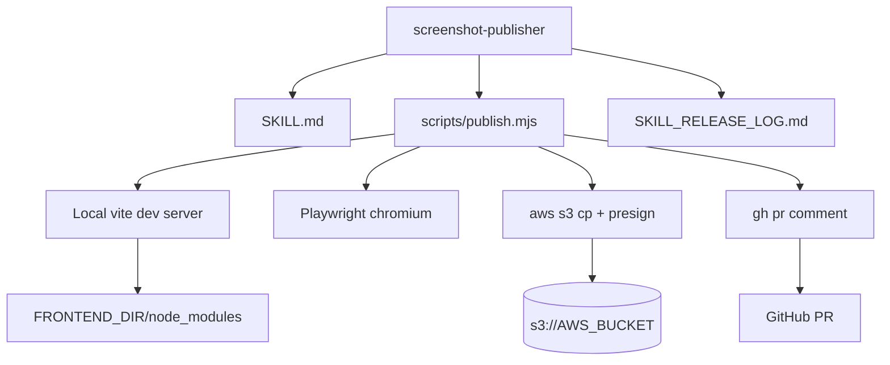
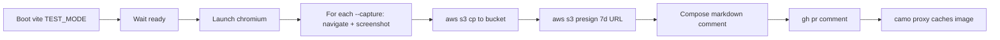

## 📸 Screenshot Publisher = Capture → S3 → PR Comment

**Core Principle:** Stage local UI screenshots from a vite dev server, host them on a private S3 bucket via short-lived presigned URLs, and embed them in a `gh pr comment` — so reviewers see visual state without launching anything and without committing PNGs to the repo.

**Resource Anatomy (Continuant - TD):**


**Publish Workflow (Occurrent - LR):**


**Ontological Rule:** TD for resource anatomy (artifacts that exist), LR for the publish run (steps that happen).

**Primary source:** `scripts/publish.mjs` (this skill)
**Original session:** `1c13dc7b-d405-47e2-a855-515bee17fe4d` by Anton Slesarev (2026-05-07) — extracted from manual workflow used to post visual verification on PR #408.

### 🎯 When to Use

¶1 **Trigger phrases:** "publish screenshots", "post screenshots to PR", "capture and post screenshots", "screenshot publisher", "screenshot the switcher", or any time the user wants UI evidence on a PR without committing PNGs.

¶2 **Right tool when:** the project already has a local dev server with a Clerk-mock test mode, an AWS profile with S3 access, and the user wants the comment posted by Claude (not via web UI drag-drop).

¶3 **Wrong tool when:** the project lacks vite + test-mode auth bypass, or screenshots are needed for a public/external audience (presigned URLs leak through obscurity but aren't truly access-controlled outside the camo cache).

### 📐 Project Assumptions (defaults)

¶1 **Frontend:** `FRONTEND_DIR/node_modules/.bin/vite` exists; `vite.config.ts` honors `VITE_TEST_MODE=true` to alias `@clerk/clerk-react` to a mock; the app shell renders a `<header>` even without backend (API calls 404, but UI mounts).

¶2 **AWS:** SSO profile `AWS_PROFILE` (default `agnify`) has `s3:PutObject` and `s3:GetObject` on `s3://AWS_BUCKET/BUCKET_PREFIX/...`. The bucket has Block Public Access enabled — that's expected; presigned URLs handle the `camo` fetch.

¶3 **GitHub:** `gh` CLI authenticated for the repo containing the PR. The repo is private, so presigned URLs in markdown are fetched once by camo and proxied to repo collaborators.

¶4 **Override any default** via env vars on the `node` invocation. See the header comment in `scripts/publish.mjs` for the full list.

### 🔄 Invocation

¶1 **Basic — header-only crops, post to PR:**
```bash
node ~/.claude/skills/screenshot-publisher/scripts/publish.mjs \
  --pr 408 \
  --capture /:Editor_active \
  --capture /vms:VMS_active \
  --header-only \
  --text "Live on beta. Switcher in the header; active state matches the surface."
```

¶2 **Full-page screenshots (no header crop):**
```bash
node ~/.claude/skills/screenshot-publisher/scripts/publish.mjs \
  --pr 412 --capture /executions/abc-123:Run_view
```

¶3 **Dry run — don't post, print markdown to stdout** (useful when previewing or chaining):
```bash
node ~/.claude/skills/screenshot-publisher/scripts/publish.mjs \
  --capture / --no-post
```

¶4 **Capture spec syntax:** `--capture <path>[:<label>]`. Path is the route to navigate (e.g., `/`, `/vms`, `/executions/abc`). Label is the heading in the comment; defaults to the path with `/` replaced by `_`.

### ⚠️ Caveats

¶1 **Presigned URL TTL.** AWS SigV4 caps presigned GET URLs at 7 days. GitHub's `camo.githubusercontent.com` proxy fetches the image on first comment render and caches the bytes. The rendered image typically survives URL expiry — but if the camo cache evicts before someone re-renders the page, the image will 403. Long-lived alternatives: drag-drop in the GitHub web UI (auto-uploads to `private-user-images.githubusercontent.com`, no expiry), or commit PNGs to the repo.

¶2 **No backend = mounted shell, blank panels.** Without a real backend running, API calls 404 and the data panels stay empty. The `<header>` mounts immediately, so header-only screenshots are reliable. Full-page screenshots may show empty content areas.

¶3 **Test-mode key prefix.** The script sets `VITE_CLERK_PUBLISHABLE_KEY=pk_test_screenshot_publisher` purely to satisfy the non-null check; the alias to `clerk-mock.tsx` (configured in `frontend/vite.config.ts` when `VITE_TEST_MODE=true`) bypasses real auth. If a project changes that alias name or removes the gate, capture will hang at the sign-in redirect.

¶4 **Single-run vite per script invocation.** The script boots and kills its own vite. Don't run two invocations concurrently against the same `VITE_PORT` — set `VITE_PORT=5175` (etc.) for parallel runs.

### 🛠️ Recovery

¶1 **`vite not found`** — run `bun install` (or `npm install`) in `FRONTEND_DIR`. The script needs `node_modules/.bin/vite` and `node_modules/playwright/`.

¶2 **`waitForVite … did not become ready`** — port already in use. Set `VITE_PORT=<other>` env or `lsof -ti:5174 | xargs kill`.

¶3 **`waitForSelector("header") … timeout`** — the test-mode alias isn't taking effect (real Clerk redirected to sign-in). Verify `frontend/vite.config.ts` has the `VITE_TEST_MODE=true` alias, and that `frontend/src/test-utils/clerk-mock.tsx` exists.

¶4 **`gh pr comment` 422** — `gh` not authenticated for the target repo, or the PR number is from a different repo. Run `gh auth status`.

¶5 **`aws s3 cp` AccessDenied** — wrong profile, or the SSO session expired. Re-run `aws sso login --profile agnify`.

¶6 **Image renders as broken icon in PR** — camo couldn't fetch the presigned URL. Confirm with `curl -s -o /dev/null -w "%{http_code}" "<presigned-url>"` (HEAD often returns 403 even when GET works — use GET to verify).
