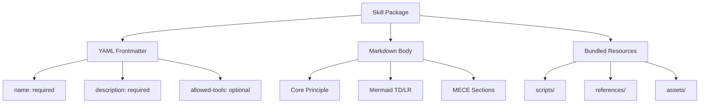
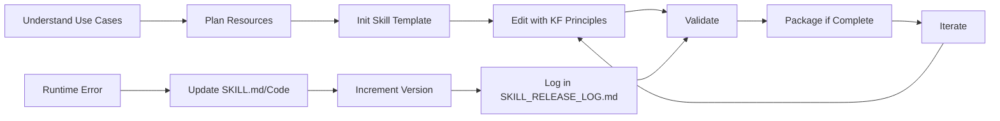

## 📋 Skill Creator = Knowledge Framework Application

**Core Principle:** Skills are modular packages extending Claude's capabilities through specialized workflows, domain knowledge, and bundled resources. Every skill follows Knowledge Framework principles - MECE structure, Mermaid diagrams, minimal verbosity, and Ground Truth attribution.

**Skill Package Anatomy (Continuant - TD):**


**Skill Creation & Evolution Workflow (Occurrent - LR):**

**Ontological Rule:** TD for skill structure (what exists), LR for creation/evolution process (what happens)

**Primary source:** `skill-creator/SKILL.md` (Anthropic base + Knowledge Framework integration)
**Original session:** `e9ce3592-bd66-4a98-b0e7-fcdd8edb5d42` by Daniel Kravtsov (2025-11-13) - v2.0.0 KF migration
**Latest update:** `e9ce3592-bd66-4a98-b0e7-fcdd8edb5d42` by Daniel Kravtsov (2025-11-13) - v2.2.0 Mermaid headers
**Release log:** See `SKILL_RELEASE_LOG.md` for full version history

### 🎯 What Skills Provide

¶1 **Skills transform Claude into specialized agent** with domain expertise no model can fully possess.

¶2 **Four core capabilities:**
- **Specialized workflows** - Multi-step procedures for specific domains
- **Tool integrations** - Instructions for file formats, APIs, databases
- **Domain expertise** - Company knowledge, schemas, business logic
- **Bundled resources** - Scripts, references, assets for complex tasks

¶3 **Progressive disclosure** - Three-level loading:
1. Metadata (name + description) - Always in context (~100 words)
2. SKILL.md body - When skill triggers (<5k words)
3. Bundled resources - As needed (unlimited, scripts executed without reading)

### 📐 Skill Structure (Anatomy)

¶1 **Required: SKILL.md** with YAML frontmatter + Markdown body

**YAML Frontmatter (Required Fields):**
```yaml
---
name: skill-identifier  # lowercase, hyphens only, max 64 chars, no "anthropic"/"claude"
description: What skill does + when to use + trigger phrases. Max 1024 chars. No angle brackets.
---
```

**YAML Optional Fields:**
- `allowed-tools` - Restricts tools (e.g., `Read, Write, Glob, Grep`)
- `model` - Specific model or `"inherit"` (default)
- `version` - Version tracking (e.g., `"2.0.0"`)
- `disable-model-invocation: true` - Manual-only invocation via `/skill-name`
- `mode: true` - Appears in "Mode Commands" section

**CRITICAL:** `description` field is PRIMARY field Claude uses for skill activation. Include trigger phrases directly: `"Use when user says 'create PDF', 'extract text', 'merge documents', or works with PDF files."`

¶2 **Optional: Bundled Resources**

```
skill-name/
├── SKILL.md (required)
└── Bundled Resources (optional)
    ├── scripts/          - Executable code (Python/Bash/etc.)
    ├── references/       - Documentation loaded as needed
    └── assets/           - Files used in output (templates, icons)
```

**Scripts (`scripts/`)** - When same code rewritten repeatedly or deterministic reliability needed
- Example: `scripts/rotate_pdf.py`
- Token efficient, executed without loading into context

**References (`references/`)** - Documentation Claude references while working
- Examples: `references/schema.md`, `references/api_docs.md`
- Loaded only when Claude determines it's needed
- **Avoid duplication:** Info lives in SKILL.md OR references, not both

**Assets (`assets/`)** - Files used in final output, not loaded into context
- Examples: `assets/logo.png`, `assets/template.html`
- Templates, boilerplate, images copied or modified

### 🔄 Skill Creation Process

¶1 **Step 1: Understand Use Cases**

Ask user for concrete examples:
- "What functionality should this skill support?"
- "Can you give examples of how this skill would be used?"
- "What would a user say that should trigger this skill?"

Skip only if usage patterns already clearly understood.

¶2 **Step 2: Plan Resources**

For each example, identify reusable resources:
- **Scripts** - Code rewritten repeatedly? → `scripts/process.py`
- **References** - Schemas/docs needed repeatedly? → `references/schema.md`
- **Assets** - Templates/boilerplate? → `assets/template.html`

¶3 **Step 3: Init Skill Template**

```bash
scripts/init_skill.py <skill-name> --path <output-directory>
```

Creates skill directory with SKILL.md template and example resource directories. Delete unused examples.

Skip if skill already exists (go to Step 4).

¶4 **Step 4: Edit Skill with Knowledge Framework**

**CRITICAL: Apply Knowledge Framework to SKILL.md**

Every SKILL.md MUST follow Knowledge Framework principles. **See `knowledge-framework` skill for complete documentation framework details.**

**Required elements:**

1. **Core Principle** - One sentence defining skill's essence
2. **Mermaid Diagrams with Headers** - Each diagram needs descriptive header (2-5 words specific to THIS skill)
   - TD diagram for structure (Continuant)
   - LR diagram for process (Occurrent)
3. **Ontological Rule** - TD for Continuants, LR for Occurrents
4. **Ground Truth Attribution** - Session ID + primary source
5. **MECE Sections** - Emoji-sections (🎯, 📐, 🔄) with ¶-numbering
6. **Minimal Verbosity** - No unnecessary words, DRY principle

**Template Structure:**
```markdown
---
name: skill-name
description: What + when + triggers. Max 1024 chars.
---
## 📋 [Skill Name] = [Core Domain]

**Core Principle:** [One sentence - what skill does and principles it follows]

**[Specific Description] (Continuant - TD):**
```mermaid
graph TD
    [Define structure nodes]
```

**[Specific Description] (Occurrent - LR):**
```mermaid
graph LR
    [Define process flow]
```

**Ontological Rule:** TD for [structure], LR for [process]

**Primary source:** [Original documentation/base]
**Session ID:** [get_session_id.py output] by [Author] (YYYY-MM-DD)

### 🎯 [Section 1 Name]
¶1 [Content with ¶-numbering]

### 📐 [Section 2 Name]
¶1 [Content]

### 🔄 [Section 3 Name]
¶1 [Content]
```

**Example headers:**
- ✅ `**Skill Package Anatomy (Continuant - TD):**` (specific to skill-creator)
- ✅ `**Email Processing Workflow (Occurrent - LR):**` (specific to email-parser)
- ❌ `**System Structure:**` (too generic)


**Writing Style:**
- **Imperative/infinitive form** (verb-first): "To accomplish X, do Y"
- NOT second person ("you should")
- Objective, instructional language

**Portability (CRITICAL):**

✅ **DO use relative paths:**
- `scripts/process.py` - Within skill directory
- `references/schema.md` - Within skill directory
- `algorithms/data/config.json` - Relative to repository root

❌ **DO NOT use absolute paths:**
- `/Users/username/projects/file.md` ❌
- `~/projects/repo/data/` ❌
- `C:\Users\username\file.txt` ❌

**YAML Examples:**

✅ **With triggers in description:**
```yaml
---
name: pdf-processor
description: Extract text, fill forms, merge PDFs. Use when user mentions "PDF", "extract from document", "fill form", or works with PDF files.
---
```

✅ **Bilingual triggers:**
```yaml
---
name: data-analyzer
description: Analyze customer data. Use when user says "analyze data", "generate report", "анализируй данные", "создай отчет", or works with analytics.
allowed-tools: Read, Bash, Glob, Grep
---
```

✅ **Manual-only invocation:**
```yaml
---
name: database-migration
description: Migrate production database. DANGER: Manual invocation only via /database-migration.
disable-model-invocation: true
allowed-tools: Bash, Read, Write
---
```

¶5 **Step 5: Validate & Package**

**Development validation (fast):**
```bash
scripts/quick_validate.py <path/to/skill-folder>
```

**Package only when COMPLETE and ready to distribute:**
```bash
scripts/package_skill.py <path/to/skill-folder>
```

Packaging automatically validates first, then creates distributable zip.

❌ **DO NOT package during:**
- Incremental development
- Testing/iterating
- User still editing

✅ **DO package when:**
- Skill COMPLETE and ready to distribute
- Final version before sharing externally
- User explicitly requests packaged skill

¶6 **Step 6: Iterate & Self-Healing**

After testing, identify improvements:
1. Use skill on real tasks
2. Notice struggles or inefficiencies
3. Update SKILL.md or bundled resources
4. Test again

**CRITICAL: Self-Healing Skills (Runtime Error Recovery)**

When skill encounters error during execution, skill should **automatically update itself**:

1. **Identify error** - Script fails, instruction unclear, resource missing
2. **Fix the issue** - Update SKILL.md, fix script, add missing reference
3. **Increment version** - Update `version` in YAML frontmatter (e.g., `"2.0.0"` → `"2.0.1"`)
4. **Log change** - Add entry to `SKILL_RELEASE_LOG.md`
5. **Preserve attribution** - ALWAYS keep original session ID + author, add new session for update

**SKILL_RELEASE_LOG.md Format:**
```markdown
# Skill Release Log

## [2.0.1] - 2025-11-13
**Session ID:** `abc123def456` by Daniel Kravtsov
**Type:** Bugfix
**Changes:**
- Fixed script path in references section
- Added missing error handling in `scripts/process.py`
**Issue:** Runtime error when processing empty file

## [2.0.0] - 2025-11-10
**Session ID:** `xyz789abc123` by Daniel Kravtsov
**Type:** Major update
**Changes:**
- Migrated to Knowledge Framework structure
- Added Mermaid diagrams
- Restructured with MECE sections
**Issue:** Initial release with KF compliance
```

**Self-Healing Rules:**
- ✅ **DO preserve** original Ground Truth attribution (session ID + author)
- ✅ **DO add** new session entry in SKILL_RELEASE_LOG.md
- ✅ **DO increment** version (patch: x.x.1, minor: x.1.0, major: 1.0.0)
- ❌ **DO NOT remove** existing session IDs from Ground Truth
- ❌ **DO NOT overwrite** SKILL_RELEASE_LOG.md - only append

**Example - Preserving attribution:**
```markdown
**Primary source:** `skill-creator/SKILL.md` (Anthropic base + Knowledge Framework integration)
**Original session:** `e9ce3592-bd66-4a98-b0e7-fcdd8edb5d42` by Daniel Kravtsov (2025-11-13)
**Latest update:** `abc123def456` by Daniel Kravtsov (2025-11-15) - Fixed runtime error
```

### 🔗 Knowledge Framework Integration

¶1 **Every skill demonstrates Knowledge Framework principles:**

When creating ANY skill, the skill itself should follow these patterns (see `knowledge-framework` skill for full details):

**Required Elements:**
- **Thesis/Core Principle** - Single sentence defining skill essence
- **Mermaid Diagrams** - Minimum 1, complex skills need both TD and LR
- **Ontological Rule** - TD for structure (nouns), LR for process (verbs)
- **MECE Sections** - 3-7 emoji-sections with ¶-numbering
- **Ground Truth** - Session ID + primary source + dates

**DRY Principle:**
- Each fact appears exactly ONCE
- Use references: "See `references/schema.md` for table structure"
- No duplication between SKILL.md and references files

**Minimal Verbosity:**
- Use minimum tokens sufficient for execution/understanding
- Remove unnecessary examples, verbose explanations
- Keep only essential procedural knowledge in SKILL.md

¶2 **Reference the knowledge-framework skill:**

When editing SKILL.md, if structure is complex or unclear, reference:
```markdown
**See:** `knowledge-framework` skill for MECE/BFO principles
```

¶3 **Common anti-patterns to avoid:**

❌ No Core Principle or thesis statement
❌ Missing Mermaid diagrams
❌ Long verbose descriptions without structure
❌ Absolute paths (`/Users/`, `/home/`, `C:\`)
❌ Duplication between SKILL.md and references
❌ Missing Ground Truth attribution (session ID, source)
❌ Flat structure without emoji-sections and ¶-numbering

### ✅ Skill Quality Checklist

Before finalizing skill:

**Structure:**
- [ ] Core Principle (1 sentence defining skill)
- [ ] Mermaid diagrams (TD for structure, LR for process)
- [ ] Diagram headers (2-5 words, specific to THIS skill, includes type/direction)
- [ ] Ontological Rule statement
- [ ] MECE emoji-sections (3-7 sections)
- [ ] ¶-numbering within sections
- [ ] Ground Truth attribution (session ID + source)

**YAML Frontmatter:**
- [ ] `name` field (lowercase, hyphens, max 64 chars)
- [ ] `description` includes trigger phrases (max 1024 chars)
- [ ] No angle brackets in description
- [ ] Optional fields correct (`allowed-tools`, `version`, etc.)

**Portability:**
- [ ] No absolute paths (`/Users/`, `~/`, `C:\`)
- [ ] Relative paths for all file references
- [ ] Works across different machines without modification

**Resources:**
- [ ] Scripts in `scripts/` (if needed)
- [ ] References in `references/` (if needed)
- [ ] Assets in `assets/` (if needed)
- [ ] No duplication between SKILL.md and references
- [ ] Example files removed if not needed

**Quality:**
- [ ] Imperative/infinitive writing style
- [ ] Minimal verbosity (no unnecessary words)
- [ ] DRY principle (no duplication)
- [ ] Validated with `quick_validate.py`

**Versioning & Evolution:**
- [ ] `version` field in YAML frontmatter
- [ ] `SKILL_RELEASE_LOG.md` exists if skill has updates
- [ ] Original session ID preserved in Ground Truth
- [ ] Latest update session documented (if applicable)
- [ ] Version incremented correctly (patch/minor/major)

---

**Meta Note:** This skill itself demonstrates Knowledge Framework - Core Principle, Mermaid diagrams (TD structure + LR process), emoji-sections with ¶-numbering, Ground Truth attribution, minimal verbosity. Skills are self-healing - they update themselves on runtime errors with proper versioning and release log tracking.
