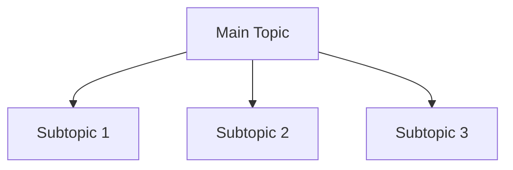
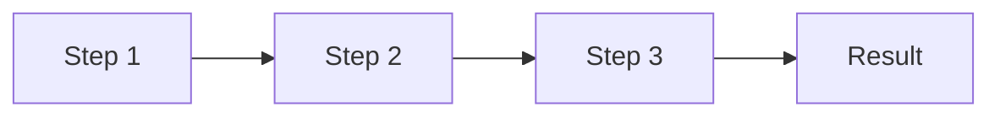

# YouTube to Knowledge Documentation Skill

Transform YouTube videos into structured Knowledge Framework documents with automatic transcript extraction, intelligent folder placement, and proper academic attribution.

## When to Use This Skill

Use this skill when:
- User wants to preserve video knowledge in repository structure
- Converting external learning materials into internal knowledge base
- Creating structured documentation from video content

## Quick Start Checklist

When user provides YouTube URL:

```markdown
[ ] 1. Extract transcript with yt-dlp (--write-auto-sub)
[ ] 2. Get video metadata (title, description, upload date)
[ ] 3. Analyze content and propose folder location
[ ] 4. Confirm folder with user before creating file
[ ] 5. Get Claude Code session ID (get_session_id.py --quiet)
[ ] 6. Generate Knowledge Framework doc (Thesis, Overview, Mermaid, MECE)
[ ] 7. Include clickable timestamp links ([timestamp MM:SS](URL?t=SECONDS))
[ ] 8. [OPTIONAL] Upload to Notion using youtube_to_notion.py library (NO temp scripts!)
[ ] 9. Add Author Checklist at end
```

**5-Second Decision Tree:**
- User provides YouTube URL? → Extract transcript + analyze content
- Content about AI agents? → algorithms/product_div/Ai Agent/
- Content about market research? → algorithms/product_div/market_research/

## Practical Workflow

**BEFORE creating documentation:**

1. **Extract content**: `yt-dlp --skip-download --write-auto-sub --sub-lang en`
2. **Analyze topic**: AI agents? Architecture? Market research?
3. **Propose location**: Use folder-finder logic (algorithms/product_div/...)
4. **Get session ID**: `python get_session_id.py --quiet`
5. **Generate doc**: Thesis + Overview + Mermaid (TD+LR) + MECE sections
6. **Add citations**: Clickable timestamp links with ?t=SECONDS format

**Example rapid application:**
```
User: "Document https://www.youtube.com/watch?v=ABC123 about AI agent security"

Agent thinks:
- Extract transcript using yt-dlp
- Topic: AI agent security patterns
- Folder: algorithms/product_div/Ai Agent/
- Check last file: 01_xxx.md → new: 02_ai_agent_security.md
- Get session ID: 21fc9ab9-7ffd-40b7
- Generate with clickable timestamps: [23:11](URL?t=1391)
```

## How It Works

### Step 1: Extract Video Content

¶1 **Get transcript using yt-dlp:**
```bash
# Download transcript
yt-dlp --skip-download --write-auto-sub --sub-lang en --sub-format vtt \
  --output "/tmp/video_title" "YOUTUBE_URL"

# Clean and deduplicate
cat /tmp/video_title.en.vtt | \
  grep -v "^WEBVTT" | grep -v "^Kind:" | grep -v "^Language:" | \
  grep -v "^[0-9][0-9]:" | grep -v "^$" | \
  sed 's/<[^>]*>//g' | \
  awk '!seen[$0]++' > /tmp/video_clean.txt
```

¶2 **Extract video metadata:**
```bash
yt-dlp --skip-download --print "%(title)s|%(description)s|%(upload_date)s" "YOUTUBE_URL"
```

### Step 2: Analyze Content and Determine Folder

¶1 **Use folder-finder skill logic:**
- **AI Agent development/research** → `algorithms/product_div/Ai Agent/`
- **Architecture/design patterns** → `algorithms/product_div/00_Architecture/`
- **Market research/industry** → `algorithms/product_div/market_research/`
- **Multi-agent systems** → `algorithms/product_div/Multi_agent_framework/`
- **Personal learning/exploration** → `algorithms/A8_G&A_div/Daniel Personal/`

¶2 **Ask user for confirmation:**
```
Based on video content about [TOPIC], I recommend:
**Folder:** algorithms/product_div/[subfolder]/
**Reasoning:** [Why this location fits]
**Filename:** NN_descriptive_title.md

Proceed? Or prefer different location?
```

### Step 3: Generate Knowledge Framework Document

¶1 **Required structure (MANDATORY):**
1. **Thesis:** One sentence previewing all MECE sections with specific outcome
2. **Overview paragraph:** Introduces each major section
3. **Mermaid diagrams:** BOTH Continuant (TD) and Occurrent (LR) for complex topics
4. **MECE sections:** 3-7 numbered sections (1.0, 2.0, 3.0)
5. **Paragraph numbering:** ¶1, ¶2, ¶3 within sections
6. **Ground truth attribution:** Primary source in Overview + inline citations

¶2 **Get Claude Code session ID:**
```bash
# Get current session ID
SESSION_ID=$(~/project/claude_venv/bin/python \
  ~/project/data_sources/claude_code/get_session_id.py --quiet)
```

¶3 **Attribution template for YouTube sources:**
```markdown
**Primary source:** [Video Creator] "[Video Title]" YouTube (YYYY-MM-DD) [URL]
**Transcript extracted:** yt-dlp (YYYY-MM-DD)
**Generated by:** Claude Code session `SESSION_ID` by Daniel Kravtsov (YYYY-MM-DD)
```

¶3 **Inline timestamp citations (MUST be clickable links):**

❌ **WRONG - Not clickable:**
```markdown
**Source:** Video timestamp 23:11-23:32
**Quote:** "Direct quote from video" (timestamp 23:11)
```

✅ **CORRECT - Clickable YouTube links:**
```markdown
**Source:** [Video timestamp 23:11-23:32](https://youtu.be/VIDEO_ID?t=1391)
**Quote:** "Direct quote from video" ([timestamp 23:11](https://youtu.be/VIDEO_ID?t=1391))
```

**Timestamp URL Format:**
- Pattern: `https://youtu.be/VIDEO_ID?t=SECONDS`
- Calculation: `MM:SS → (MM × 60) + SS = SECONDS`
- Example: `23:11 → (23 × 60) + 11 = 1391 seconds`
- Full URL: `https://youtu.be/LAwBdRR4wQk?t=1391`

**Rules:**
1. **ALWAYS use markdown link syntax** for timestamps: `[text](URL)`
2. Include timestamp in link text (MM:SS or MM:SS-MM:SS)
3. Calculate seconds for `?t=` parameter
4. Use same VIDEO_ID from original YouTube URL

### Step 3.5: Upload to Notion (Optional)

¶1 **Using the youtube_to_notion.py library (CRITICAL - No temporary scripts!):**

❌ **WRONG - Creating temporary Python scripts:**
```python
# DON'T DO THIS - Creates files that clutter repo
with open("upload_to_notion.py", "w") as f:
    f.write("# Script code...")
```

✅ **CORRECT - Using reusable library:**
```python
from data_sources.notion.youtube_to_notion import create_youtube_notion_page

# Runtime mode - create directly from memory, no temp files
create_youtube_notion_page(
    page_id="abc123",
    video_id="DxL2HoqLbyA",
    video_title="Entropy and Life",
    content_sections=[
        {
            "type": "heading",
            "level": 1,
            "content": "Энтропия и Жизнь"
        },
        {
            "type": "paragraph",
            "content": "Энтропия - это тенденция энергии рассеиваться.",
            "timestamps": [("04:19", "[таймкод 04:19]")]
        },
        {
            "type": "mermaid",
            "mermaid_code": "graph TD\n  A[Start] --> B[End]"
        },
        {
            "type": "callout",
            "icon": "💡",
            "color": "yellow_background",
            "content": "Важный инсайт!"
        },
        {
            "type": "list",
            "items": ["Пункт 1", "Пункт 2"]
        }
    ],
    language="ru",
    session_id="a725304d-8bb9-42d5-9a0e-95258889f959"
)
```

¶2 **Library Architecture:**
- **Location:** `data_sources/notion/youtube_to_notion.py`
- **Mode 1 - Runtime:** Create Notion page directly from structured data (recommended)
- **Mode 2 - File:** Convert existing MD file to Notion (TODO - not yet implemented)
- **No temp files:** All operations in memory
- **Proper blocks:** Automatically adds `"object": "block"` to all blocks
- **Mermaid support:** Native Notion Mermaid code blocks

¶3 **Helper functions available:**
```python
from data_sources.notion.youtube_to_notion import (
    add_block,                  # Add any block type
    create_mermaid_block,       # Create Mermaid diagram
    create_timestamp_link,      # Create clickable timestamp
    create_youtube_notion_page  # Main function (runtime mode)
)
```

¶4 **When to use Notion upload:**
- User explicitly says "upload to Notion" or "создай в Notion"
- User provides Notion page URL alongside YouTube URL
- User has existing Notion page they want to populate

¶5 **Notion Page ID extraction:**
```python
# From URL: https://www.notion.so/improvado-home/Entropy-VS-life-2ad9aec621258187b81edc7e0144d38a
# Page ID is the last part: 2ad9aec621258187b81edc7e0144d38a
```

### Step 4: File Naming Convention

¶1 **Determine next number in sequence:**
```bash
# List existing files in target folder
ls -1 algorithms/product_div/Ai\ Agent/ | grep "^[0-9][0-9]_" | tail -1

# If last file is 01_xxx.md, new file is 02_yyy.md
```

¶2 **Create descriptive filename:**
- Pattern: `NN_key_topic_from_video.md`
- Example: `02_anthropic_introspection_research.md`
- Use underscores, lowercase, descriptive (3-5 words)

### Step 5: Quality Validation

¶1 **Run through Author Checklist:**
```markdown
**Structure:**
- [ ] Thesis previews all sections
- [ ] Overview introduces each section
- [ ] Mermaid diagrams present (TD + LR for complex docs)
- [ ] MECE sections (3-7 top-level)
- [ ] Ordering principle stated
- [ ] Paragraph numbering (¶1, ¶2, ¶3)

**Ground Truth:**
- [ ] Primary source in Overview with URL and date
- [ ] Section sources attributed
- [ ] Inline citations with timestamps
- [ ] LLM analysis flagged where applicable
- [ ] Session ID included
```

## Usage Pattern

### Example 1: AI Research Video
```
User: "Create documentation from https://www.youtube.com/watch?v=ABC123"

Assistant workflow:
1. Extract transcript using yt-dlp
2. Get session ID: python get_session_id.py --quiet → 21fc9ab9-7ffd-40b7
3. Analyze: "Video discusses Claude's introspection capabilities (Anthropic research)"
4. Recommend: algorithms/product_div/Ai Agent/ (AI agent development topic)
5. Check last file number: 01_dual_llm_security_pattern.md
6. Create: 02_anthropic_introspection_research.md
7. Generate document with:
   - Thesis covering methodology, consciousness, implications
   - Continuant diagram (research structure) + Occurrent diagram (experimental flow)
   - 3 MECE sections with ¶-numbered paragraphs
   - YouTube URL + timestamps in citations
   - Session ID `21fc9ab9-7ffd-40b7` in Overview
```

### Example 2: Market Research Video
```
User: "Document this Gartner webinar on AI agents: https://www.youtube.com/watch?v=XYZ789"

Assistant workflow:
1. Extract transcript
2. Analyze: "Industry analysis of AI agent market trends"
3. Recommend: algorithms/product_div/market_research/
4. Create: 03_gartner_ai_agent_market_2025.md
5. Structure with competitive landscape (Continuant) + adoption process (Occurrent)
```

### Example 3: Personal Learning
```
User: "I want to document this tutorial I watched"

Assistant workflow:
1. Extract transcript
2. Ask: "Is this for personal learning or team knowledge?"
3. If personal → algorithms/A8_G&A_div/Daniel Personal/
4. If team → determine appropriate product_div subfolder
```

## Technical Requirements

### Dependencies
- **yt-dlp:** YouTube transcript extraction
  - Install: `brew install yt-dlp` (macOS)
  - Already available in chrome-extension-tcs environment
- **get_session_id.py:** Claude Code session ID extraction
  - Location: `~/project/data_sources/claude_code/get_session_id.py`
  - Python: `~/project/claude_venv/bin/python`

### File Locations
- **Temporary transcripts:** `/tmp/` (auto-cleaned)
- **Target folders:** `algorithms/` hierarchy (see folder-finder skill)
- **Knowledge Framework guide:** `~/project/How to organize documents_knowladge_framework.md`
- **Session ID script:** `~/project/data_sources/claude_code/get_session_id.py`

### Command Reference

¶1 **Download transcript:**
```bash
yt-dlp --skip-download --write-auto-sub --sub-lang en --sub-format vtt \
  --output "/tmp/video_$(date +%s)" "URL"
```

¶2 **Clean transcript:**
```bash
cat FILE.vtt | \
  grep -v "^WEBVTT" | grep -v "^Kind:" | grep -v "^Language:" | \
  grep -v "^[0-9][0-9]:" | grep -v "^$" | \
  sed 's/<[^>]*>//g' | \
  awk '!seen[$0]++'
```

¶3 **Get metadata:**
```bash
yt-dlp --skip-download --print "%(title)s|%(description)s" "URL"
```

¶4 **Get Claude Code session ID (MANDATORY):**
```bash
~/project/claude_venv/bin/python \
  ~/project/data_sources/claude_code/get_session_id.py --quiet
```

## Quality Standards

### Mermaid Diagram Requirements

¶1 **Continuant (TD) diagram shows structure:**


¶2 **Occurrent (LR) diagram shows process:**


### MECE Section Principles

¶1 **Mutually Exclusive:** Sections don't overlap in content
- ❌ BAD: "1.0 Methods" + "2.0 Experiments" (experiments are methods)
- ✅ GOOD: "1.0 Methodology" + "2.0 Results" + "3.0 Implications"

¶2 **Collectively Exhaustive:** Sections cover entire topic
- ❌ BAD: Only covering "positive results" (missing limitations)
- ✅ GOOD: Cover methods, findings, limitations, implications

### Attribution Standards

¶1 **YouTube-specific patterns (ALL timestamps MUST be clickable):**

❌ **WRONG - Plain text timestamps:**
```markdown
**Source:** [Creator Name], "Video Title", YouTube (YYYY-MM-DD) URL
**Quote:** "Exact quote" (timestamp 23:11)
**Visual reference:** Diagram shown at timestamp 15:30
```

✅ **CORRECT - Clickable timestamp links:**
```markdown
**Source:** [Creator Name], "Video Title", YouTube (YYYY-MM-DD) [Full video](https://youtu.be/VIDEO_ID)
**Quote:** "Exact quote" ([timestamp 23:11](https://youtu.be/VIDEO_ID?t=1391))
**Visual reference:** Diagram shown at [timestamp 15:30](https://youtu.be/VIDEO_ID?t=930)
**Key insight from:** Explanation at [15:30-17:45](https://youtu.be/VIDEO_ID?t=930)
```

**Timestamp Calculation Reference:**
| Time | Calculation | Seconds |
|------|-------------|---------|
| 5:30 | (5×60)+30 | 330 |
| 15:30 | (15×60)+30 | 930 |
| 23:11 | (23×60)+11 | 1391 |
| 1:05:45 | (1×3600)+(5×60)+45 | 3945 |

¶2 **LLM synthesis flagging:**
```markdown
**LLM Analysis:** Based on video segment MM:SS (topic A) combined with MM:SS (topic B)
**Reasoning:** Connection drawn between [concept 1] and [concept 2] from video
```

## Anti-Patterns to Avoid

❌ **No folder confirmation:** Creating doc without asking user about location
❌ **Missing diagrams:** Skipping Mermaid visualizations (MANDATORY)
❌ **Flat structure:** Not using MECE sections with numbering
❌ **No timestamps:** Generic attribution without video timestamp citations
❌ **Plain text timestamps:** Using "(timestamp 23:11)" instead of clickable `[timestamp 23:11](URL?t=1391)`
❌ **Duplicate content:** Repeating facts instead of cross-referencing §X.Y
❌ **Vague thesis:** Not previewing all major sections in opening sentence
❌ **No session ID:** Missing Claude Code session attribution (CRITICAL - MUST use get_session_id.py)
❌ **Wrong session format:** Using "by Daniel Kravtsov" instead of session `UUID` by Daniel Kravtsov

## Success Criteria

✅ User can find document later using folder structure
✅ Document standalone readable without watching video
✅ All claims traceable to specific video timestamps
✅ Structure follows Knowledge Framework (MECE, diagrams, ¶ numbering)
✅ Filename follows NN_descriptive_name.md convention
✅ Author Checklist completed and included at document end

---

**Meta Note:** This skill automates preservation of external video knowledge into chrome-extension-tcs repository with proper academic rigor and organizational structure.